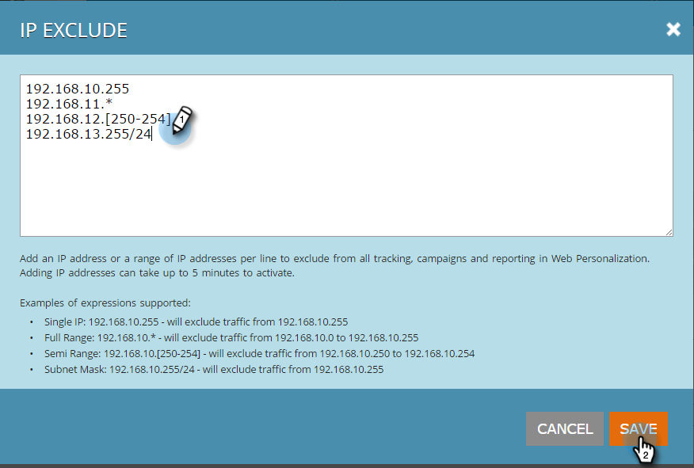

# 추적되지 않는 특정 IP 제외 {#exclude-specific-ips-from-being-tracked}

웹 개인화의 추적 및 보고에서 자신의 직원 및 조직 이름을 제외하고자 하십니까?

개별 IP와 IP 범위의 전체 또는 일부를 제외할 수 있습니다.

>[!NOTE]
>
>이 프로세스를 완료하는 데 최대 5분이 걸릴 수 있습니다.

1. 웹 개인화에 로그인하고 로그인 아래에서 **계정 설정을 클릭합니다**.

   

1. 아래로 스크롤하여 **IP 제외** 영역으로 이동합니다. 처음으로 IP 주소를 제외하는 경우 빈 IP 주소 **제외 필드를** 클릭합니다.

   

1. 추적 및 보고에서 제외할 개별 IP 또는 IP 범위를 입력하고 **저장을 클릭합니다**.

   

   >[!NOTE]
   >
   >단일 IPv4 또는 IPv6 주소 또는 전체 범위, 반범위 또는 서브넷 마스크로 제외시킬 수 있습니다. 위 예제의 항목들은 Marketing To 양식 자체에서 제공되는 예제를 기반으로 한 각각의 항목을 보여줍니다.

1. 이제 IP 주소 제외 필드에 입력한 IP 주소가 나열됩니다. IP 제외를 편집하려면 녹색 더하기(+)를 클릭하여 양식을 다시 엽니다.

   

   그게 얼마나 쉬운지 보셨나요? 이제 추가된 IP에서 개별적으로 또는 범위별로 모든 데이터를 제외할 수 있습니다.

