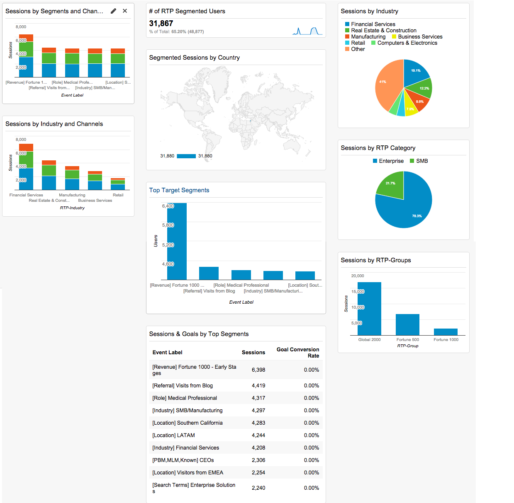

# Google Universal Analytics의 사용자 지정 RTP 대시보드 {#custom-rtp-dashboards-in-google-universal-analytics}

>[!NOTE]
>
>**사전 요구 사항**
>
>[Google Universal Analytics와 RTP 통합](integrate-rtp-with-google-universal-analytics.md)

이 게시물은 GUA(Google Universal Analytics)에서 RTP 대시보드를 설정하는 방법을 설명합니다.  RTP에서 GUA로 전송된 데이터는 다음과 같은 두 개의 개별 사용자 지정 대시보드로 설정할 수 있습니다.

* RTP B2B
* RTP 참여

## 사용자 지정 대시보드 설정 {#setting-up-a-custom-dashboard}

1. Google Analytics에 로그인합니다. 상단 메뉴에서 **보고 **를 클릭합니다. **대시보드 **와 **+새 사용자 지정 대시보드를 클릭합니다.**

   

1. 빈 캔버스 **를**&#x200B;선택하고 **대시보드 이름을** 추가하고 대시보드 **만들기를**&#x200B;클릭합니다.

1. 위젯 **추가를** 클릭하여 새 위젯을 만듭니다.\
   

## RTP B2B 대시보드 {#rtp-b-b-dashboard}

이 대시보드를 사용하면 B2B 관점에서 웹 사이트 성능을 분석할 수 있습니다.

업계, 매출, 크기, 계정 기반 목록 및 타겟 세그먼트별로 방문 소스 및 온사이트 동작과 같은 정보를 제공합니다.

대시보드는 3개의 열로 구성됩니다.

* 트래픽 소스
* 세분화
* Firmographic drill down

1. **RTP B2B Dashboard **라는 새 대시보드를 만들고 다음 위젯을 정의합니다.

<table> 
 <thead> 
  <tr> 
   <th> 
    

      열 1 - 트래픽 소스 
    
</th> 
   <th> 
    
 <strong>열 2 - 세그멘테이션</strong> 
    
</th> 
   <th> 
    
 <strong>열 3 - 스크롤 드릴다운</strong> 
    
</th> 
  </tr> 
 </thead> 
 <tbody> 
  <tr> 
   <td> 
    <ul> 
     <li>이름:세그먼트 및 채널별 세션</li> 
     <li>위젯 유형:막대 </li> 
     <li>다음과 같은 막대 차트를 만듭니다.세션</li> 
     <li>그룹화된 기준:이벤트 레이블</li> 
     <li>피벗 기준:기본 채널 그룹화</li> 
     <li>필터:  표시 전용 | 이벤트 범주(포함) RTP-세그먼트</li> 
    </ul>

</td> 
   <td> 
    <ul> 
     <li>이름:RTP 세그먼트된 사용자 수</li> 
     <li>유형:2.1 지표</li> 
     <li>다음 지표를 표시합니다.사용자 </li> 
     <li>필터:  표시 전용 | 이벤트 범주(포함) RTP-세그먼트</li> 
    </ul>

</td> 
   <td> 
    <ul> 
     <li>이름:업계별 세션</li> 
     <li>유형:파이 </li> 
     <li>다음과 같은 파이 차트를 만듭니다.세션</li> 
     <li>그룹화된 기준:RTP-Industry</li> 
    </ul>

</td> 
  </tr> 
  <tr> 
   <th> 
    <ul> 
     <li><strong>이름:업계 및 채널별 세션</strong></li> 
     <li><strong>위젯 유형:막대</strong></li> 
     <li><strong>다음과 같은 막대 차트를 만듭니다.세션</strong></li> 
     <li><strong>그룹화된 기준:RTP-Industry</strong></li> 
     <li><strong>피벗 기준:기본 채널 그룹화</strong> </li> 
    </ul></th> 
   <th> 
    <ul> 
     <li><strong>이름:국가별 세그먼트화된 세션</strong></li> 
     <li><strong>유형:검랍</strong></li> 
     <li><strong>선택한 지표 플롯:국가 | 세션</strong></li> 
     <li><strong>지역 선택:월드</strong></li> 
     <li><strong>필터:표시 전용 | 이벤트 범주(포함) RTP-세그먼트</strong></li> 
    </ul>

</th> 
   <th> 
    <ul> 
     <li><strong>이름:RTP 범주별 세션</strong></li> 
     <li><strong>유형:파이</strong></li> 
     <li><strong>다음과 같은 파이 차트를 만듭니다.세션</strong></li> 
     <li><strong>그룹화된 기준:RTP-Category</strong></li> 
    </ul>

</th> 
  </tr> 
  <tr> 
   <th> </th> 
   <th> 
    <ul> 
     <li>이름:상위 Target 세그먼트</li> 
     <li>유형:막대</li> 
     <li>다음과 같은 막대 차트를 만듭니다.사용자</li> 
     <li>그룹화된 기준:이벤트 작업</li> 
     <li>필터:표시 전용 | 이벤트 범주(포함) RTP-세그먼트</li> 
    </ul>

</th> 
   <th> 
    <ul> 
     <li>이름:RTP-그룹별 세션</li> 
     <li>유형:막대 </li> 
     <li>다음과 같은 막대 차트를 만듭니다.세션</li> 
     <li>그룹화된 기준:RTP-Group</li> 
    </ul>
<strong></strong>
</th> 
  </tr> 
  <tr> 
   <th> </th> 
   <th> 
    <ul> 
     <li>이름:상위 세그먼트별 세션 및 목표</li> 
     <li>유형:표 </li> 
     <li>다음 열을 표시합니다.  이벤트 레이블 | 세션 | 목표 전환율</li> 
     <li>필터:  표시 전용 | 이벤트 범주(포함) RTP-세그먼트</li> 
    </ul>
<strong></strong>
</th> 
   <th> </th> 
  </tr> 
 </tbody> 
</table>

## RTP 관여 대시보드 {#rtp-engagement-dashboard}

이 대시보드를 통해 사용자는 자신의 RTP 캠페인 성과 및 추천 엔진 참여를 분석할 수 있습니다. 그것은 평균을 비교한다. 다음 사이의 세션당 세션 지속 시간 및 페이지 수:

* 

   * 불참여
   * 참여(개인화된 캠페인에 대한 노출 및 클릭)
   * 권장 사항 엔진 및 상위 권장 컨텐츠 클릭

RTP 관여 대시보드라는 새 **대시보드를 만들고** 다음 위젯을 정의합니다.

<table> 
 <thead> 
  <tr> 
   <th> 
    
 <strong>열 1 캠페인 노출</strong> 
    
</th> 
   <th> 
    
 <strong>열 2 캠페인 클릭스루</strong> 
    
</th> 
   <th> 
    
 <strong>열 3 추천 엔진</strong> 
    
</th> 
  </tr> 
 </thead> 
 <tbody> 
  <tr> 
   <td> 
    <ul> 
     <li>이름: <strong>총 CTA(참여)</strong></li> 
     <li>유형: <strong>2.1 지표 </strong></li> 
     <li>다음 지표를 표시합니다. <strong>총 이벤트</strong></li> 
     <li>필터: <strong>[표시]이벤트 범주(포함):RTP-캠페인</strong> <strong>[표시]이벤트 작업(정확히 일치):노출</strong><strong>[표시 안 함] 이벤트 레이블(포함):#</strong></li> 
    </ul>
<strong></strong>
</td> 
   <td> 
    <ul> 
     <li>이름: <strong>총 CTA(클릭스루)</strong></li> 
     <li>유형: <strong>2.1 지표 </strong></li> 
     <li>다음 지표를 표시합니다. <strong>총 이벤트</strong></li> 
     <li>필터: <strong>[표시]이벤트 범주(포함):RTP-캠페인</strong> <strong>[표시]이벤트 작업(정확히 일치):클릭</strong><strong>[표시 안 함] 이벤트 레이블(포함):#</strong></li> 
    </ul>
<strong></strong>
</td> 
   <td> 
    <ul> 
     <li>이름: <strong>CRE - 총 클릭 수</strong></li> 
     <li>유형: <strong>2.1 지표</strong> </li> 
     <li>다음 지표를 표시합니다. <strong>페이지 보기</strong></li> 
     <li>필터: <strong>[표시 전용] 페이지(포함):rcmd</strong></li> 
    </ul>

</td> 
  </tr> 
  <tr> 
   <td colspan="1"> 
    <ul> 
     <li>이름: <strong>평균 세션 기간(참여)</strong></li> 
     <li>유형: <strong>2.1 지표 </strong></li> 
     <li>다음 지표를 표시합니다. <strong>평균 세션 기간</strong></li> 
     <li>필터: <strong>[표시]이벤트 범주(정확히 일치):RTP-캠페인</strong> <strong>[표시]이벤트 작업(정확히 일치):노출</strong><strong>[표시 안 함] 이벤트 레이블(포함):#</strong></li> 
    </ul>
<strong></strong>
</td> 
   <td colspan="1"> 
    <ul> 
     <li>이름: <strong>평균 세션 기간(클릭스루)</strong></li> 
     <li>유형: <strong>2.1 지표 </strong></li> 
     <li>다음 지표를 표시합니다. <strong>평균 세션 기간</strong></li> 
     <li>필터: <strong>[표시]이벤트 범주(정확히 일치):RTP-캠페인</strong> <strong>[표시]이벤트 작업(정확히 일치):클릭</strong><strong>[표시 안 함] 이벤트 레이블(포함):#</strong></li> 
    </ul>
<strong></strong>
</td> 
   <td colspan="1"> 
    <ul> 
     <li>이름: <strong>CRE - 권장 컨텐츠</strong></li> 
     <li>유형: <strong>표</strong> </li> 
     <li>다음 열을 표시합니다.  <strong>페이지 제목 | 페이지 보기</strong> </li> 
     <li>필터: 필터: <strong>[표시 전용] 페이지(포함):rcmd</strong></li> 
    </ul>

</td> 
  </tr> 
  <tr> 
   <td> 
    <ul> 
     <li>이름: <strong>페이지/세션(참여)</strong></li> 
     <li>유형: <strong>2.1 지표 </strong></li> 
     <li>다음 지표를 표시합니다. <strong>페이지/세션</strong></li> 
     <li>필터: <strong>[표시]이벤트 범주(정확히 일치):RTP-캠페인</strong></li> 
     <li><strong>[표시]이벤트 동작(정확히 일치):노출</strong></li> 
     <li><strong>[표시 안 함] 이벤트 레이블(포함):#</strong></li> 
    </ul>

</td> 
   <td> 
    <ul> 
     <li>이름: <strong>페이지/세션(클릭스루)</strong></li> 
     <li>유형: <strong>2.1 지표 </strong></li> 
     <li>다음 지표를 표시합니다. <strong>페이지/세션</strong></li> 
     <li>필터: <strong>[표시]이벤트 범주(정확히 일치):RTP-캠페인</strong></li> 
     <li><strong>[표시]이벤트 동작(정확히 일치):클릭</strong></li> 
     <li><strong>[표시 안 함] 이벤트 레이블(포함):#</strong></li> 
    </ul>
<strong></strong>
</td> 
   <td> </td> 
  </tr> 
  <tr> 
   <td> 
    <ul> 
     <li>이름: <strong>CTA별 노출 횟수</strong></li> 
     <li>유형: <strong>표</strong></li> 
     <li>다음 열을 표시합니다. <strong>이벤트 레이블 | 총 이벤트 수 | 사용자</strong></li> 
     <li>필터: <strong>[표시]이벤트 범주(정확히 일치):RTP-캠페인</strong> <strong>[표시]이벤트 작업(정확히 일치):노출</strong><strong>[표시 안 함] 이벤트 레이블(포함):#</strong></li> 
    </ul>

</td> 
   <td> 
    <ul> 
     <li>이름: <strong>클릭스루(CTA)</strong></li> 
     <li>유형: <strong>표</strong></li> 
     <li>다음 열을 표시합니다. <strong>이벤트 레이블 | 총 이벤트 수 | 사용자</strong></li> 
     <li>필터: <strong>[표시]이벤트 범주(정확히 일치):RTP-캠페인</strong> <strong>[표시]이벤트 작업(정확히 일치):클릭</strong></li> 
    </ul>

</td> 
   <td> </td> 
  </tr> 
 </tbody> 
</table>

>[!NOTE]
>
>**관련 문서**
>
>[Google Universal Analytics와 RTP 통합](integrate-rtp-with-google-universal-analytics.md)
>
>[Google Universal Analytics의 사용자 지정 RTP 보고서](custom-rtp-reports-in-google-universal-analytics.md)

