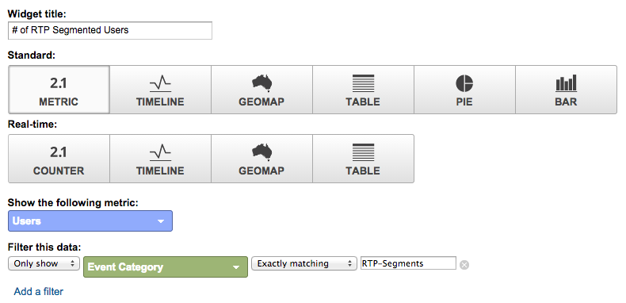

# Google Universal Analytics의 사용자 정의 RTP 대시보드 {#custom-rtp-dashboards-in-google-universal-analytics}

>[!PREREQUISITES]
>
>[Google Universal Analytics와 RTP 통합](/help/marketo/product-docs/web-personalization/reporting-for-web-personalization/web-analytics-integrations/integrate-rtp-with-google-universal-analytics.md)

이 게시물에서는 GUA(Google Universal Analytics)에서 RTP 대시보드를 설정하는 방법을 설명합니다. RTP에서 GUA로 전송되는 데이터는 라는 두 개의 별도 사용자 정의 대시보드로 설정할 수 있습니다.

* RTP B2B
* RTP 참여

## 사용자 정의 대시보드 설정 {#setting-up-a-custom-dashboard}

1. Google Analytics에 로그인. 상단 메뉴에서 **[!UICONTROL Reporting]**&#x200B;을(를) 클릭합니다. **[!UICONTROL Dashboards]** 및 **[!UICONTROL New Dashboard]**&#x200B;을(를) 클릭합니다.

   

1. **빈 캔버스**&#x200B;를 선택하고 **대시보드 이름**&#x200B;을 추가한 다음 **[!UICONTROL Create Dashboard]**&#x200B;을(를) 클릭합니다.

1. 새 위젯을 만들려면 **[!UICONTROL Add Widget]**&#x200B;을(를) 클릭합니다.

   

## RTP B2B 대시보드 {#rtp-b-b-dashboard}

이 대시보드를 통해 사용자는 B2B 관점에서 웹 사이트 성과를 분석할 수 있습니다.

업계, 매출, 규모, 계정 기반 목록 및 타겟 세그먼트별로 방문 소스 및 현장 행동과 같은 정보를 제공합니다.

대시보드는 3개의 열로 구성됩니다

* 트래픽 소스
* 세분화
* 그래픽 드릴다운

1. **RTP B2B 대시보드**&#x200B;라는 새 대시보드를 만들고 다음 위젯을 정의합니다.

<table>
 <thead>
  <tr>
   <th>
    

      열 1 - 트래픽 소스
    
</th>
   <th>
    
 <strong>열 2 - 세분화</strong>
    
</th>
   <th>
    
 <strong>열 3 - Firmographic 드릴다운</strong>
    
</th>
  </tr>
 </thead>
 <tbody>
  <tr>
   <td>
    <ul>
     <li>이름: 세그먼트 및 채널별 세션</li>
     <li>위젯 유형: 막대 </li>
     <li>표시되는 막대 차트 만들기: 세션</li>
     <li>그룹화 기준: 이벤트 레이블</li>
     <li>피벗 기준: 기본 채널 그룹화</li>
     <li>필터:  표시만 | 이벤트 범주(포함) RTP-Segments</li>
    </ul>

</td>
   <td>
    <ul>
     <li>이름: 세그먼트화된 RTP 사용자 수</li>
     <li>유형: 2.1 지표</li>
     <li>다음 지표 표시: 사용자 </li>
     <li>필터:  표시만 | 이벤트 범주(포함) RTP-세그먼트</li>
    </ul>

</td>
   <td>
    <ul>
     <li>이름: 산업별 세션</li>
     <li>유형: 원형 </li>
     <li>표시되는 원형 차트 만들기: 세션</li>
     <li>그룹화 기준: RTP-Industry</li>
    </ul>

</td>
  </tr>
  <tr>
   <th>
    <ul>
     <li><strong>이름: 업계 및 채널별 세션</strong></li>
     <li><strong>위젯 유형: 막대</strong></li>
     <li><strong>표시되는 막대 차트 만들기: 세션</strong></li>
     <li><strong>그룹화 기준: RTP-Industry</strong></li>
     <li><strong>피벗 기준: 기본 채널 그룹화</strong> </li>
    </ul></th>
   <th>
    <ul>
     <li><strong>이름: 국가별로 세그먼트화된 세션</strong></li>
     <li><strong>유형: Geomap</strong></li>
     <li><strong>선택한 지표 플롯: 국가 | 세션</strong></li>
     <li><strong>지역 선택: 세계</strong></li>
     <li><strong>필터: 표시만 | 이벤트 범주(포함) RTP-세그먼트</strong></li>
    </ul>

</th>
   <th>
    <ul>
     <li><strong>이름: RTP 범주별 세션</strong></li>
     <li><strong>유형: 원형</strong></li>
     <li><strong>표시되는 원형 차트 만들기: 세션</strong></li>
     <li><strong>그룹화 기준: RTP-Category</strong></li>
    </ul>

</th>
  </tr>
  <tr>
   <th> </th>
   <th>
    <ul>
     <li>이름: 상위 타겟 세그먼트</li>
     <li>유형: 막대</li>
     <li>표시하는 막대 차트 만들기: 사용자</li>
     <li>그룹화 기준: 이벤트 동작</li>
     <li>필터: 표시만 | 이벤트 범주(포함) RTP-세그먼트</li>
    </ul>

</th>
   <th>
    <ul>
     <li>이름: RTP-그룹별 세션</li>
     <li>유형: 막대 </li>
     <li>다음을 보여주는 막대 차트를 만듭니다. 세션</li>
     <li>그룹화 기준: RTP-Group</li>
    </ul>

</th>
  </tr>
  <tr>
   <th> </th>
   <th>
    <ul>
     <li>이름: 상위 세그먼트별 세션 및 목표</li>
     <li>유형: 테이블 </li>
     <li>다음 열을 표시합니다.  이벤트 레이블 | 세션 | 목표 전환율</li>
     <li>필터:  표시만 | 이벤트 범주(포함) RTP-Segments</li>
    </ul>

</th>
   <th> </th>
  </tr>
 </tbody>
</table>

## RTP 참여 대시보드 {#rtp-engagement-dashboard}

이 대시보드를 사용하여 사용자가 자신의 RTP 캠페인 성능 및 권장 사항 엔진 참여를 분석할 수 있습니다. 평균 비교를 제공합니다. 세션 기간 및 다음 기간 사이의 세션당 페이지 수:

* 참여하지 않음
* 참여(개인화된 캠페인에 대한 노출 횟수 및 클릭 수)
* 추천 엔진 및 상위 추천 콘텐츠 클릭

**RTP 참여 대시보드**&#x200B;라는 새 대시보드를 만들고 다음 위젯을 정의합니다.

<table>
 <thead>
  <tr>
   <th>
    
 <strong>열 1 캠페인 노출</strong>
    
</th>
   <th>
    
 <strong>열 2 캠페인 클릭스루</strong>
    
</th>
   <th>
    
 <strong>3열 추천 엔진</strong>
    
</th>
  </tr>
 </thead>
 <tbody>
  <tr>
   <td>
    <ul>
     <li>이름: <strong>총 CTA(참여)</strong></li>
     <li>유형: <strong>2.1 지표 </strong></li>
     <li>다음 지표 표시: <strong>총 이벤트</strong></li>
     <li>필터: <strong>[only show] 이벤트 범주(포함): RTP-Campaigns</strong> <strong>[only show] 이벤트 작업(정확히 일치): 노출</strong>[don't show] 이벤트 레이블(포함): #</li>
    </ul>

</td>
   <td>
    <ul>
     <li>이름: <strong>총 CTA(클릭스루)</strong></li>
     <li>유형: <strong>2.1 지표 </strong></li>
     <li>다음 지표 표시: <strong>총 이벤트</strong></li>
     <li>필터: <strong>[전용 표시] 이벤트 범주(포함): RTP-Campaigns</strong> <strong>[전용 표시] 이벤트 작업(정확히 일치): 클릭 수</strong><strong>[표시 안 함] 이벤트 레이블(포함): #</strong></li>
    </ul>

</td>
   <td>
    <ul>
     <li>이름: <strong>CRE - 총 클릭 수</strong></li>
     <li>유형: <strong>2.1 지표</strong> </li>
     <li>다음 지표 표시: <strong>페이지 보기</strong></li>
     <li>필터: <strong>[표시만] 페이지(포함): rcmd</strong></li>
    </ul>

</td>
  </tr>
  <tr>
   <td colspan="1">
    <ul>
     <li>이름: <strong>평균 세션 기간(참여)</strong></li>
     <li>유형: <strong>2.1 지표 </strong></li>
     <li>다음 지표를 표시합니다. <strong>평균 세션 기간</strong></li>
     <li>필터: <strong>[only show] 이벤트 범주(정확히 일치): RTP-Campaigns</strong> <strong>[only show] 이벤트 작업(정확히 일치): impression</strong><strong>[don't show] 이벤트 레이블(포함): #</strong></li>
    </ul>

</td>
   <td colspan="1">
    <ul>
     <li>이름: <strong>평균 세션 기간(클릭스루)</strong></li>
     <li>유형: <strong>2.1 지표 </strong></li>
     <li>다음 지표를 표시합니다. <strong>평균 세션 기간</strong></li>
     <li>필터: <strong>[only show] 이벤트 범주(정확히 일치): RTP-Campaigns</strong> <strong>[only show] 이벤트 작업(정확히 일치): 클릭</strong><strong>[don't show] 이벤트 레이블(포함): #</strong></li>
    </ul>

</td>
   <td colspan="1">
    <ul>
     <li>이름: <strong>CRE - 상위 권장 콘텐츠</strong></li>
     <li>형식: <strong>테이블</strong> </li>
     <li>다음 열을 표시:  <strong>페이지 제목 | 페이지 보기</strong> </li>
     <li>필터: 필터: <strong>[표시만] 페이지(포함): rcmd</strong></li>
    </ul>

</td>
  </tr>
  <tr>
   <td>
    <ul>
     <li>이름: <strong>페이지/세션(참여)</strong></li>
     <li>유형: <strong>2.1 지표 </strong></li>
     <li>다음 지표 표시: <strong>페이지 / 세션</strong></li>
     <li>필터: <strong>[표시만] 이벤트 범주(정확히 일치): RTP-Campaigns</strong></li>
     <li><strong>[표시] 이벤트 작업(정확히 일치): 노출 횟수</strong></li>
     <li><strong>[표시하지 않음] 이벤트 레이블(포함): #</strong></li>
    </ul>

</td>
   <td>
    <ul>
     <li>이름: <strong>페이지/세션(클릭스루)</strong></li>
     <li>유형: <strong>2.1 지표 </strong></li>
     <li>다음 지표 표시: <strong>페이지 / 세션</strong></li>
     <li>필터: <strong>[only show] 이벤트 범주(정확히 일치): RTP-Campaigns</strong></li>
     <li><strong>[only show] 이벤트 작업(정확히 일치): 클릭 수</strong></li>
     <li><strong>[표시하지 않음] 이벤트 레이블(포함): #</strong></li>
    </ul>

</td>
   <td> </td>
  </tr>
  <tr>
   <td>
    <ul>
     <li>이름: <strong>CTA의 노출 횟수</strong></li>
     <li>형식: <strong>테이블</strong></li>
     <li>다음 열을 표시: <strong>이벤트 레이블 | 총 이벤트 | 사용자</strong></li>
     <li>필터: <strong>[표시] 이벤트 범주(정확히 일치): RTP-Campaigns</strong> <strong>[정확히 일치] 이벤트 작업(정확히 일치): 노출</strong><strong>[표시하지 않음] 이벤트 레이블(포함): #</strong></li>
    </ul>

</td>
   <td>
    <ul>
     <li>이름: <strong>CTA 클릭스루</strong></li>
     <li>형식: <strong>테이블</strong></li>
     <li>다음 열을 표시: <strong>이벤트 레이블 | 총 이벤트 | 사용자</strong></li>
     <li>필터: <strong>[정확히 일치] 이벤트 범주(정확히 일치): RTP-Campaigns</strong> <strong>[정확히 일치] 이벤트 작업(정확히 일치): 클릭</strong></li>
    </ul>

</td>
   <td> </td>
  </tr>
 </tbody>
</table>

>[!MORELIKETHIS]
>
>[Google Universal Analytics와 RTP 통합](/help/marketo/product-docs/web-personalization/reporting-for-web-personalization/web-analytics-integrations/custom-rtp-reports-in-google-universal-analytics.md)
>
>[Google Universal Analytics의 사용자 지정 RTP 보고서](/help/marketo/product-docs/web-personalization/reporting-for-web-personalization/web-analytics-integrations/custom-rtp-reports-in-google-universal-analytics.md)
