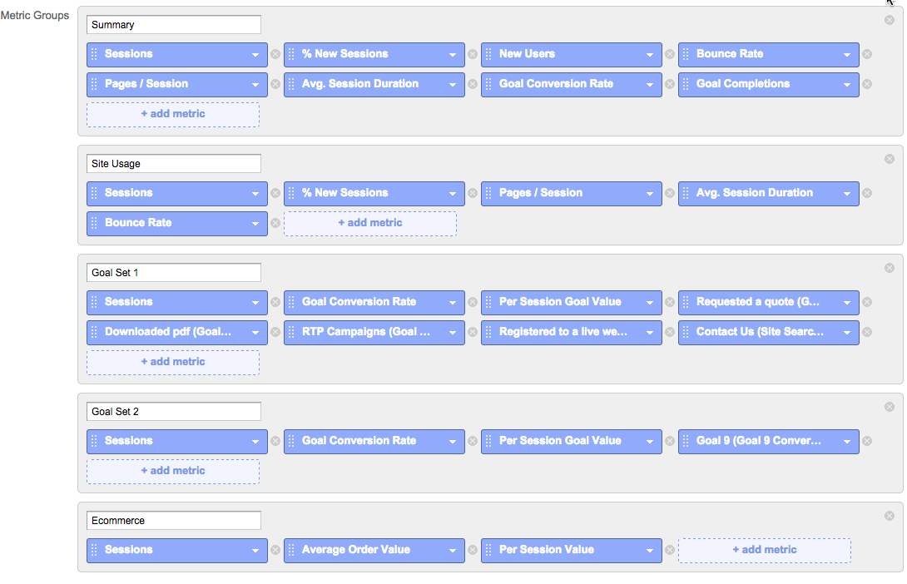
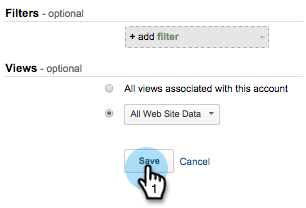

# Google Universal Analytics의 사용자 정의 RTP 보고서 {#custom-rtp-reports-in-google-universal-analytics}

>[!PREREQUISITES]
>
>[Google Universal Analytics와 RTP 통합](/help/marketo/product-docs/web-personalization/reporting-for-web-personalization/web-analytics-integrations/integrate-rtp-with-google-universal-analytics.md)

이 문서에서는 GUA(Google Universal Analytics)에 대한 RTP 사용자 지정 보고서를 설정하는 방법에 대해 설명합니다.  RTP에서 GUA로 전송되는 데이터는 라는 두 개의 별도 사용자 정의 보고서로 설정할 수 있습니다.

* RTP B2B
* RTP 참여

## [!UICONTROL Custom Report] 설정 중 {#setting-up-a-custom-report}

1. Google Analytics에 로그인.

1. 상단 메뉴에서 **[!UICONTROL Customization]**&#x200B;을(를) 클릭합니다.

1. **[!UICONTROL New Custom Report]**&#x200B;를 클릭합니다.

## RTP B2B 보고서 {#rtp-b-b-report}

1. 보고서 이름을 **RTP B2B 보고서**&#x200B;로 지정합니다.

1. 첫 번째 탭의 이름을 **[!UICONTROL Industry]**&#x200B;로 지정합니다.

>[!NOTE]
>
>**이 탭을 복제**&#x200B;하고 유사한 탭을 추가로 만듭니다. - 5단계)

1. **[!UICONTROL Explorer]** 보고서 유형을 선택하십시오.

   

1. **[!UICONTROL Metric Groups]** 섹션에서 비즈니스와 관련된 지표를 선택합니다.

   a. 다음 사항을 권장합니다.

   

1. 이 탭을 4번 복제하고 이름을 지정합니다.

   1. **업계**
   1. **그룹**
   1. **범주**
   1. **ABM**
   1. **조직**

   

1. **Dimension 드릴다운** 섹션에서 각 탭의 관련 차원을 아래와 같이 설정합니다.

<table>
 <thead>
  <tr>
   <th>
    

      탭 이름
    
</th>
   <th>
    

      Dimension 드릴다운
    
</th>
  </tr>
 </thead>
 <tbody>
  <tr>
   <td>업종</td>
   <td></td>
  </tr>
  <tr>
   <td>그룹</td>
   <td></td>
  </tr>
  <tr>
   <td>카테고리</td>
   <td></td>
  </tr>
  <tr>
   <td>ABM</td>
   <td></td>
  </tr>
  <tr>
   <td>조직</td>
   <td></td>
  </tr>
 </tbody>
</table>

1. 필터를 설정하지 말고 이 보고서를 **[!UICONTROL All Web Site Data]**&#x200B;에서 사용할 수 있도록 설정하십시오(또는 특정 Analytics 계정과 관련된 경우 변경하지 마십시오).

1. **[!UICONTROL Save]**&#x200B;를 클릭합니다.

   

## RTP 참여 보고서 {#rtp-engagement-report}

1. 보고서 이름을 **RTP 참여 보고서**&#x200B;로 지정합니다.

1. 첫 번째 탭 이름을 **[!UICONTROL All Engagement]**(으)로 설정합니다.

>[!NOTE]
>
>이 탭을 복제하고 유사한 탭을 추가로 만듭니다(5단계).

1. **[!UICONTROL Explorer]** 보고서 유형을 선택하십시오.

   

1. [!UICONTROL Metric Groups] 섹션에서 비즈니스와 관련된 지표를 선택합니다. 권장 사항은 다음과 같습니다.

   

1. 이 탭을 4번 복제하고 이름을 지정합니다.

   1. **모든 참여**
   1. **업종별 참여**
   1. 그룹별 **참여**
   1. 범주별 **참여**
   1. ABM의 **참여**

   

1. **Dimension 드릴다운** 섹션에서 각 탭의 관련 차원을 아래와 같이 설정합니다.

<table>
 <thead>
  <tr>
   <th>
    

      탭 이름
    
</th>
   <th>
    

      Dimension 드릴다운
    
</th>
  </tr>
 </thead>
 <tbody>
  <tr>
   <td>모든 참여</td>
   <td></td>
  </tr>
  <tr>
   <td>ABM에 의한 참여</td>
   <td></td>
  </tr>
  <tr>
   <td>범주별 참여</td>
   <td></td>
  </tr>
  <tr>
   <td>그룹별 참여</td>
   <td></td>
  </tr>
  <tr>
   <td>업종별 참여</td>
   <td></td>
  </tr>
 </tbody>
</table>

1. 다음 필터를 설정합니다.

<table>
 <thead>
  <tr>
   <th>
    

      Inc/Exc
    
</th>
   <th>
    

      필드
    
</th>
   <th>
    

      일치 유형
    
</th>
   <th>
    

      값
    
</th>
   <th colspan="1">
    

      댓글
    
</th>
  </tr>
 </thead>
 <tbody>
  <tr>
   <td>
포함
</td>
   <td>
이벤트 범주
</td>
   <td>Regex</td>
   <td>RTP-Campaigns|RTP-Recommendations|RTP-Segments</td>
   <td colspan="1">RTP와 관련이 없는 다른 모든 사용자 지정 이벤트를 필터링합니다.</td>
  </tr>
  <tr>
   <td>제외</td>
   <td>이벤트 레이블</td>
   <td>Regex</td>
   <td>#</td>
   <td colspan="1">캠페인 이름에서 #을 사용하여 보고서 캠페인에서 필터링할 수 있습니다.</td>
  </tr>
 </tbody>
</table>

1. 이 보고서를 **[!UICONTROL All Web Site Data]**&#x200B;에서 사용할 수 있도록 설정합니다(필요한 경우 변경).

   

1. **[!UICONTROL Save]**&#x200B;를 클릭합니다.

>[!MORELIKETHIS]
>
>[Google Universal Analytics와 RTP 통합](/help/marketo/product-docs/web-personalization/reporting-for-web-personalization/web-analytics-integrations/integrate-rtp-with-google-universal-analytics.md)
>
>[Google Universal Analytics의 사용자 지정 RTP 대시보드](/help/marketo/product-docs/web-personalization/reporting-for-web-personalization/web-analytics-integrations/custom-rtp-dashboards-in-google-universal-analytics.md)
