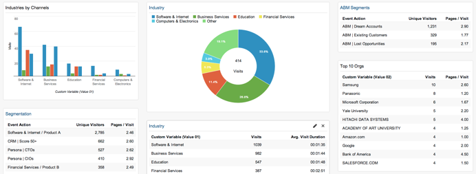

# RTP를 Google Analytics {#integrate-rtp-with-google-analytics}과 통합

>[!NOTE]
>
>유니버설 분석은 이제 운영 표준이며 Google의 모든 속성이 범용 분석으로 업그레이드되었습니다.
>
>이 문서에서는 이전 Google Standard Analytics를 사용하는 방법을 보여주지만 Universal Analytics로 전환하는 것이 좋습니다.
>
>아직 [analytics.js 추적 코드](https://developers.google.com/analytics/devguides/collection/analyticsjs/)를 사용하고 있지 않은 경우 Google에서는 이를 사용하기 위해 사이트에 태그를 다시 지정하는 것이 좋습니다. Google에서 다음 항목을 사용하지 않습니다.
>
>* ga.js
>* urchin.js
>* WAP/서버측 조각
>* YT / MO
>* 사용자 지정 변수
>* 사용자 정의 변수

>
>
유니버설 분석](integrate-rtp-with-google-universal-analytics.md)과 [웹 개인화를 통합하는 방법 보기

## 소개 {#introduction}

Marketing-to-Real-Time Personalization (RTP)에서 Google Analytics(GA) 계정에 이르는 직접 데이터 흐름을 사용하여 새로운 관점에서 웹 분석을 분석할 수 있습니다. 조직, 업계 및 RTP 캠페인에 따라 GA에서 웹 방문을 측정할 수 있습니다. GA의 산업 분야 또는 RTP 세그먼트 유형과 같은 측정 지표를 보고 다양한 트래픽 소스(소셜, 유료, 유기적)에 따라 리드를 수행하고 생성하는 방법, 캠페인의 클릭스루 비율을 분석하고 웹 사이트에 미치는 영향을 측정합니다. 이 기능을 활용하여 RTP 계정의 이점을 최대한 활용할 수 있습니다.

**RTP Audience Analytics**

통합을 통해 GA 계정에 새 차원이 있습니다. RTP는 다음과 같은 기능을 통해 대시보드를 자동으로 향상시킵니다.

1. 조직 및 업계
1. RTP에서 사용자 지정된 세그먼트
1. 계정 기반 마케팅 목록

주요 B2B 잠재 고객에게 초점을 맞춥니다. 대상 산업 분야 및 세그먼트별로 채널을 분석합니다.

## 채널 보고서 {#channel-report}

RTP B2B Dashboard를 사용하면 수직 및 RTP 세그멘테이션에 따라 방문자의 분류를 이해할 수 있습니다. 금융 업계 및 다양한 마케팅 캠페인(유료, 유기, 소셜)에 따라 방문자 성과를 볼 수 있습니다. 또한 대시보드는 RTP 세그먼트가 어떻게 수행되고 있으며 드릴다운 방식을 통해 사이트를 방문하는 상위 조직이 표시되는 방법에 대한 고급 개요를 제공합니다.

## 행동 흐름 {#behavioral-flow}

행동 흐름 보고서(이미지 참조)는 방문자가 한 페이지나 이벤트에서 다음 페이지까지 이동하는 경로를 시각화합니다. 이미지 예는 금융 부문의 모든 방문자의 경로를 보여줍니다. 이 보고서를 사용하면 방문자가 사이트에 계속 참여하는 컨텐츠를 파악할 수 있습니다.

## RTP 성능 {#rtp-performance}

RTP 캠페인을 측정하고 전체 사이트 평균과 관련화합니다. 이러한 캠페인이 웹 사이트 지표에 어떤 영향을 미치는지 알아보고 이 데이터를 사용하여 적합한 타겟에 개인화 노력을 집중할 수 있습니다. 맞춤형 보고서를 생성하여 개인화 캠페인의 성과를 보다 효과적으로 파악할 수 있습니다.

## Google Analytics {#setting-up-rtp-with-google-analytics}으로 RTP 설정

1. GA 계정에 읽기 및 분석 사용자로 이메일 [`[email protected]`](http://docs.marketo.com/cdn-cgi/l/email-protection#0674727628616734466b67746d6372692865696b)을 추가합니다. 자세한 내용은 [여기](https://support.google.com/analytics/answer/2884495?hl=en)를 참조하십시오.
1. RTP 계정에서. **계정 설정**&#x200B;으로 이동합니다.

   

1. **계정 설정**, **도메인** 및 **분석**&#x200B;에서
1. Google Analytics** 클릭합니다.**
1. 관련 **사용자 지정 변수** 및 **이벤트**&#x200B;를 설정하여 이 데이터를 RTP에서 Google Analytics으로 추가합니다.
1. 사용자 지정 변수 데이터를 보낼 **슬롯** 번호를 입력합니다(기본값은 1,2).

**저장**&#x200B;을 클릭합니다.

>[!NOTE]
>
>세그먼트 데이터를 GA로 전송하려면 RTP 플랫폼의 [세그먼트 편집 페이지](/help/marketo/product-docs/web-personalization/using-web-segments/create-a-basic-web-segment.md) 아래에서 세그먼트 일치&#x200B;**의 Google Analytics에 이벤트 보내기 확인란을 선택합니다.**

## RTP 데이터가 {#setting-up-google-analytics-reports-with-rtp-data}인 Google Analytics 보고서 설정

Google Analytics에서 대시보드, GA 세그멘테이션 및 보고를 사용하여 RTP 데이터를 볼 수 있습니다.

* [대시보드](https://support.google.com/analytics/answer/1068216?hl=en) 는 웹 사이트 성능에 대한 개요를 제공합니다.
* GA 세그먼트는 GA 인터페이스에서 방문자를 필터링하고 세그먼트당 트래픽을 보기 위한 것입니다. 세그먼트 [여기에서 ](https://support.google.com/analytics/answer/3124493?hl=en)을(를) 만드는 방법을 참조하십시오.
* 예약된 이메일을 보거나 설정하려면 [사용자 지정된 보고서](https://support.google.com/analytics/answer/1033013?hl=en)를 만듭니다. 사용자 지정 > 새 사용자 지정 보고서에서 을 참조하십시오.
