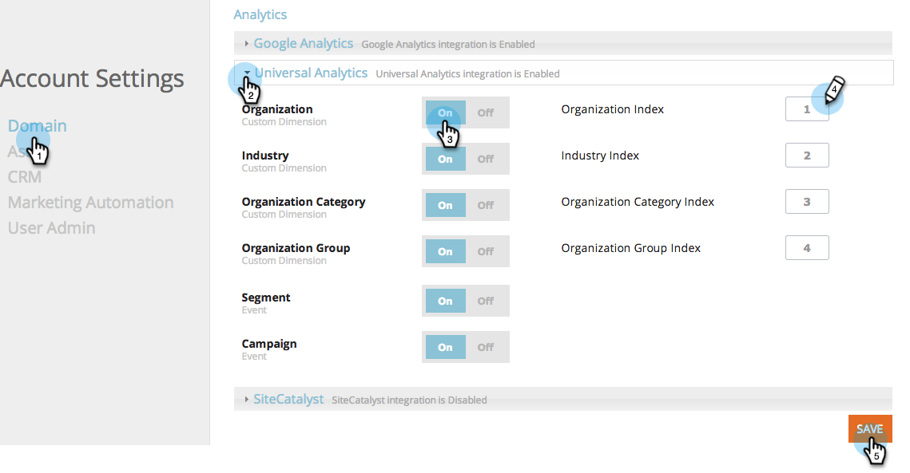

# Google Universal Analytics와 RTP 통합 {#integrate-rtp-with-google-universal-analytics}

## 인트로 {#intro}

Marketo 실시간 개인화(RTP)의 초기 및 개인화 데이터를 사용하여 Google Universal Analytics(GUA)를 활용하여 온라인 마케팅 활동을 보다 효과적으로 측정하고 분석할 수 있습니다.

이 게시물은 Marketo RTP(실시간 개인화) 플랫폼을 Google Universal Analytics(GUA) 계정과 통합하는 방법을 설명합니다. RTP 데이터는 GUA 계정에 추가되어 웹 사이트를 방문하는 조직, 업계, 최초 그래픽 및 RTP 세그먼트의 성능을 보고 볼 수 있습니다.

**Google Universal Analytics**

RTP 데이터가 있는 Google Universal Analytics는 B2B 사용자가 온라인 컨텐츠와 상호 작용하는 방법을 보다 잘 이해하고 개인화 캠페인에서 더 나은 결과를 얻을 수 있도록 지원합니다. [Google Universal Analytics에 대해 자세히 보기](https://support.google.com/analytics/answer/2790010/?hl=en&amp;authuser=1).

>[!NOTE]
>
>**Google Tag Manager 사용자 전용**
>
>코딩 또는 특수 구성을 수행할 필요가 없습니다. 다음 체크리스트를 완료했는지 확인합니다.
>
>* RTP 차원은 Google Universal Analytics에서 만들어집니다
>* [RTP 태그가 Google 태그 관리자에 제대로 설치되어 있습니다](https://docs.marketo.com/display/public/DOCS/Implementing+RTP+using+Google+Tag+Manager)
>* Google Universal Analytics 통합이 RTP의 계정 설정에서 활성화되어 있습니다
>* [Google 범용 Analytics 태그가 Google 태그 관리자에서 제대로 구성되어 있습니다](https://support.google.com/tagmanager/answer/6107124?hl=en)
>* [Google 태그 관리자 태그가 웹 사이트에 제대로 설치되어 있습니다](https://developers.google.com/tag-manager/quickstart)

## GUA에서 사용자 지정 Dimension 설정 {#set-up-custom-dimensions-in-gua}

1. Google Analytics에서,

   1. 이동 **관리**
   1. 을(를) 선택합니다 **계정.**
   1. 을(를) 선택합니다 **속성.**
   1. 선택 **사용자 지정 정의** 및 **사용자 지정 Dimension**.
      

1. 새 사용자 지정 차원을 추가합니다. 클릭 **+새 사용자 지정 Dimension**

   

1. 다음을 추가합니다 **사용자 지정 Dimension:**

<table> 
 <tbody> 
  <tr> 
   <td>
<strong>사용자 지정 Dimension 이름</strong>
</td> 
   <td>
<strong>범위</strong>
</td> 
   <td>
<strong>활성</strong>
</td> 
  </tr> 
  <tr> 
   <td>
<strong>RTP-조직</strong>
</td> 
   <td>
Session
</td> 
   <td>
✓
</td> 
  </tr> 
  <tr> 
   <td>
<strong>RTP-Industry</strong>
</td> 
   <td>
Session
</td> 
   <td>
✓
</td> 
  </tr> 
  <tr> 
   <td>
<strong>RTP-범주</strong>
</td> 
   <td>
Session
</td> 
   <td>
✓
</td> 
  </tr> 
  <tr> 
   <td>
<strong>RTP-그룹</strong>
</td> 
   <td>
Session
</td> 
   <td>
✓
</td> 
  </tr> 
 </tbody> 
</table>

>[!NOTE]
>
>**사용자 지정 Dimension 이름** 는 위의 표에 정의된 대로 정확히 여야 합니다. 그렇지 않으면 사용자 지정 RTP 대시보드가 표시되고 GUA의 보고서가 올바르게 표시되지 않습니다.

1. 추가 **이름**. 범위를 다음으로 선택 **Session**. Click **Create**.

   

사용자 지정 Dimension 목록은 다음과 같습니다.

GUA에서 사용자 지정 Dimension을 활성화한 후 RTP 플랫폼으로 이동하여 RTP 내에서 이러한 차원을 활성화합니다.

## RTP 계정에서 GUA 통합 활성화 {#activate-the-gua-integration-in-your-rtp-account}

1. RTP 플랫폼에서 **계정 설정.**

   

1. 아래 **계정 설정**&#x200B;를 클릭합니다. **도메인**.
1. 아래 **Analytics**&#x200B;를 클릭합니다. **Google Universal Analytics**.
1. 회전 **설정** 관련 사용자 지정 Dimension 및 이벤트를 사용하여 이 데이터를 RTP에서 Google Universal Analytics에 추가합니다.
1. 을(를) 입력합니다. **인덱스 번호** 값이 GUA의 색인 번호와 정렬되었습니다.
1. 클릭 **저장**.

>[!NOTE]
>
>사용자 지정 Dimension의 색인 번호는 사용자 지정 Dimension 아래의 GUA에서 찾을 수 있습니다.
>
>예: RTP-산업 인덱스 번호는 1이고, RTP-조직 인덱스 번호는 2입니다.

## Google Analytics에서 이전 대시보드 제거 {#remove-old-dashboards-in-google-analytics}

1. Google Analytics. 이동 **보고.**
1. 클릭 **대시보드.**
1. 선택 **대시보드** (RTP B2B 또는 RTP 성능)
1. 클릭 **대시보드 삭제**.

