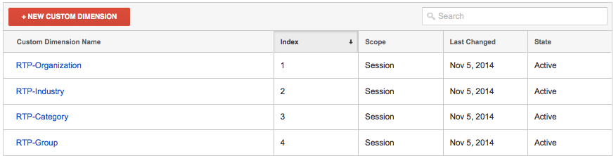

# RTP와 [!DNL Google Universal Analytics] 통합 {#integrate-rtp-with-google-universal-analytics}

## 소개 {#intro}

[!DNL Google Universal Analytics]&#x200B;(GUA)를 [!DNL Marketo Real-Time Personalization]의 (RTP) 그래픽 및 개인화 데이터와 함께 활용하여 온라인 마케팅 활동을 더 잘 측정하고 분석할 수 있습니다.

이 게시물에서는 [!DNL Marketo Real-Time Personalization]&#x200B;(RTP) 플랫폼을 설정하고 [!DNL Google Universal Analytics]&#x200B;(GUA) 계정과 통합하는 방법을 설명합니다. RTP 데이터를 GUA 계정에 추가하여 웹 사이트를 방문하는 조직, 업계, 펌웨어 및 RTP 세그먼트의 성능을 보고 확인할 수 있습니다.

**[!DNL Google Universal Analytics]**

RTP의 데이터가 있는 [!DNL Google Universal Analytics]을(를) 사용하면 B2B 사용자가 온라인 컨텐츠와 상호 작용하는 방법을 더 잘 이해하고 개인화 캠페인을 측정하여 더 나은 결과를 얻을 수 있습니다. [자세한 정보 [!DNL Google Universal Analytics]](https://support.google.com/analytics/answer/2790010/?hl=en&authuser=1).

>[!NOTE]
>
>**Google 태그 관리자 전용**
>
>코딩이나 특수 구성을 수행할 필요가 없습니다. 다음 체크리스트를 완료하십시오.
>
>* RTP 차원이 [!DNL Google Universal Analytics]에 만들어집니다.
>* [RTP 태그가 Google Tag Manager에 올바르게 설치되어 있습니다](https://docs.marketo.com/display/public/DOCS/Implementing+RTP+using+Google+Tag+Manager)
>* RTP의 계정 설정에서 [!DNL Google Universal Analytics] 통합이 활성화되어 있습니다.
>* [[!DNL Google Universal Analytics] 태그가 Google 태그 관리자에서 올바르게 구성되었습니다](https://support.google.com/tagmanager/answer/6107124?hl=en)
>* [웹 사이트에 Google Tag Manager 태그가 올바르게 설치되었습니다](https://developers.google.com/tag-manager/quickstart)

## GUA에서 사용자 지정 차원 설정 {#set-up-custom-dimensions-in-gua}

1. Google Analytics,

   1. **[!UICONTROL Admin]**(으)로 이동
   1. **[!UICONTROL Account].** 선택
   1. **[!UICONTROL Property].** 선택
   1. **[!UICONTROL Custom Definitions]** 및 **[!UICONTROL Custom Dimensions]**&#x200B;을(를) 선택합니다.
      

1. 새 사용자 지정 차원을 추가합니다. **[!UICONTROL +New Custom Dimension]**&#x200B;를 클릭합니다.

   

1. **[!UICONTROL Custom Dimensions]:** 추가

<table>
 <tbody>
  <tr>
   <td>
<strong>사용자 지정 Dimension 이름</strong>
</td>
   <td>
<strong>범위</strong>
</td>
   <td>
<strong>활성</strong>
</td>
  </tr>
  <tr>
   <td>
<strong>RTP-조직</strong>
</td>
   <td>
Session
</td>
   <td>
✓
</td>
  </tr>
  <tr>
   <td>
<strong>RTP-업계</strong>
</td>
   <td>
Session
</td>
   <td>
✓
</td>
  </tr>
  <tr>
   <td>
<strong>RTP 범주</strong>
</td>
   <td>
Session
</td>
   <td>
✓
</td>
  </tr>
  <tr>
   <td>
<strong>RTP 그룹</strong>
</td>
   <td>
Session
</td>
   <td>
✓
</td>
  </tr>
 </tbody>
</table>

>[!NOTE]
>
>**사용자 지정 Dimension 이름**&#x200B;은(는) 위의 표에 정의된 대로 정확히 정의되어야 합니다. 그렇지 않으면 GUA의 사용자 지정 RTP 대시보드 및 보고서가 올바르게 표시되지 않습니다.

1. **[!UICONTROL Name]** 추가. 범위를 **[!UICONTROL Session]**(으)로 선택하십시오. **[!UICONTROL Create]**&#x200B;를 클릭합니다.

   

사용자 지정 Dimension 목록은 다음과 같아야 합니다.

GUA에서 사용자 정의 차원을 활성화한 후 RTP 플랫폼으로 이동하여 RTP 내에서 이러한 차원을 활성화합니다.

## RTP 계정에서 GUA 통합 활성화 {#activate-the-gua-integration-in-your-rtp-account}

1. RTP 플랫폼에서 **[!UICONTROL Account Settings].**(으)로 이동합니다

   

1. **[!UICONTROL Account Settings]**&#x200B;에서 **[!UICONTROL Domain]**&#x200B;을(를) 클릭합니다.
1. **[!UICONTROL Analytics]**&#x200B;에서 **[!UICONTROL Google Universal Analytics]**&#x200B;을(를) 클릭합니다.
1. 관련 사용자 지정 차원 및 이벤트를 **[!UICONTROL On]**&#x200B;하여 RTP에서 [!DNL Google Universal Analytics]&#x200B;(으)로 이 데이터를 추가합니다.
1. GUA에서 색인 번호와 정렬된 차원의 **[!UICONTROL Index number]**&#x200B;을(를) 입력하십시오.
1. **[!UICONTROL Save]**&#x200B;를 클릭합니다.

>[!NOTE]
>
>사용자 지정 Dimension의 색인 번호는 사용자 지정 차원 아래의 GUA에 있습니다.
>
>예: RTP-Industry Index Number 는 1, RTP-Organization Index Number 는 2 입니다.

## Google Analytics에서 이전 대시보드 제거 {#remove-old-dashboards-in-google-analytics}

1. Google Analytics. **[!UICONTROL Reporting].**(으)로 이동
1. **[!UICONTROL Dashboards].** 클릭
1. **[!UICONTROL Dashboard]**(RTP B2B 또는 RTP 성능) 선택
1. **[!UICONTROL Delete Dashboard]**&#x200B;를 클릭합니다.

