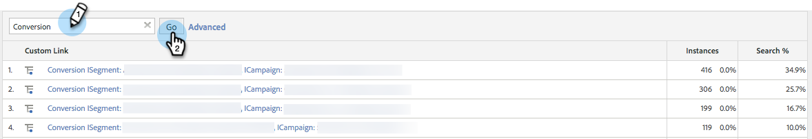

# Adobe Analytics과 통합 {#integrate-with-adobe-analytics}

## 소개 {#intro}

Adobe Analytics 계정 내에서 조직, 업계 및 [!DNL Marketo Real-Time Personalization]&#x200B;(RTP) 캠페인 데이터를 보고 B2B 관점에서 웹 분석을 분석합니다.

이 문서는 [!DNL Marketo Real-Time Personalization]&#x200B;(RTP)과 Adobe Adobe Analytics 간의 통합을 활성화합니다. RTP의 데이터를 사용하면 사이트를 방문하는 모든 업계 세그먼트 및 조직의 트렌드를 감지하고 분석하고 RTP 캠페인의 효과를 측정하여 최적의 결과를 얻을 수 있는 통찰력과 분석을 제공할 수 있습니다.

각 세그먼트의 신규 방문자 수와 재방문자 수 등의 지표를 보고, 캠페인에 대한 클릭률을 분석하고, 최고의 전환 리드를 생성한 업계 및 사용자 정의 세그먼트와 실시간 캠페인을 발견하여 이를 달성할 수 있습니다. 이 기능을 활용하여 RTP 계정의 최대 이점을 얻으십시오.

## RTP AUDIENCE ANALYTICS {#rtp-audience-analytics}

RTP - AA 통합을 사용하면 웹 분석 인터페이스 내에 새 차원이 있습니다. RTP는 다음을 통해 웹 분석 대시보드를 자동으로 향상시킵니다.

1. 조직 및 업계 데이터
1. 사용자 지정된 RTP 세그먼트
1. 명명된 계정 목록(Account-Based Marketing)

이렇게 하면 B2B 데이터가 향상되고, 다음을 최적화하여 관련 방문자에 집중할 수 있습니다.

1. 아웃바운드 채널
1. 콘텐츠
1. 리타기팅

## 채널 보고서 {#channel-report}

RTP 대시보드는 세로 및 RTP 세그먼트에 따른 방문자 분류를 이해하는 데 도움이 됩니다. 업종에 따른 방문자 실적과 해당 업종과 관련된 다양한 마케팅 캠페인(유료, 유기, 소셜)을 볼 수 있습니다. 또한 대시보드는 방문자가 업계 유형에 따라 보고 있는 사이트 섹션에 대한 높은 수준의 개요를 제공합니다.

## 동작 보고서 {#behavioral-report}

조직, 업계 및 RTP 세그먼트 데이터를 기반으로 Adobe Analytics에서 다양한 동작 보고서를 만들 수 있습니다. 이러한 흐름 보고서는 방문자가 한 페이지 또는 이벤트에서 다음 페이지로 이동하는 경로를 시각화합니다. 이 보고서는 방문자가 사이트에 계속 참여할 수 있는 콘텐츠를 찾는 데 도움이 될 수 있습니다.

## RTP 성능 {#rtp-performance}

Adobe Analytics의 사용자 지정 링크에서 RTP 캠페인 노출 횟수 및 전환을 봅니다.

이 사용자 지정 링크 보고서는 다음 이름 지정 형식으로 캠페인의 노출 횟수 및 변환 횟수를 보여줍니다.

* 노출 ISegment: [RTP 세그먼트 이름], ICcampaign: [RTP 캠페인 이름]
* 전환 ISegment: [RTP 세그먼트 이름], ICcampaign: [RTP 캠페인 이름]

## Adobe Analytics에서 설정 {#set-up-in-adobe-analytics}

통합에서는 Adobe Analytics이 제공하는 JavaScript API를 사용합니다. 사용자 지정 전환 변수(eVar), 사용자 지정 이벤트(이벤트) 및 트래픽 변수가 통합에 사용됩니다. 모든 은(는) AA 관리자 내에서 활성화되어야 합니다. RTP에서 전환 변수, 사용자 지정 이벤트 및 트래픽 변수를 설정해야 합니다. 그렇지 않으면 RTP에서 데이터를 활성화하더라도 세트에서 데이터를 볼 수 없습니다.

다음 단계를 완료하여 AA에서 이러한 변수를 설정합니다.

1. AA 계정의 **[!UICONTROL Admin Tools]**(으)로 이동합니다.
1. 통합에 사용할 **[!UICONTROL Report Suite]**&#x200B;을(를) 선택하십시오.
1. **[!UICONTROL Edit Settings]**&#x200B;에서 **[!UICONTROL Conversion]**(으)로 이동하여 **[[!UICONTROL Conversion Variables]](https://microsite.omniture.com/t2/help/en_US/reference/#Edit_conversion_variables)**&#x200B;을(를) 선택합니다.\
   [전환 변수](https://microsite.omniture.com/t2/help/en_US/reference/#Conversion_Variables_eVar) 번호를 선택하십시오(권장).

   1. 업계 사용자 정의 전환용 Evar # 20
   1. 조직 사용자 정의 전환에 대한 Evar # 21

   >[!NOTE]
   >
   >이 #을 사용하는 경우 사용 가능한 다른 숫자를 선택하십시오. 이 숫자를 RTP 계정 설정의 슬롯 번호에 맞춥니다.

   1. 상태를 _[!UICONTROL Enabled_]&#x200B;(으)로 변경합니다.

      1. 이름을 **Industry** 및 **Organization**(으)로 변경하십시오. (이것이 보고서 세트에 표시되는 방식입니다.)

      1. 다음 시기 이후에 만료 필드를 **[!UICONTROL Visit]**(으)로 변경합니다.

1. **[!UICONTROL Edit Settings]**&#x200B;에서 **[!UICONTROL Conversion]**(으)로 이동하여 **[[!UICONTROL Success Events]](https://microsite.omniture.com/t2/help/en_US/reference/#Configure_success_events)**&#x200B;을(를) 선택합니다.

   1. 사용자 지정 성공 이벤트 이벤트 이벤트 번호를 선택합니다(권장).

      1. RTP 캠페인용 event20
      1. rtp 세그먼트에 대한 event21

      >[!NOTE]
      >
      >이 #을 사용하는 경우 사용 가능한 다른 숫자를 선택하십시오. 이 숫자를 RTP 계정 설정의 슬롯 번호에 맞춥니다.

      1. 두 이벤트 이름을 **RTP 캠페인** 및 **RTP 세그먼트**(으)로 변경합니다. 보고서 세트에 표시되는 이름입니다.

   1. 형식 필드를 **카운터(하위 관계 없음)로 선택**

1. **[!UICONTROL Edit Settings]**&#x200B;에서 **[트래픽](https://microsite.omniture.com/t2/help/en_US/reference/#Traffic_Variable)**(으)로 이동하여 **[트래픽 변수](https://microsite.omniture.com/t2/help/en_US/reference/#Enable_traffic_variable_reports)**&#x200B;를 선택합니다.

   1. 트래픽 변수 속성 번호 를 선택합니다(권장).

      1. 속성 # 20 - 이름: RTP 세그먼트 조직
      1. 속성 # 21 - 이름: RTP 세그먼트 업계
      1. 속성 # 25 - 이름: 캠페인 조직
      1. 속성 # 26 - 이름: RTP Campaign 업계

      >[!NOTE]
      >
      >이 #을 사용하는 경우 사용 가능한 다른 숫자를 선택하십시오. 이 숫자를 RTP 계정 설정의 슬롯 번호에 맞춥니다.)

      1. 4개의 속성 이름을 변경합니다. 보고서 세트에 표시되는 이름입니다.

   1. [!UICONTROL Enabled]에 대한 **[!UICONTROL Enabled]** 필드를 선택하십시오.

   1. [!UICONTROL Path Reports]에 대한 **[!UICONTROL Enabled]** 필드를 선택하십시오.

## [!DNL Marketo Real-Time Personalization]&#x200B;(RTP)에서 설정 {#set-up-in-marketo-real-time-personalization-rtp}

1. RTP 플랫폼에서 **[!UICONTROL Account Settings]**(으)로 이동합니다.

   

1. **[!UICONTROL Account Settings]**&#x200B;에서 **[!UICONTROL Domain]**&#x200B;을(를) 클릭합니다.
1. **[!UICONTROL Analytics]**&#x200B;에서 **Adobe Analytics**&#x200B;을(를) 클릭합니다.
1. 전환, 사용자 지정 및 트래픽 변수를 전환하여 **[!UICONTROL On]**&#x200B;을(를) 설정합니다.
1. AA에서 만든 슬롯 번호와 일치하도록 전환, 이벤트 및 트래픽 변수 **슬롯 번호**&#x200B;를 할당하십시오.
1. **[!UICONTROL Save]**&#x200B;을(를) 클릭합니다.

>[!NOTE]
>
>권장되는 슬롯 설정은 다음과 같습니다.
>
>**전환 변수**
>
>* [!UICONTROL Industry Custom Conversions] - 슬롯 20
>* [!UICONTROL Organization Custom Conversions] - 슬롯 21
>
>**사용자 지정 이벤트**
>
>* [!UICONTROL Campaign Custom Event] - 슬롯 20
>* [!UICONTROL Segment Custom Event] - 슬롯 21
>
>**트래픽 변수**
>
>* [!UICONTROL Segment Organization Traffic Variable] - 슬롯 20
>* [!UICONTROL Segment Industry Traffic Variable] - 슬롯 21
>* [!UICONTROL Campaign Organization Traffic Variable] - 슬롯 22
>* [!UICONTROL Campaign Industry Traffic Variable] - 슬롯 23
>
>**이 슬롯 번호가 AA에서 만들어진 변수 및 이벤트 번호와 일치하는지 확인하십시오.**

## 보고서 {#reports}

조직 이름, 업계 및 RTP 세그먼트 및 실시간 캠페인 데이터에 따라 향상된 SiteAdobe Analytics 보고서를 만듭니다.

AA의 맞춤화된 보고서 및 대시보드의 예는 다음과 같습니다.

* 업계 또는 정의된 세그먼트별 성능(계정 기반 명명 목록)
* KPI 성과별 업계 분류
* 조직당 본 페이지 수
* 조직, 업계, 세그먼트에 따른 마케팅 채널 성과

**-보고서 예-**

**주요 업종 보고서**

**조직 보고서**

**RTP 대시보드 만들기**

[RTP 대시보드](https://microsite.omniture.com/t2/help/en_US/sc/user/t_dashboard_add.html)라는 **새 대시보드**&#x200B;를 만듭니다. 이 대시보드는 세로 및 RTP 세그먼트에 따른 방문자 분류를 이해하는 데 도움이 됩니다.

1. **[!UICONTROL Dashboard]을(를) 클릭하고**&#x200B;을(를) 클릭한 다음 **[!UICONTROL Add Dashboard]**&#x200B;을(를) 클릭합니다.

1. 대시보드 이름을 **RTP 대시보드**&#x200B;로 지정합니다.

1. **대시보드 크기** 3 x 2, 2 x 2를 선택합니다.

1. [reportlet](https://microsite.omniture.com/t2/help/en_US/sc/user/t_dashboard_add_report.html#task_EC3AFBBAA51C45CEBAF632F841C305B3)을(를) 만들고 [콘텐츠를 대시보드에 추가](https://docs.marketo.com/Add%2520content%2520to%2520a%2520dashboard)합니다.

대시보드에 업계 Reportlet 추가

1. **[!UICONTROL Custom Conversions]**(으)로 이동하고 **[!UICONTROL Industry]**&#x200B;을(를) 클릭합니다.

1. 그래프를 **원형 차트**&#x200B;에 구성합니다.

1. **[!UICONTROL Dashboard]**&#x200B;을(를) 클릭하고 **[!UICONTROL Reportlet]**&#x200B;을(를) 추가합니다.

1. 보고서 이름을 **주요 업종**&#x200B;으로 지정합니다.

1. 대시보드 **RTP 대시보드**&#x200B;에 배치합니다.

1. **새로 만들기**&#x200B;를 만듭니다.

대시보드에 세그먼트 Reportlet 추가

1. **[!UICONTROL Site Metrics]**(으)로 이동합니다. **[!UICONTROL Custom Events]**, **[!UICONTROL Segments]**&#x200B;을(를) 클릭합니다.

1. 그래프를 **세로 막대**&#x200B;로 구성합니다.

1. **[!UICONTROL Dashboard]**&#x200B;을(를) 클릭하고 **[!UICONTROL Reportlet]**&#x200B;을(를) 추가합니다.

1. 보고서 이름을 **상위 세그먼트**&#x200B;로 지정합니다.

1. 대시보드 **RTP 대시보드**&#x200B;에 배치합니다.

1. **새로 만들기**&#x200B;를 만듭니다.

reportlet이 대시보드에 표시됩니다.

## Adobe Analytics에서 노출 횟수 및 클릭 수(전환) 보기 {#view-impressions-and-clicks-conversions-in-adobe-analytics}

1. **[!UICONTROL Custom]개의 링크**&#x200B;를 클릭합니다.

   

1. 캠페인 노출 횟수를 나타내는 세그먼트 및 캠페인 이름을 보려면 노출 횟수를 검색합니다.\
   

1. 캠페인 클릭 수를 나타내는 세그먼트 및 캠페인 이름을 보기 위해 전환을 검색합니다.

   
