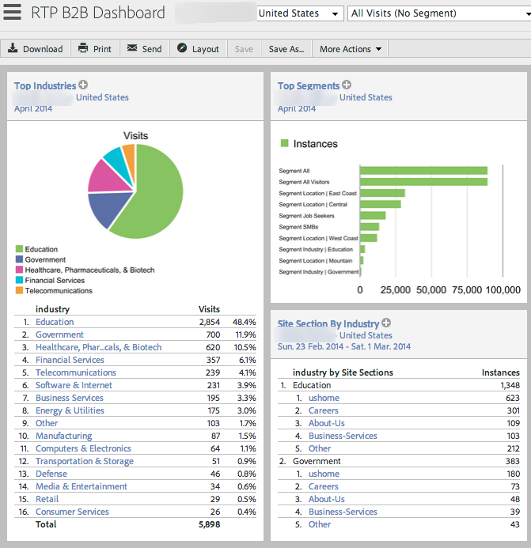
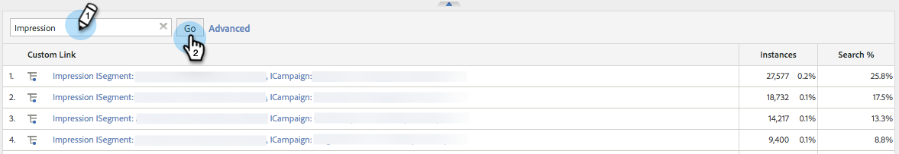

# Adobe Analytics과 통합 {#integrate-with-adobe-analytics}

## 인트로 {#intro}

Adobe Analytics 계정 내에서 조직, 업계 및 RTP(Marketing to Real-Time Personalization) 캠페인 데이터를 확인하여 B2B 관점에서 웹 분석을 분석할 수 있습니다.

이 문서에서는 Marketing to Real-Time Personalization(RTP)과 Adobe Adobe Analytics 간의 통합을 지원합니다. RTP의 데이터를 사용하면 사이트를 방문하는 모든 업계 세그먼트 및 조직의 트렌드를 검색 및 분석하고 RTP 캠페인의 효과를 측정할 수 있으며 최적의 결과를 얻을 수 있는 통찰력과 분석을 제공할 수 있습니다.

각 세그먼트에서 신규 방문자와 재방문자 수 등의 지표를 살펴보고, 캠페인의 클릭 비율을 분석하고, 전환율이 가장 높은 업계 및 사용자 지정된 세그먼트 및 실시간 캠페인을 검색하여 이를 달성할 수 있습니다. 이 기능을 활용하여 RTP 계정의 이점을 최대한 활용할 수 있습니다.

## RTP Audience Analytics {#rtp-audience-analytics}

RTP - AA 통합을 통해 웹 분석 인터페이스 내에 새로운 차원이 있습니다. RTP는 다음을 통해 웹 분석 대시보드를 자동으로 향상시킵니다.

1. 조직 및 업계 데이터
1. 사용자 지정된 RTP 세그먼트
1. 지정된 계정 목록(계정 기반 마케팅)

이를 통해 B2B 데이터가 향상되고 다음을 최적화하여 관련 방문자에 집중할 수 있습니다.

1. 아웃바운드 채널
1. 컨텐츠
1. 재타깃팅

## 채널 보고서 {#channel-report}

RTP 대시보드는 수직 및 RTP 세그먼트에 따라 방문자의 분류를 이해하는 데 도움이 됩니다. 해당 업계와 관련된 업계 및 다양한 마케팅 캠페인(유료, 유기, 소셜)에 따라 방문자 성과를 볼 수 있습니다. 또한 대시보드는 방문자가 업계 유형에 따라 보고 있는 사이트 섹션에 대한 고급 개요를 제공합니다.

## 행동 보고서 {#behavioral-report}

조직, 업계 및 RTP 세그먼트 데이터를 기반으로 Adobe Analytics에서 다양한 행동 보고서를 만들 수 있습니다. 이러한 흐름 보고서는 방문자가 한 페이지 또는 이벤트에서 다음 페이지로 이동하는 경로를 시각화합니다. 이 보고서는 방문자가 사이트에 계속 참여하는 컨텐츠를 찾는 데 도움이 됩니다.

## RTP 성능 {#rtp-performance}

Adobe Analytics의 사용자 지정 링크에서 RTP 캠페인 노출 횟수 및 전환을 봅니다.

이 사용자 지정 링크 보고서는 다음 명명 형식으로 캠페인의 노출 및 전환을 보여줍니다.

* 노출 ISegment: [RTP 세그먼트 이름], 캠페인: [RTP 캠페인 이름]
* 전환 ISegment: [RTP 세그먼트 이름], 캠페인: [RTP 캠페인 이름]

## Adobe Analytics 설치 {#set-up-in-adobe-analytics}

통합은 Adobe Analytics이 제공하는 JavaScript API를 사용합니다. 사용자 지정 전환 변수(eVar), 사용자 지정 이벤트(이벤트) 및 트래픽 변수가 통합에 사용됩니다. 모든 것은 관리자 내에서 활성화해야 합니다. A에서 전환 변수, 사용자 지정 이벤트 및 트래픽 변수를 설정해야 합니다. 그렇지 않으면 RTP에서 활성화한 경우에도 세트에서 데이터를 볼 수 없습니다.

다음 단계를 완료하여 AA에서 이러한 변수를 설정합니다.

1. AA **계정의** 관리 툴로 이동합니다.
1. 통합에 사용할 **보고서** 세트를 선택합니다.
1. 설정 **편집에서** **전환으로** 이동하고 ** [전환 변수](http://microsite.omniture.com/t2/help/en_US/reference/#Edit_conversion_variables)**를 선택합니다.\
   전환 [변수](http://microsite.omniture.com/t2/help/en_US/reference/#Conversion_Variables_eVar) 번호를 선택합니다(권장).

   1. 

      1. 업계 사용자 지정 전환을 위한 Evar 번호 20
      1. 조직 사용자 지정 전환용 Evar 번호 21

         >[!NOTE]
         >
         >이러한 번호를 선택한 경우 다른 사용 가능한 번호를 선택합니다. 이 숫자를 RTP 계정 설정의 슬롯 번호와 맞춥니다.

      1. 상태 변경을* 활성화됨으로 변경*

         1. 이름을 **업계** 및 **조직으로**&#x200B;변경합니다. 보고서 세트에 표시되는 방식입니다.

         1. 종료 후 필드를 **방문으로 변경합니다.**

1. **설정 편집 **아래에서**&#x200B;전환으로&#x200B;**이동하고 ** [성공 이벤트를 선택합니다](http://microsite.omniture.com/t2/help/en_US/reference/#Configure_success_events)**.

1. 사용자 지정 성공 이벤트 이벤트 이벤트 번호를 선택합니다(권장).

   1. event20 for RTP 캠페인
   1. event21 for RTP Segments

      >[!NOTE]
      >
      >이러한 번호를 선택한 경우 다른 사용 가능한 번호를 선택합니다. 이 숫자를 RTP 계정 설정의 슬롯 번호와 맞춥니다.

   1. 두 이벤트 이름을 **RTP 캠페인** 및 **RTP 세그먼트로 변경합니다**. 보고서 세트에 표시되는 이름입니다.

1. 카운터(하위 관계 없음)로 **지정할 유형* *필드를 선택합니다.**

1. 설정 **편집** 아래에서 ** 트래픽 [으로](http://microsite.omniture.com/t2/help/en_US/reference/#Traffic_Variable) 이동하고 ** **트래픽 변수를 [선택합니다](http://microsite.omniture.com/t2/help/en_US/reference/#Enable_traffic_variable_reports)**.

   1. 트래픽 변수 속성 번호 선택(권장):

      1. 속성 번호 20 - 이름:RTP 세그먼트 조직
      1. 속성 번호 21 - 이름:RTP 세그먼트 산업
      1. 속성 번호 25 - 이름:캠페인 조직
      1. 속성 번호 26 - 이름:RTP Campaign Industry

         >[!NOTE]
         >
         >이러한 번호를 선택한 경우 다른 사용 가능한 번호를 선택합니다. 이 숫자를 RTP 계정 설정의 슬롯 번호와 맞춥니다.)

      1. 4 속성 이름을 변경합니다. 보고서 세트에 표시되는 이름입니다.
   1. 활성화할 사용 필드 **선택**
   1. 활성화할 경로 보고서 필드 **선택**

## Marketing to Real-Time Personalization(RTP)에서 설정 {#set-up-in-marketo-real-time-personalization-rtp}

1. RTP 플랫폼에서 **계정 설정으로 이동합니다**.

   

1. 계정 **설정**&#x200B;아래에서 **도메인을 클릭합니다**.
1. [ **분석]에서** Adobe Analytics을 클릭합니다 ****.
1. **On **전환, 사용자 지정 및 트래픽 변수를 전환합니다.
1. 전환, 이벤트 및 트래픽 변수 **슬롯 번호를** AA에서 만든 슬롯 번호와 일치하도록 지정
1. 저장을 **클릭합니다**.

>[!NOTE]
>
>권장되는 슬롯 설정은
>
>**전환 변수**
>
>* 업계 사용자 지정 전환 - 슬롯 20
>* 조직 사용자 지정 전환 - 슬롯 21

>
>
**사용자 지정 이벤트**
>
>* 캠페인 사용자 지정 이벤트 - 슬롯 20
>* 세그먼트 사용자 지정 이벤트 - 슬롯 21

>
>
**트래픽 변수**
>
>* 세그먼트 조직 트래픽 변수 - 슬롯 20
>* 세그먼트 산업 트래픽 변수 - 슬롯 21
>* 캠페인 조직 트래픽 변수 - 슬롯 22
>* 캠페인 산업 트래픽 변수 - 슬롯 23

>
>
**이러한 슬롯 번호가 AA에서 만든 변수 및 이벤트 번호와 일치하는지 확인합니다.**

## 보고서 {#reports}

조직 이름, 업계 및 RTP 세그먼트 및 실시간 캠페인 데이터에 따라 향상된 SiteAdobe Analytics 보고서를 만듭니다.

AA에서 사용자 지정된 보고서와 대시보드의 예는 다음과 같습니다.

* 업계별 또는 정의된 세그먼트별 성과(계정 기반 명명된 목록)
* KPI 성과당 업계 분류
* 조직별로 본 페이지
* 조직, 업계, 세그먼트에 따른 마케팅 채널 성과

**보고서 예**

**주요 산업 보고서**

** 

**

**조직 보고서**

**RTP 대시보드 만들기**

RTP Dashboard라고 하는 [새](http://microsite.omniture.com/t2/help/en_US/sc/user/t_dashboard_add.html)대시보드를 **만듭니다**. 이 대시보드는 수직 및 RTP 세그먼트에 따라 방문자의 분류를 이해하는 데 도움이 됩니다.

1. 대시보드 **를 클릭하고** ** 대시보드 추가를 클릭합니다*

1. 대시보드 **RTP 대시보드 이름 지정**
1. 대시보드 **크기** 3 x 2, 2 x 2 선택
1. reportlet [을](http://microsite.omniture.com/t2/help/en_US/sc/user/t_dashboard_add_report.html#task_EC3AFBBAA51C45CEBAF632F841C305B3) 만들고 [컨텐츠를 대시보드에 추가](https://docs.marketo.com/Add%2520content%2520to%2520a%2520dashboard)

대시보드에 업계 Reportlet 추가

1. 사용자 **지정 전환**&#x200B;으로 이동하고 산업을 **클릭합니다**

1. 파이 차트로 그래프 **구성**
1. 대시보드를 **클릭하고** Reportlet **추가**

1. 보고서 이름 **상위 산업**
1. 대시보드 **RTP 대시보드에 배치**
1. 새로 **만들기**.

대시보드에 세그먼트 Reportlet 추가

1. **사이트 지표로 이동, **사용자 지정 이벤트, **세그먼트를 클릭합니다.**

1. 세로 막대로 그래프 **구성**
1. 대시보드를 **클릭하고** Reportlet **추가**

1. 보고서 이름을 **상위 세그먼트**
1. 대시보드 **RTP 대시보드에 배치**
1. 새로 **만들기.**

reportlet이 대시보드에 표시됩니다.

## Adobe Analytics에서 노출 횟수 및 클릭 수(전환) 보기 {#view-impressions-and-clicks-conversions-in-adobe-analytics}

1. 사용자 지정 링크를 클릭합니다.

   

1. 노출 횟수를 검색하여 캠페인에 대한 노출 횟수를 나타내는 세그먼트 및 캠페인 이름을 봅니다.\
   

1. 전환을 검색하여 캠페인에 대한 클릭 수를 나타내는 세그먼트 및 캠페인 이름을 봅니다.

   

