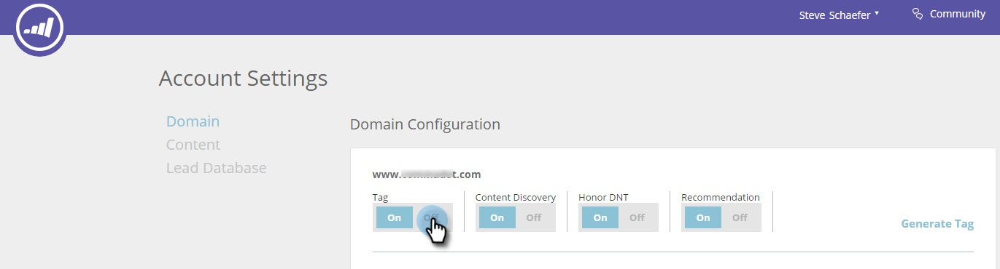

# RTP JavaScript 태그 활성화 또는 비활성화 {#enabling-or-disabling-the-rtp-javascript-tag}

RTP JavaScript 태그는 웹 Personalization이 웹 활동을 추적하는지 또는 웹 사이트에서 캠페인이나 컨텐츠 권장 사항을 실행하는지 여부를 제어합니다.

>[!NOTE]
>
>**웹 사이트의 html 코드에서 태그를 제거할 필요가 없습니다.** [!UICONTROL Account Settings]을(를) 통해 제어합니다.

## 태그 활성화 또는 비활성화 {#enable-or-disable-the-tag}

1. **[!UICONTROL Account Settings]** 으로 이동합니다.

   

1. [!UICONTROL Domain] 및 [!UICONTROL Domain Configuration]의 [!UICONTROL Tag]에서 **[!UICONTROL Off]**&#x200B;을(를) 선택하여 JavaScript 태그를 비활성화합니다.

   

   [!UICONTROL Tag]이(가) [!UICONTROL Off]&#x200B;(으)로 설정되면 JavaScript 코드가 비활성화되고 [!UICONTROL Web Personalization]이(가) 웹 활동을 추적하거나 웹 사이트에서 캠페인이나 콘텐츠 권장 사항을 실행하지 않습니다.

1. RTP 태그를 사용하려면 [!UICONTROL Domain] 및 [!UICONTROL Domain Configuration]의 [!UICONTROL Tag]에서 **[!UICONTROL On]** 전환을 선택합니다.

   진정해.
