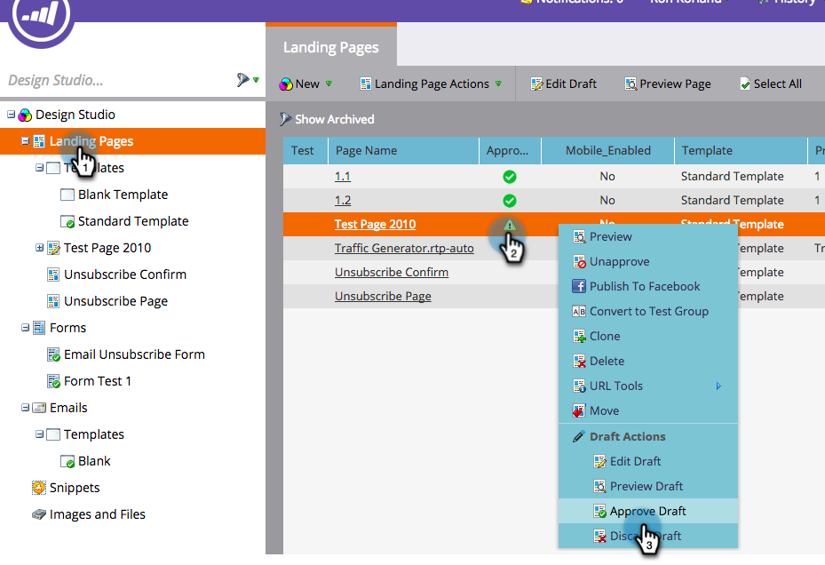

# Marketo 랜딩 페이지에 RTP 구현 {#implementing-rtp-on-marketo-landing-pages}

[!UICONTROL RTP tag]을(를) 구현하려면 아래 설치 지침을 따르십시오.

1. **[!UICONTROL Design Studio].**(으)로 이동 편집할 항목을 엽니다. **[!UICONTROL Template Actions]**&#x200B;을(를) 선택하고 **[!UICONTROL Edit Draft]**&#x200B;을(를) 선택합니다.

   

1. **HTML Source** 탭에서 템플릿을 변경합니다.

   

1. RTP 계정에서 **[!UICONTROL Account Settings]**(으)로 이동합니다.

   a. 지원에서 JavaScript 태그를 이미 받은 경우 5단계로 이동합니다.

   

1. [!UICONTROL Domain]에서 관련 도메인을 찾아 **[!UICONTROL Generate Tag]**&#x200B;을(를) 클릭합니다.

   

   

1. RTP JavaScript 태그를 복사하여 **`<head> </head>`** 태그 사이의 모든 랜딩 페이지 템플릿에 붙여넣습니다.

1. **[!UICONTROL Save]** 및 **[!UICONTROL Close]** 창을 클릭합니다.

1. **[!UICONTROL Design Studio]**(으)로 돌아가서 **[!UICONTROL Template Actions]**&#x200B;에서 랜딩 페이지를 승인하고 **[!UICONTROL Approve]**&#x200B;을(를) 클릭합니다.

   

1. 마지막으로, 템플릿 변경 사항을 적용하려면 해당 템플릿을 사용하는 모든 랜딩 페이지를 **다시 승인**&#x200B;해야 합니다. 기본 [!UICONTROL Landing Pages] 섹션에서 한 번에 모두 다시 승인할 수 있습니다.

   

1. 랜딩 페이지 및 하위 도메인을 포함한 모든 페이지에 표시되는지 확인합니다.

   웹 사이트의 페이지를 마우스 오른쪽 버튼으로 클릭하여 이 작업을 수행할 수 있습니다. **[!UICONTROL View Page Source].**(으)로 이동 태그를 찾으려면 **[!UICONTROL RTP]**&#x200B;을(를) 검색하세요.
