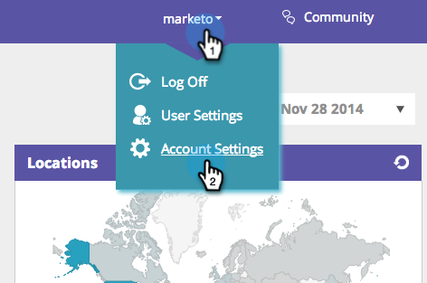

# Wordpress Enterprise에 RTP 구현 {#implementing-rtp-on-wordpress-enterprise}

[!UICONTROL RTP tag]을(를) 구현하려면 아래 설치 지침을 따르십시오.

1. **[!UICONTROL Account Settings]** 으로 이동합니다.

   a. 지원에서 JavaScript 태그를 이미 받은 경우 3단계로 이동합니다.

   

1. [!UICONTROL Domain]에서 관련 도메인을 찾아 **[!UICONTROL Generate Tag]**&#x200B;을(를) 클릭합니다.

   

1. RTP JavaScript 태그를 복사합니다.

1. [!DNL WordPress] 계정에 관리자로 로그인합니다.

   a. **[!UICONTROL Appearance]**&#x200B;에서 **[!UICONTROL Custom JavaScript]**(으)로 이동합니다.
   b. 기존 코드 바로 뒤에 RTP Javascript 태그를 붙여 넣습니다.

   

   >[!CAUTION]
   >
   >코드를 붙여넣을 때 다음 태그를 제외합니다.
   >
   >* `<!-- RTP tag -->`
   >* ``
   >* `<!-- End of RTP tag -->`
   >
   >스크립트 자체만 삽입합니다.

1. **[!UICONTROL Update]**&#x200B;를 클릭합니다.
