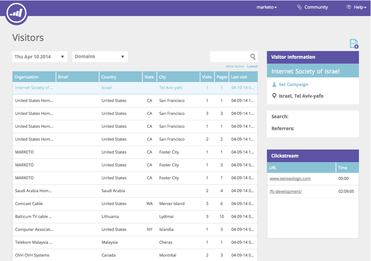
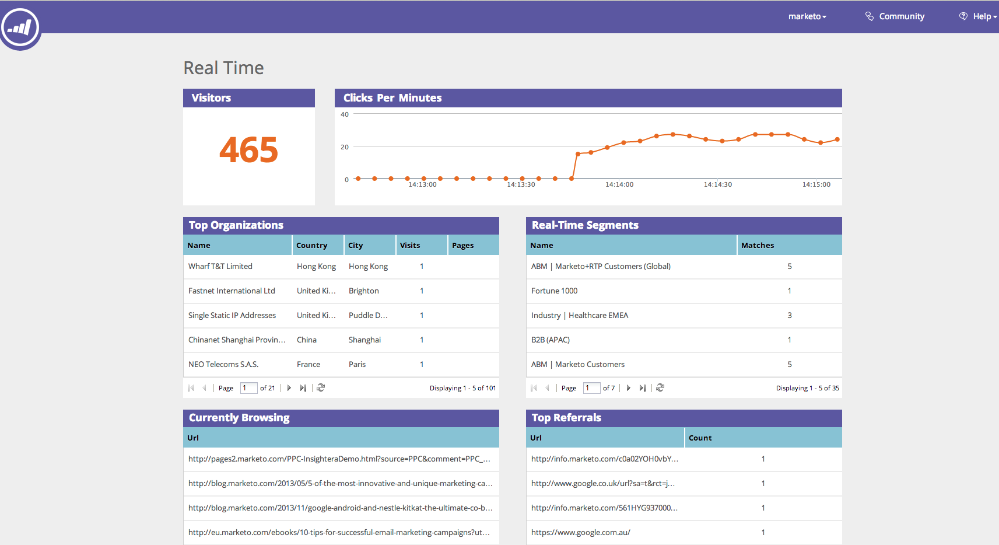

# 웹 개인화 개요 {#web-personalization-overview}

## 소개 {#introduction}

신규 Marketing 고객의 경우 실시간 개인화는 4개의 앱으로 나뉘어 다음 2개의 타일을 사용하여 액세스합니다.웹 개인화 및 콘텐츠`AI`.

 

>[!NOTE]
>
>웹 개인화 및 콘텐츠`AI`는 마케터가 지원하는 모든 언어(영어, 프랑스어, 독일어, 일본어, 포르투갈어, 스페인어)로 사용할 수 있습니다.

기존 고객은 갱신될 때까지 실시간 개인화 타일을 통해 앱을 계속 이용할 수 있으며, 이때 상기의 로그인을 사용하게 됩니다.

웹 개인화 타일을 클릭하면 대시보드 페이지가 나타납니다. 컨텐츠`AI` 타일을 클릭하면 컨텐츠 Recommendations 페이지로 바로 이동합니다.

4개의 앱은 다음과 같습니다.

* 웹 개인화
* 계정 기반 웹 마케팅
* 웹 사이트 리타겟팅
* 내용`AI`

** 웹 개인화 **타일은 개인화된 웹 캠페인을 만들기 위한 액세스 포인트입니다.** **** **계정 기반 웹 마케팅 및 웹 리타겟팅. 컨텐츠 분석 페이지에서 컨텐츠를 추가할 수 있습니다.

**계정 기반 웹 마케팅** 은 웹 개인화 및 계정 지정 기능과 연동됩니다. [지정된 계정] 페이지는 계정 목록뿐만 아니라 기존 고객, 총 참여, 조직 동향에 대한 그래픽 정보를 제공합니다. 여기에서 새 명명된 계정을 만들 수도 있습니다.

**웹 사이트** 리타겟팅은 세분화된 고객을 재마케팅할 수 있는 기능을 제공합니다. 세그먼트를 설정할 수 있지만 필터에서 지정된 계정을 사용할 수 없습니다.

**컨텐츠`AI`** 추천을 제공할 장소가 포함됩니다. 컨텐츠 Recommendations 페이지에 컨텐츠를 쉽게 추가할 수 있습니다.

>[!NOTE]
>
>계정 기반 웹 마케팅 또는 웹 사이트 재타깃팅에 액세스하려면 웹 개인화 앱이 없더라도 웹 개인화 타일을 클릭해야 합니다.

## 조직 {#organizations}

조직 탭에는 지정된 기간 동안 웹 사이트를 방문한 조직의 모든 세부 사항(이름, 위치, 활동 및 타임스탬프)이 표시됩니다. 표는 시간, 위치, 도메인 및 무료 텍스트 검색을 통해 정렬하고 구성할 수 있습니다.

>[!TIP]
>
>&#39;가장 활성화된&#39; 대&#39;최신&#39; - 테이블은 식별된 조직과 인터넷 서비스 제공업체(ISP 아이콘으로 표시됨)가 구성합니다. 다음과 같이 정렬할 수 있습니다.
>
>* 가장 활성화된 항목:페이지 보기 횟수를 기반으로 표에서 가장 활성화된 조직
>* 최신:테이블의 최근 조직(기본값)
>* 중요한 인사이트를 얻으려면 가장 활성화된

>

**조직 - 오른쪽 패널**

조직 페이지의 오른쪽 패널에는 다음 기능과 통찰력이 제공됩니다.

<table> 
 <tbody> 
  <tr> 
   <td>
<strong>스프레드시트 아이콘</strong>:패널의 오른쪽 상단에 있는 이 아이콘은 조직 테이블을 오프라인으로 사용할 수 있도록 CSV 형식으로 다운로드합니다

<strong>이메일 경고 설정</strong>:선택한 조직이 웹 사이트를 방문할 때마다 로그인한 사용자에게 이메일을 보냅니다.

<strong>리드</strong>:선택한 조직에 대한 리드 테이블을 엽니다.

<strong>공유</strong>:웹 페이지를 방문한 조직의 세부 정보를 이메일로 전송하고 공유할 수 있는 팝업 창을 엽니다

<strong>위치 아이콘</strong>:선택한 조직의 국가 및 구/군/시를 표시합니다.

<strong>링크</strong>:Jigsaw, Whois, Linkedin, Google, Twitter는 선택한 조직에 대한 추가 통찰력을 제공하는 각 웹 페이지의 추가 정보가 포함된 새 창을 엽니다

<strong>검색</strong>:방문자가 검색 엔진을 통해 도착한 경우 사용된 키워드를 표시합니다.

<strong>레퍼러</strong>:사이트로 트래픽을 유도한 페이지의 URL 링크를 표시합니다.

<strong>방문자</strong>:방문 횟수, 선택한 조직에서 조회한 페이지 수 및 이메일 주소(제출 양식이 완료된 경우), 마지막 방문 시간 및 날짜를 표시합니다.

<strong>클릭스트림</strong>:사이트의 사용자 활동 및 URL 경로 표와 각 페이지를 방문한 시간 표시
</td> 
   <td></td> 
  </tr> 
 </tbody> 
</table>

**공유 조직**

웹 사이트 방문자의 정보를 동료에게 공유하시겠습니까? 조직을 클릭한 다음 오른쪽 패널에서 공유 링크를 클릭합니다.

이렇게 하면 웹 사이트를 방문한 조직의 이름과 세부 정보를 공유하는 이메일을 보낼 수 있는 이 조직 공유 오버레이가 활성화됩니다.

## 방문자 {#visitors}

방문자 페이지에는 지정된 기간 내에 사이트에 도착한 각 방문자의 모든 세부 사항과 온라인 동작이 표시됩니다. 이 페이지는 각 개별 방문자의 활동 및 온라인 행동에 대한 깊은 통찰력을 제공합니다. 테이블의 방문자 데이터는 24-48시간 이내에 업데이트됩니다.

방문자 페이지의 오른쪽 패널에서는 다음 통찰력을 제공합니다.

<table> 
 <thead> 
  <tr> 
   <th colspan="1" rowspan="1">이름</th> 
   <th colspan="1" rowspan="1">설명</th> 
  </tr> 
 </thead> 
 <tbody> 
  <tr> 
   <td colspan="1" rowspan="1"><strong>스프레드시트 아이콘</strong></td> 
   <td colspan="1" rowspan="1">패널의 오른쪽 상단에 있는 이 아이콘은 방문자 테이블을 오프라인으로 사용할 수 있도록 CSV 형식으로 다운로드합니다</td> 
  </tr> 
  <tr> 
   <td colspan="1" rowspan="1">
<strong>조직명</strong>
</td> 
   <td colspan="1" rowspan="1"> </td> 
  </tr> 
  <tr> 
   <td colspan="1" rowspan="1"><strong>캠페인 설정</strong></td> 
   <td colspan="1" rowspan="1">선택한 방문자와 연결된 캠페인 CTA를 설정할 수 있습니다.</td> 
  </tr> 
  <tr> 
   <td colspan="1"><strong>위치</strong></td> 
   <td colspan="1">방문자의 국가, 주 및 시를 표시합니다.</td> 
  </tr> 
  <tr> 
   <td colspan="1" rowspan="1"><strong>Clickstream</strong></td> 
   <td colspan="1" rowspan="1">사이트의 방문자 활동 및 URL 경로 표와 각 페이지를 방문한 시간 표시</td> 
  </tr> 
 </tbody> 
</table>

## 실시간 {#real-time}

실시간 페이지는 웹 사이트의 방문자를 실시간으로 표시하여 방문자가 일어나는 대로 활동을 측정합니다.

실시간 페이지는 6개의 유용한 온사이트 방문자 세부 정보 표로 분할됩니다.

<table> 
 <thead> 
  <tr> 
   <th colspan="1" rowspan="1">이름</th> 
   <th colspan="1" rowspan="1">설명</th> 
  </tr> 
 </thead> 
 <tbody> 
  <tr> 
   <td colspan="1" rowspan="1"><strong>방문자 수</strong></td> 
   <td colspan="1" rowspan="1"> 현재 웹 사이트에 있는 방문자 수를 나타냅니다.</td> 
  </tr> 
  <tr> 
   <td colspan="1" rowspan="1">
<strong>분당 클릭 수</strong>
</td> 
   <td colspan="1" rowspan="1"> 분당 사이트에 대한 클릭 수를 보여주는 라이브 라인 그래프</td> 
  </tr> 
  <tr> 
   <td colspan="1" rowspan="1"><strong>상위 조직</strong></td> 
   <td colspan="1" rowspan="1">조직 테이블의 짧은 버전</td> 
  </tr> 
  <tr> 
   <td colspan="1"><strong>실시간 세그먼트</strong></td> 
   <td colspan="1">지정된 세그먼트와 일치하는 현재 온사이트 방문자 수</td> 
  </tr> 
  <tr> 
   <td colspan="1"><strong>현재 검색 중</strong></td> 
   <td colspan="1">온사이트 방문자가 현재 보고 있는 페이지의 URL</td> 
  </tr> 
  <tr> 
   <td colspan="1" rowspan="1"><strong>상위 참조</strong></td> 
   <td colspan="1" rowspan="1">방문자를 사이트로 연결시킨 참조 URL</td> 
  </tr> 
 </tbody> 
</table>

