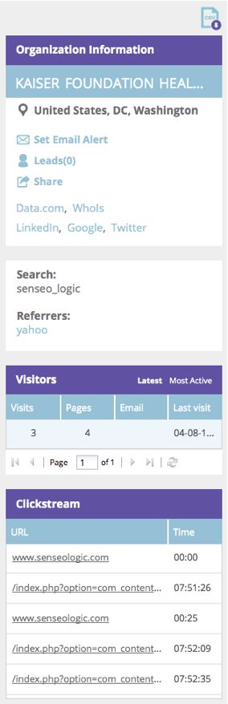

# 웹 Personalization 개요 {#web-personalization-overview}

## 소개 {#introduction}

새 Marketo 고객의 경우 [!UICONTROL Real-Time Personalization]은(는) 다음 두 개의 타일을 사용하여 액세스되는 네 개의 앱으로 나뉩니다. [!UICONTROL Web Personalization] 및 [!UICONTROL ContentAI].

 

>[!NOTE]
>
>[!UICONTROL Web Personalization] 및 [!UICONTROL ContentAI]은(는) 모든 Marketo 지원 언어(영어, 프랑스어, 독일어, 일본어, 포르투갈어, 스페인어)로 제공됩니다.

기존 고객은 갱신 전까지 실시간 Personalization 타일을 통해 앱에 계속 액세스하고 이 때 위의 로그인을 사용합니다.

[!UICONTROL Web Personalization] 타일을 클릭하면 대시보드 페이지가 나타납니다. [!UICONTROL ContentAI] 타일을 클릭하면 콘텐츠 권장 사항 페이지로 바로 이동합니다.

네 가지 앱은 다음과 같습니다.

* [!UICONTROL Web Personalization]
* [!UICONTROL Account-Based Web Marketing]
* [!UICONTROL Website Retargeting]
* [!UICONTROL ContentAI]

**[!UICONTROL Web Personalization]** 타일은 개인화된 웹 캠페인을 만들기 위한 액세스 포인트입니다. 계정 기반 웹 마케팅 및 웹 리타겟팅. Content Analytics 페이지에서 콘텐츠를 추가할 수 있습니다.

**[!UICONTROL Account-Based Web Marketing]**&#x200B;은(는) Web Personalization 및 Named Accounts 기능을 사용합니다. [명명 계정] 페이지는 기존 고객, 총 참여 및 조직 트렌드에 대한 그래픽 정보와 계정 목록을 제공합니다. 새 명명된 계정을 만들 수도 있습니다.

**[!UICONTROL Website Retargeting]**&#x200B;을(를) 통해 세분화된 대상자에게 리마케팅할 수 있습니다. 세그먼트를 설정할 수 있지만 필터에서 명명된 계정을 사용할 수 없습니다.

**[!UICONTROL ContentAI]**&#x200B;은(는) 콘텐츠 추천을 위한 위치입니다. 콘텐츠를 콘텐츠 권장 사항 페이지에 쉽게 추가할 수 있습니다.

>[!NOTE]
>
>[!UICONTROL Account-Based Web Marketing] 또는 [!UICONTROL Website Retargeting]에 액세스하려면 [!UICONTROL Web Personalization] 앱이 없는 경우에도 [!UICONTROL Web Personalization] 타일을 클릭해야 합니다.

## 조직 {#organizations}

조직 탭에는 지정된 기간 동안 웹 사이트를 방문한 조직의 모든 세부 정보(이름, 위치, 활동 및 타임스탬프)가 표시됩니다. 표는 시간, 위치, 도메인 및 자유 텍스트 검색을 통해 정렬 및 구성할 수 있습니다.

>[!TIP]
>
>&#39;가장 활성&#39;과 &#39;최신&#39; - 식별된 조직과 인터넷 서비스 공급자(ISP 아이콘으로 표시)로 테이블이 구성됩니다. 다음에 따라 정렬할 수 있습니다.
>
>* 최대 활성: 페이지 보기 수를 기반으로 테이블에서 가장 활성화된 조직
>* 최근 조직: 테이블에서 가장 최근 조직(기본값)
>* 중요한 통찰력을 위해 가장 활동적인 기준에 따라 필터링하십시오.

**조직 - 오른쪽 패널**

조직 페이지의 오른쪽 패널에는 다음과 같은 기능과 통찰력이 있습니다.

<table>
 <tbody>
  <tr>
   <td>
<strong>스프레드시트 아이콘</strong>: 패널의 오른쪽 상단에 있는 아이콘은 오프라인으로 사용할 수 있도록 조직 테이블을 CSV 형식으로 다운로드합니다

<strong>[!UICONTROL Set Email Alert]</strong>: 선택한 조직이 웹 사이트를 방문할 때마다 로그인한 사용자에게 이메일을 보냅니다.

<strong>[!UICONTROL Leads]</strong>: 선택한 조직의 리드 테이블을 엽니다.

<strong>[!UICONTROL Share]</strong>: 웹 페이지를 방문한 조직의 세부 정보를 이메일로 보내고 공유하는 팝업 창을 엽니다

<strong>위치 아이콘</strong>: 선택한 조직의 국가 및 도시를 표시합니다.

<strong>링크</strong>: Jigsaw, Whois, Linkedin, Google, Twitter는 선택한 조직에 추가 insight을 제공하는 각 웹 페이지의 추가 정보가 있는 새 창을 엽니다.

<strong>[!UICONTROL Search]</strong>: 방문자가 검색 엔진을 통해 도착한 경우 사용되는 키워드를 표시합니다

<strong>[!UICONTROL Referrers]</strong>: 사이트에 트래픽을 참조한 페이지의 URL 링크를 표시합니다

<strong>[!UICONTROL Visitors]</strong>: 방문 횟수, 선택한 조직에서 본 페이지 수 및 이메일 주소(제출 양식을 완료한 경우)와 마지막 방문의 시간 및 날짜를 표시합니다

<strong>[!UICONTROL Clickstream]</strong>: 사이트의 사용자 활동 및 URL 경로에 대한 표와 각 페이지를 방문한 시간을 표시합니다
</td>
   <td></td>
  </tr>
 </tbody>
</table>

**조직 공유**

웹 사이트 방문자의 정보를 동료에게 공유하시겠습니까? 조직을 클릭한 다음 오른쪽 패널의 공유 링크를 클릭합니다.

이렇게 하면 웹 사이트를 방문한 조직의 이름과 세부 정보를 공유하는 전자 메일을 보낼 수 있는 [!UICONTROL Share this Organization] 오버레이가 활성화됩니다.

## 방문자 {#visitors}

방문자 페이지에는 지정된 기간 내에 사이트에 도착한 각 방문자의 모든 세부 정보와 온라인 동작이 표시됩니다. 이 페이지는 각 개별 방문자의 활동 및 온라인 행동에 대한 심도 있는 insight을 제공합니다. 테이블의 방문자 데이터는 24-48시간 이내에 업데이트됩니다.

[!UICONTROL Visitors] 페이지의 오른쪽 패널에서는 다음과 같은 통찰력을 제공합니다.

<table>
 <thead>
  <tr>
   <th colspan="1" rowspan="1">이름</th>
   <th colspan="1" rowspan="1">설명</th>
  </tr>
 </thead>
 <tbody>
  <tr>
   <td colspan="1" rowspan="1"><strong>스프레드시트 아이콘</strong></td>
   <td colspan="1" rowspan="1">패널의 오른쪽 상단에 있는 아이콘은 방문자 테이블을 오프라인 사용을 위해 CSV 형식으로 다운로드합니다</td>
  </tr>
  <tr>
   <td colspan="1" rowspan="1">
<strong>조직 이름</strong>
</td>
   <td colspan="1" rowspan="1"> </td>
  </tr>
  <tr>
   <td colspan="1" rowspan="1"><strong>캠페인 설정</strong></td>
   <td colspan="1" rowspan="1">선택한 방문자와 연결된 Campaign CTA을 설정할 수 있습니다.</td>
  </tr>
  <tr>
   <td colspan="1"><strong>위치</strong></td>
   <td colspan="1">방문자의 국가, 주 및 도시를 표시합니다.</td>
  </tr>
  <tr>
   <td colspan="1" rowspan="1"><strong>클릭스트림</strong></td>
   <td colspan="1" rowspan="1">방문자가 사이트에서 보낸 활동 및 URL 경로와 각 페이지를 방문한 시간을 표로 표시합니다</td>
  </tr>
 </tbody>
</table>

## 실시간 {#real-time}

실시간 페이지에는 웹 사이트의 방문자가 실시간으로 표시되며, 활동을 측정할 수 있습니다.

실시간 페이지는 온사이트 방문자 세부 정보의 6개 정보 표로 분할됩니다.

<table>
 <thead>
  <tr>
   <th colspan="1" rowspan="1">이름</th>
   <th colspan="1" rowspan="1">설명</th>
  </tr>
 </thead>
 <tbody>
  <tr>
   <td colspan="1" rowspan="1"><strong>[!UICONTROL Visitors]</strong></td>
   <td colspan="1" rowspan="1"> 현재 웹 사이트에 있는 방문자의 수를 나타냅니다.</td>
  </tr>
  <tr>
   <td colspan="1" rowspan="1">
<strong>[!UICONTROL Clicks per minute]</strong>
</td>
   <td colspan="1" rowspan="1"> 분당 사이트 클릭 수를 보여 주는 라이브 선 그래프</td>
  </tr>
  <tr>
   <td colspan="1" rowspan="1"><strong>[!UICONTROL Top Organizations]</strong></td>
   <td colspan="1" rowspan="1">조직 테이블의 짧은 버전</td>
  </tr>
  <tr>
   <td colspan="1"><strong>[!UICONTROL Real-Time Segment]</strong></td>
   <td colspan="1">지정된 세그먼트와 일치하는 현재 온사이트 방문자의 수</td>
  </tr>
  <tr>
   <td colspan="1"><strong>[!UICONTROL Currently Browsing]</strong></td>
   <td colspan="1">현장 방문자가 현재 보고 있는 페이지의 URL</td>
  </tr>
  <tr>
   <td colspan="1" rowspan="1"><strong>[!UICONTROL Top Referrals]</strong></td>
   <td colspan="1" rowspan="1">방문자를 사이트로 유도한 참조 URL</td>
  </tr>
 </tbody>
</table>
