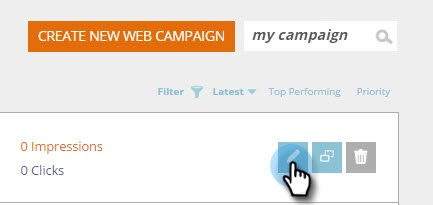

# 캠페인을 {#save-your-campaign-as-a-template} 템플릿으로 저장

완벽한 웹 캠페인을 제작하는 데 시간을 소비한 적이 있습니까? 나중에 쉽게 다시 사용할 수 있도록 템플릿으로 저장할 수 있습니다.

1. 웹 캠페인으로 이동합니다.

   

1. 템플릿으로 저장할 캠페인을 검색합니다.

   

1. 편집 아이콘을 클릭합니다.

   

1. 템플릿으로 사용을 선택하고 저장을 클릭합니다.

      

1. 바로 그거야! 다음에 캠페인을 만들고 템플릿을 선택할 때 캠페인 설정 페이지에서 내 템플릿을 선택하여 저장한 템플릿을 확인합니다.

   

