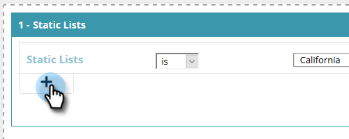

# 정적 목록 {#create-a-segment-using-a-static-list}을 사용하여 세그먼트 만들기

마커 [정적 목록](http://docs.marketo.com/display/DOCS/Understanding+Static+Lists)에 있는지 여부를 기준으로 웹 사이트를 방문할 때 알고 있는 웹 방문자를 세그먼트화합니다.

1. **세그먼트**&#x200B;로 이동합니다.

   

1. **새로 만들기**&#x200B;를 클릭합니다.

   

1. 세그먼트 이름을 입력합니다.

   

1. 알려진 리드에서 **정적 목록**을 캔버스로 드래그합니다.

   

1. 드롭다운을 클릭하여 **is** 또는 **is not**(원하는 내용에 따라 다름)을 선택하고 정적 목록의 이름을 입력합니다.

   

1. 여러 목록을 추가하려면 **+**&#x200B;을 클릭하여 각 목록에 대해 새 줄을 만들어야 합니다. 하나의 목록만 필요한 경우 [8단계](#eight)로 건너뜁니다.

   

1. 여러 목록(또는 여러 개의 &quot;is not&quot; 목록)에 대해 [5단계](#five)에서 학습한 단계를 반복합니다.

   

   >[!NOTE]
   >
   >및/또는 드롭다운은 바로 그것입니다. **및**, **또는** 또는 **및/또는**&#x200B;를 선택하려면 이 아이콘을 클릭합니다.

1. **저장**&#x200B;을 클릭하여 세그먼트를 저장하거나 **저장 및 캠페인 정의 **를 클릭하여 저장하고 캠페인 페이지로 이동합니다.

   

