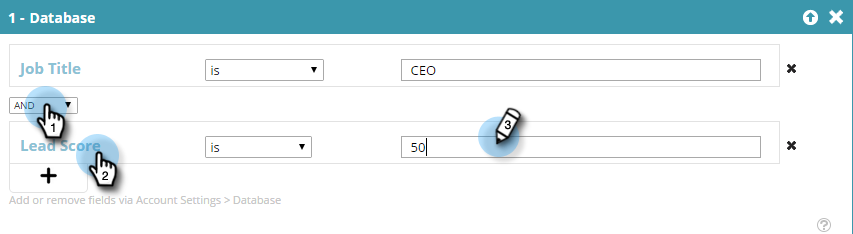

# 알려진 사용자 데이터를 사용하여 세그먼트 만들기 {#create-a-segment-using-known-person-data}

다음은 알려진 개인 데이터 값을 사용하여 세그먼트를 만드는 방법입니다.

>[!PREREQUISITES]
>
>[개인 데이터 관리](/help/marketo/product-docs/web-personalization/using-web-segments/manage-person-data.md)

1. **세그먼트**(으)로 이동합니다.

   

1. **새로 만들기**&#x200B;를 클릭합니다.

   

1. 세그먼트 이름을 입력합니다.

   

1. 프로필 세분화에서 **데이터베이스**&#x200B;을(를) 캔버스로 드래그합니다.

   

1. 드롭다운에서 개인 데이터 필드를 선택합니다.

   

1. 개인 데이터 값을 입력합니다.

   

   각 필드에는 값이 하나만 있을 수 있습니다. 예를 들어 직책 필드에 여러 값을 추가하려면 각 값에 대해 필드 이름이 동일한 새 라인을 생성해야 합니다. 반드시 OR 값을 사용하여 모든 값이 일치 항목을 캡처하도록 하십시오.

   

## 여러 개인 데이터 필드 선택 {#selecting-multiple-person-data-fields}

1. 다른 사용자 데이터 필드를 추가하려면 **+**&#x200B;을(를) 클릭하십시오.

   

1. AND/OR 연산자를 선택합니다. 추가할 필드를 선택합니다. 개인 데이터 필드를 선택합니다. 개인 데이터 값을 입력합니다.

   

1. 세그먼트를 저장하려면 **저장**&#x200B;을 클릭하고, 저장하고 캠페인 페이지로 이동하려면 **캠페인 저장 및 정의**&#x200B;를 클릭하십시오.

   

   이제 알려진 사용자 데이터를 타겟팅하는 세그먼트를 설정했습니다.
