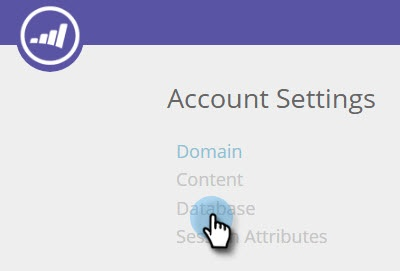

# 사용자 데이터 관리 {#manage-person-data}

세분화에 사용할 개인 필드를 선택하여 [!DNL Web Personalization]의 개인 데이터를 활용하십시오.

1. **[!UICONTROL Account Settings]** 으로 이동합니다.

   

1. **[!UICONTROL Database]** 으로 이동합니다.

   

## 새 사용자 필드 추가 {#adding-a-new-person-field}

1. 목록에 개인 데이터 필드를 추가하려면 드롭다운에서 **추가할 필드**&#x200B;를 선택하십시오.

   

   >[!NOTE]
   >
   >새 필드는 보류 중 상태로 추가되며 활성화하는 데 최대 24시간이 걸릴 수 있습니다.

## 개인 필드 삭제 {#deleting-a-person-field}

1. 목록에서 필드를 제거하려면 삭제 아이콘()을 클릭하십시오. 필드를 삭제하려면 **[!UICONTROL Yes]**&#x200B;을(를) 클릭하십시오.

   

   >[!NOTE]
   >
   >**개인 데이터 필드 관리**
   >
   >* 개인 데이터 필드만 포함할 수 있습니다.
   >* 최대 30개의 개인 데이터 필드를 추가할 수 있습니다.
   >* 새 필드를 추가하는 데 최대 24시간이 걸릴 수 있습니다.
   >* 문자열 유형의 최대 길이는 255자입니다.
   >* 숨겨진 필드는 자동으로 제거됩니다.

<table>
 <tbody>
  <tr>
   <th>
REST API 이름
</th>
   <th>
SOAP API 이름
</th>
   <th>
알기 쉬운 이름
</th>
  </tr>
  <tr>
   <td>
부서
</td>
   <td>
부서
</td>
   <td>
부서
</td>
  </tr>
  <tr>
   <td>
제목
</td>
   <td>
직함
</td>
   <td>
직위
</td>
  </tr>
  <tr>
   <td>
등급
</td>
   <td>
등급
</td>
   <td>
등급
</td>
  </tr>
  <tr>
   <td>
잠재 고객 스코어
</td>
   <td>
잠재 고객 스코어
</td>
   <td>
스코어
</td>
  </tr>
  <tr>
   <td>
잠재 고객 상태
</td>
   <td>
잠재 고객 상태
</td>
   <td>
상태
</td>
  </tr>
  <tr>
   <td>
우선 순위
</td>
   <td>
우선 순위
</td>
   <td>
우선 순위
</td>
  </tr>
  <tr>
   <td>
리드 역할
</td>
   <td>
잠재 고객 역할
</td>
   <td>
역할
</td>
  </tr>
  <tr>
   <td>
구독 취소됨
</td>
   <td>
구독 취소
</td>
   <td>
구독 취소
</td>
  </tr>
 </tbody>
</table>

새 [!DNL Web Personalization] 계정에 대해 다음 리드 필드가 즉시 제공됩니다.

>[!MORELIKETHIS]
>
>[알려진 사용자 데이터를 사용하여 세그먼트 만들기](/help/marketo/product-docs/web-personalization/using-web-segments/create-a-segment-using-known-person-data.md)
