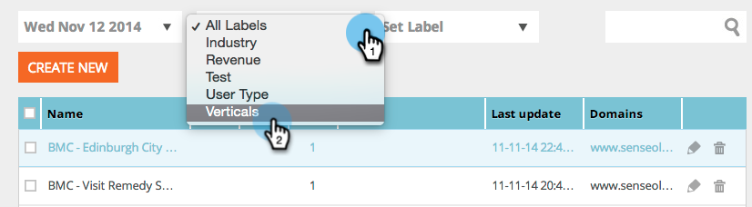
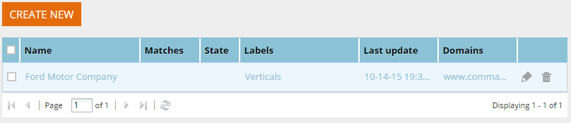

# 특정 레이블의 세그먼트 보기 {#view-segments-from-a-specific-label}

특정 레이블에 따라 세그먼트를 보고 필터링하시겠습니까?

## 기존 레이블로 필터링 {#filter-by-existing-labels}

레이블 드롭다운 아래에서 원하는 레이블을 선택합니다.

매우 좋습니다. 이제 선택한 레이블과 연결된 세그먼트만 표시됩니까?

