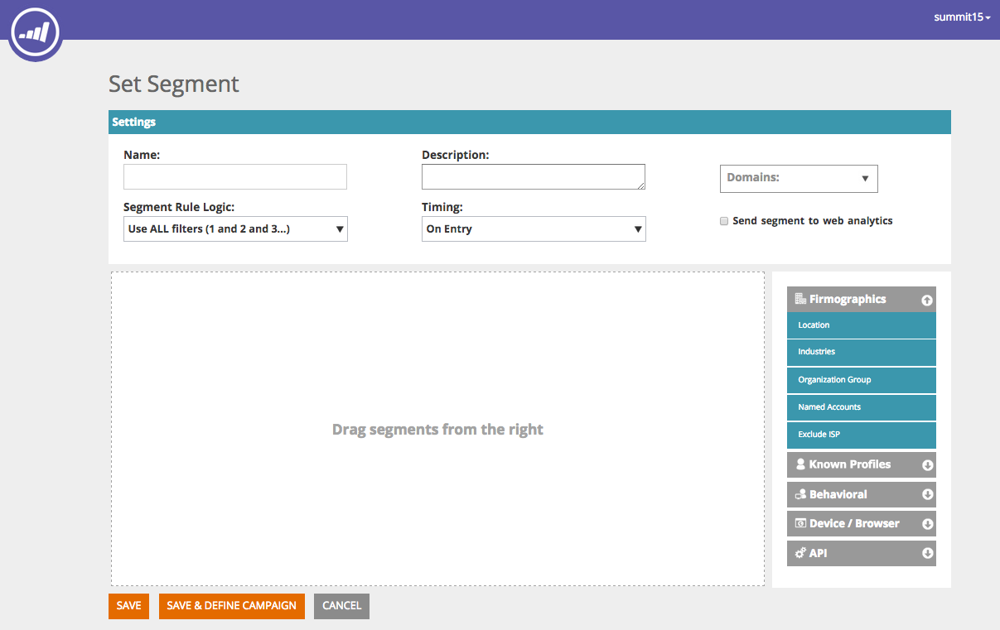
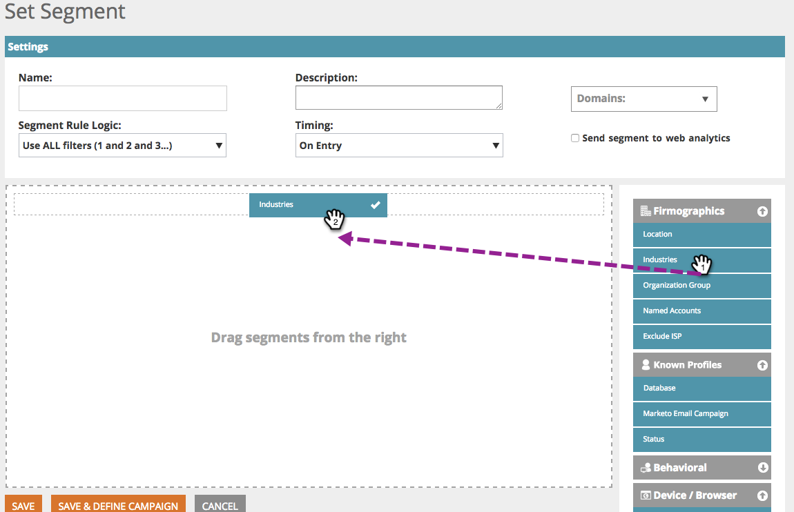

# 웹 세그먼트 {#web-segments}

## 세그먼트 보기 {#view-segment}

세그먼트 탭에는 다양한 속성을 기준으로 설정한 모든 사용자 지정 정의된 세그먼트가 표시됩니다.  **세그먼트는 &#39;세그먼트 설정&#39; 페이지에 정의된 특정 기준을 충족하는 방문자 모음입니다.**  세그먼트는 특정 업계, 위치 또는 방문자의 온사이트 활동을 기반으로 하는 방문자일 수 있습니다.

웹 개인화에서 방문자는 두 개 이상의 세그먼트와 일치할 수 있습니다. 예를 들어 미국 방문자에 대한 세그먼트와 금융 회사에 대한 세그먼트가 있는 경우 미국 은행의 웹 방문자는 미국 방문자에 대한 세그먼트와 금융 회사에 대한 세그먼트 **둘** 모두를 일치시킵니다.

**그래프:** 세그먼트 페이지에는 세그먼트(y축) 및 세그먼트 이름(x축)의 방문자 수에 따라 선택한 세그먼트의 막대 차트 그래프가 표시됩니다.

<table> 
 <thead> 
  <tr> 
   <th colspan="1" rowspan="1">이름</th> 
   <th colspan="1" rowspan="1">설명</th> 
  </tr> 
 </thead> 
 <tbody> 
  <tr> 
   <td colspan="1" rowspan="1"><strong>이름</strong></td> 
   <td colspan="1" rowspan="1">세그먼트의 제목</td> 
  </tr> 
  <tr> 
   <td colspan="1" rowspan="1">
<strong>일치</strong>
</td> 
   <td colspan="1" rowspan="1">세그먼트의 사용자 정의된 기준을 충족하는 방문자 수</td> 
  </tr> 
  <tr> 
   <td colspan="1" rowspan="1"><strong>캠페인 설정</strong></td> 
   <td colspan="1" rowspan="1">선택한 검색어와 연관된 캠페인 CTA를 설정할 수 있습니다</td> 
  </tr> 
  <tr> 
   <td colspan="1"><strong>방문자 수</strong></td> 
   <td colspan="1">선택한 검색어와 연관된 방문자 테이블 미리 보기</td> 
  </tr> 
  <tr> 
   <td colspan="1" rowspan="1"><strong>클릭스트림</strong></td> 
   <td colspan="1" rowspan="1">사이트의 방문자 활동 및 URL 경로 및 각 페이지를 방문한 시간 테이블을 표시합니다. </td> 
  </tr> 
 </tbody> 
</table>

세그먼트 레이블을 만들고 보는 [방법 보기](label-your-segment.md)

**세그먼트 - 오른쪽 패널**

표에서 세그먼트를 선택하면 오른쪽 패널에서 세그먼트에 대한 추가 세부 사항이 표시됩니다.

이러한 세부 사항은 다음과 같습니다.

* 세그먼트 이름
* 세그먼트 작성 날짜
* 세그먼트와 함께 작동하는 캠페인을 보여주는 연관된 캠페인입니다. 반응 수를 클릭하면 세그먼트에 대한 캠페인 CTA(클릭유도문안)를 표시하는 캠페인 페이지로 이동합니다
* 세그먼트에 대한 일치(세그먼트 기준을 충족하는 방문자 수) 수와 세그먼트에 일치하는 고유한 방문자 수 고유 방문자 링크를 클릭하면 세그먼트 결과를 표시하는 방문자의 페이지로 이동합니다
* 세그먼트의 소유자/사용자 생성자
* 세그먼트와 연관된 도메인 사이트
* 세그먼트의 선택한 기준에 대한 간략한 요약

## 세그먼트 활성화 또는 비활성화 {#enable-or-disable-a-segment}

세그먼트를 활성화하거나 비활성화하려면 테이블에서 해당 세그먼트의 확인란을 선택하고 표 하단의 &quot;작업 선택&quot; 드롭다운 상자에서 &quot;활성화&quot; 또는 &quot;비활성화&quot; 작업을 선택합니다. 세그먼트가 비활성화되면 &quot;비활성화&quot;라는 단어가 [상태] 열 아래에 표시됩니다.

## 세그먼트 만들기 {#create-segments}

만든 세그먼트는 세그먼트 설정 페이지에서 정의한 특정 **기준을** 충족합니다. 캠페인의 특정 대상을 타깃팅하여 기준 조합을 기반으로 세그먼트를 사용자 지정할 수도 있습니다.

새 세그먼트를 만들려면

세그먼트 **페이지** 에서 그래프 **아래에 있는 새로** 만들기를 클릭합니다. 다음 화면이 나타납니다.

세그먼트에 일반 매개 변수를 정의합니다.

1. 

   * **이름:** 세그먼트 이름을 지정합니다.
   * **설명:** 세그먼트 기준에 대한 자세한 설명을 제공합니다.
   * **도메인:** 세그먼트에 포함할 도메인을 선택합니다.
   * **세그먼트 규칙 논리:** AND/OR 논리를 선택하여 각 세그멘테이션 속성을 작성합니다.
   * **타이밍:** 캠페인에서 원하는 방문자 참여 수준을 정의합니다.

      * **시작 시**:방문자가 웹 사이트에 도착하여 참여
      * **1일 후 - 9번째 클릭**:웹 사이트에서 특정 클릭 수 이후 방문자 참여

>[!TIP]
>
>**세그먼트 규칙 논리**
>
>세 가지 필터 옵션이 있습니다.
>
>1. 모든 필터 사용(1 및 2, 3...)
>1. 필터 사용(1 또는 2 또는 3..)
>1. 고급 필터(및/또는 표현식 사용) >
   >    1. >    
   >       

      >고급 필터를 사용하면 세그먼트 조건을 제어할 수 있습니다. &quot;and&quot; 및 &quot;or&quot;로 구분된 필터 번호를 입력합니다.  >
      >        * 1 및 2 및 3
      >        * 1 또는 2 또는 3

      >
      &quot;and&quot; 및 &quot;or&quot;를 혼합하려면 괄호가 논리 의도를 명확히 해야 합니다. 예:&quot;1 또는 2 및 3&quot;은 다음 중 하나로 작성해야 합니다. >
      * 1 및 (2 또는 3)
      * (1 및 2) 또는 3

      중첩 괄호는 보다 복잡한 로직을 위해 허용됩니다(예:). >
      * (1 및 2) 또는 (3 및 4)
      * 1 및 (2 또는 (3 및 4))

      삽입, 삭제 또는 순서 변경 후 논리를 확인합니다.

오른쪽 열의 세그먼트 속성을 왼쪽 세그먼트 편집기로 드래그하여 놓습니다.

### Firmographics {#firmographics}

**위치**

**Location **을 세그먼트 편집기로 드래그하여 놓습니다.

* 다음 매개 변수 중에서 선택합니다.

   * **포함 **- 캠페인을 포함할 위치를 제외할지 여부를 선택합니다.
   * **추가할** 국가 선택 - 드롭다운 상자에서 세그먼트에 포함할 국가를 선택합니다. 국가 이름이 오른쪽에 나타납니다. 여러 국가를 선택할 수 있습니다.

국가가 추가되면 세그먼트의 시/도 및 우편 번호도 지정할 수 있습니다.

* **추가할** 시 또는 도 선택 - 드롭다운 상자에서 포함시킬 미국 주 또는 캐나다 지역을 선택합니다. 여러 항목을 선택할 수 있습니다.
* **우편번호** - 세그먼트에 포함할 우편번호를 입력합니다.
* **도시** - 포함할 구/군/시를 입력합니다. 시 사이에 세미콜론을 사용합니다.

>[!TIP]
>
>**어떤 세그먼트 조건을 선택합니까? &#39;AND&#39; 또는 &#39;OR&#39;? **OR은 각 필드 내에서 추가 옵션으로 작동합니다. 잠재 고객은 세그먼트 자격을 갖추려면 각 필드 내에서 선택한 여러 기준의 한 가지 기준만 충족하면 됩니다. (예를 들어, 잠재 고객 *은 미국 또는* 국방 산업일 수 있습니다.) AND는 이 세그먼트에 충족해야 하는 추가적인 필수 매개 변수로 작동합니다. (예를 들어, 전망은 미국과 국방 산업에서 나오는 것이다) 각 세그먼트 프로필 내에서 각 개별 필드는 선택한 세그먼트 조건에 따라 &quot;AND&quot; 또는 &quot;OR&quot;로 모두 작동할 수 있습니다.

**산업** 분야 **프로필 세그멘테이션** 섹션에서 **산업**&#x200B;옆의 상자를 선택합니다.

* 다음 매개 변수 중에서 선택합니다.

   * **포함** - 세그먼트를 산업 포함 또는 제외할지 여부를 선택합니다.
   * **추가할** 산업 선택 - 세그먼트에 포함할 산업을 선택합니다. 드롭다운 상자 아래에 산업이 나타납니다. 여러 업계를 선택할 수 있습니다.

**조직 그룹**

프로필 **세그멘테이션** 섹션에서 **조직 그룹 옆의 상자를 선택합니다.**

* 드롭다운 상자에서 다음 선택 항목 중에서 선택합니다.

   * 포춘 500 - 이 부문에 포춘 500대 회사만 포함
   * 포춘 1000 - 이 부문에 포춘 1000대 회사만 포함
   * 2000년 글로벌 - 이 부문에 글로벌 2000개 회사 포함
   * 기업 - 직원 수가 1,000명 이상이고 매출이 2억 5천만 달러 이상인 조직 포함
   * SMB - 이 부문에 중소기업 포함

**지정된 계정**

**조직**

* 

   * **해당 회사(특정 이름)의**

      * &#39;추가할 회사 선택&#39; 드롭다운에서 타게팅할 회사를 선택합니다.
      * 타깃팅할 정확한 조직 이름을 입력할 수 있습니다. *더 나은 일치 항목을 위해 이름을 수동으로 입력하는 대신 지정된 계정 목록을 사용하는 것이 *좋습니다(아래 참조).*

**지정된 계정 목록**

지정된 [계정 목록에서](../../../product-docs/web-personalization/account-based-web-marketing/create-a-new-account-list.md) 선택하여 주요 타깃팅된 계정을 세그먼트화합니다.

>[!NOTE]
>
>웹 개인화 [읽기 API](http://developers.marketo.com/documentation/websites/rtp-js-api/)목록에 대한 색인 참조로 명명된 계정 목록 이름 옆의 괄호 안의 숫자가 사용됩니다.

**ISP 제외**

세그먼트에서 인터넷 서비스 공급자(ISP)를 제외합니다.

### 알려진 사람 {#known-people}

**데이터베이스**

웹 개인화는 Marketing To 데이터베이스와 통합되므로 알려진 개인 특성 및 데이터를 기반으로 캠페인을 세분화하고 개인화할 수 있습니다.

데이터베이스를 선택하고 드롭다운에서 개인 데이터 필드를 선택합니다. 드롭다운에서 필드 **를** 추가하려면 +를 선택합니다.

계정 설정 > 데이터베이스에서 개인 데이터 필드를 추가하거나 제거할 수 있습니다

>[!TIP]
>
>Marketing에서 직위와 같은 사람에 대한 모든 개인 데이터 필드에 따라 세그먼트 기준을 만듭니다.점수;역할;등..
>
>예. &quot;Job Title equals CMO&quot; 및 &quot;Score is less than or equals to 50&quot;

**마케팅 이메일 캠페인** 세그먼트. 마케팅 이메일을 클릭하고 사이트에 도달하는 방문자로부터 이메일을 조회하여 캠페인을 개인화합니다. 마케팅 프로그램 이름 또는 캠페인 이름별로 세그먼트화하고 이메일에서 웹으로 대화를 계속합니다. 드롭다운에서 필드를 추가하려면 +를 선택합니다.

**상태**

잠재 고객의 상태에 따라 세그먼트를 정의합니다.알려진 또는 익명

* 

   * 알려진 방문자에 대해 드롭다운 상자에서 이 옵션을 선택합니다. 방문자는 웹 사이트에서 양식을 제출하고 웹 개인화 사람 페이지에 표시될 때 알려져 있습니다.
   * 익명 - 익명 방문자의 경우 드롭다운 상자에서 이 옵션을 선택합니다.

### 행동 {#behavioral}

**방문 -** 방문자 행동 또는 식별에 따라 세그먼트를 정의합니다.

* 

   * 방문 횟수 - 드롭다운 상자에서 이 옵션을 선택하여 웹 사이트의 잠재 고객에 대한 방문 횟수를 지정합니다.

      * 드롭다운 상자에서 같음, 같음 또는 보다 큼, 같음 또는 보다 작음 을 선택합니다.
   * 특정 방문 - 특정 방문자를 지정하려면 드롭다운 상자에서 이 옵션을 선택합니다.

      * 오른쪽의 텍스트 상자에 추적할 방문자 번호를 입력합니다. 고유 웹 개인화 방문자 식별 번호는 방문자 페이지(방문자 페이지)와 오른쪽 패널의 캠페인 설정을 클릭할 때 찾을 수 있습니다. 방문자 ID는 고급 설정 섹션에 있습니다. 방문자 ID는 URL에서도 찾을 수 있습니다(예: VISITOR=JZJIFJNUI60PZ8Y97BHTY9BL8PKWS).

**검색어** - 잠재 고객의 검색어에 따라 세그먼트를 정의합니다.

* 

   * 방문자가 검색하는 대상 - 드롭다운 목록에서 방문자 검색에서 추적할 용어를 선택하거나 자신의 검색어를 추가합니다. (검색어를 포함하는 구문을 포함하도록 기본값으로 설정되므로 검색 용어에 * 와일드카드가 필요하지 않습니다.)

**참조** - 방문자가 참조한 URL을 추가합니다.

* 

   * 추가할 레퍼러 선택 - 드롭다운 목록에서 추적할 참조 사이트를 선택하거나 직접 참조를 추가합니다. 선택하면 아래 상자에 레퍼러가 표시됩니다. (와일드카드로 * 사용 가능)

**페이지 포함** - 웹 사이트에서 방문한 특정 페이지 잠재 고객을 추적합니다.

* 

   * URL 일치 - 추적할 특정 웹 페이지의 URL을 추가합니다. 여러 URL을 세미콜론으로 구분하여 추가할 수 있습니다. 와일드카드로 * 사용이 허용됩니다.

**페이지** 제외 - 세그먼트에서 일치하지 않을 특정 페이지를 제외합니다. 와일드카드로 * 사용이 허용됩니다.

* 

   * 

      * URL이 일치하지 않음 - 추적에서 제외할 특정 웹 페이지의 URL을 추가합니다. 여러 URL을 세미콜론으로 구분하여 추가할 수 있습니다

### 장치/브라우저 {#device-browser}

**모바일 OS**

Mobile OS를 세그먼트 편집기로 드래그하여 놓기

* **방문자 유형 **
   **Mobile OS** - 드롭다운 상자에서 하나 이상의 모바일 OS를 선택합니다. 선택한 모바일 OS가 아래에 나타납니다.

   * 방문자가 모든 모바일 장치를 사용하고 있습니다. **
   * 방문자가 이 특정 장치/OS를 사용하고 있습니다.
   * 방문자가 모바일 장치를 사용하고 있지 않습니다.

* **장치** - 드롭다운 목록에서 하나 이상의 장치(Apple, Samsung, LG, HTC, Nexus, Blackberry 등)에서 선택합니다. 선택한 장치가 아래에 나타납니다.

**브라우저**

특정 브라우저 유형 및/또는 버전을 사용하는 Target 방문자.

* 

   * 브라우저 유형 - 드롭다운 상자에서 하나 이상의 인터넷 브라우저를 선택합니다. 선택한 브라우저가 아래에 나타납니다.
   * 브라우저 버전 - 세그먼트에 추가할 브라우저 버전을 입력합니다. 쉼표로 구분하여 여러 버전을 선택할 수 있습니다. 와일드카드로 * 사용이 허용됩니다.

### API {#api}

**데이터 이벤트** - 특정 사용자 지정 데이터 이벤트를 트리거하는 방문자 세그먼트

타깃팅할 이벤트 값을 추가합니다. 예를 들어 타사 데이터 소스에서 가져온

**사용자 컨텍스트 API**

웹 개인화 API 호출 [에서 자세한 내용을 참조하십시오.](http://developers.marketo.com/documentation/websites/rtp-user-context-api/)

>[!TIP]
>
>**와일드카드 사용 - **해당 검색어 내에 있는 항목이 포함된 URL을 포함하려는 경우&quot; [google.com](http://google.com)&quot; 또는 &quot;search term product&quot;를 검색할 때 이 와일드카드라고 하며 각 끝마다 별표(이 작은 사람*)를 붙여야 합니다. 따라서 [google.com](http://google.com) 에서 오는 모든 내용은 * [google.com](http://google.com)*으로 입력해야 합니다.

## 세그먼트 편집 {#edit-segments}

만들어진 세그먼트를 편집할 수 있습니다.

1. 세그먼트를 편집하려면 세그먼트로 **이동합니다**.

   

1. 세그먼트 **** 테이블에서 편집할 세그먼트의 편집 아이콘( )을 클릭합니다. 세그먼트 **설정** 페이지가 열리고 선택한 세그먼트가 표시됩니다.
1. 세그먼트에 적용할 편집 또는 변경 사항을 적용합니다.
1. 저장을 **클릭합니다**.

## 세그먼트 삭제 {#delete-segments}

만든 세그먼트를 삭제할 수 있습니다.

1. 위의 **세그먼트** 페이지에서 세그먼트를 선택합니다.
1. 삭제할 세그먼트의 삭제 아이콘(  )을 클릭합니다.* **입니다.
1. 세그먼트를 삭제하려고 한다는 확인 메시지가 **나타납니다**.

>[!NOTE]
캠페인과 연관된 세그먼트는 삭제할 수 없습니다. 먼저 캠페인을 삭제한 다음 세그먼트를 삭제해야 합니다.

좋아요! 세그먼트 섹션을 이해했으므로 캠페인에 대해 알아 보겠습니다.

>[!MORELIKETHIS]
* [기본 웹 세그먼트 만들기](create-a-basic-web-segment.md)
* [새 대화 상자 웹 캠페인 만들기](../../../product-docs/web-personalization/working-with-web-campaigns/create-a-new-dialog-web-campaign.md)
* [영역에서 새 웹 캠페인 만들기](../../../product-docs/web-personalization/working-with-web-campaigns/create-a-new-in-zone-web-campaign.md)
* [새 위젯 웹 캠페인 만들기](../../../product-docs/web-personalization/working-with-web-campaigns/create-a-new-widget-web-campaign.md)

