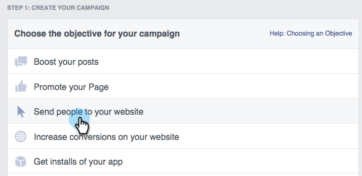

# Facebook에서 개인화된 리마케팅 {#personalized-remarketing-in-facebook}

개인화된 리마케팅을 사용하면 RTP 데이터 및 Facebook 리마케팅의 강력한 기능을 사용하여 사용자와 다시 교류할 수 있습니다.

>[!NOTE]
>
>**사전 요구 사항**
>
>* 웹 [개인화 데이터](retargeting-with-web-personalization-data.md) 설정 완료
>* 사용자 지정  대상 및 [리마케팅에 대한](https://developers.facebook.com/docs/ads-for-websites/website-custom-audiences/getting-started#install-the-pixel)Facebook 설명서 검토

>

## Facebook에서 대상자 만들기 {#creating-an-audience-in-facebook}

1. Facebook에서 광고 관리자의 [대상 탭으로](https://www.facebook.com/ads/audience_manager) 이동합니다.
1. 도구 **를** 클릭하고 대상을 **선택합니다**.

   

1. 사용자 **지정 대상 만들기를 클릭합니다**.

   

1. 웹 **사이트 트래픽을 선택합니다**.

   

1. 웹 사이트 트래픽 목록에서*** 사용자 지정 조합**을 선택합니다.

   

1. 포함 목록에서 **이벤트를 선택합니다**.

   

1. 이벤트 목록에서 **RTP 리마케팅 **을 선택하고 매개 변수를 선택합니다.

   

1. 이 예의 경우 교육 내용을 포함할 산업 **을 선택합니다**. 교육용 **프로그램을**&#x200B;입력하고 **마지막** 에서 180일이 되도록 편집합니다. 대상자 이름 입력: **교육 업계**. 대상자 **만들기를 클릭합니다**.

   

1. 이제 Facebook에서 RTP 데이터를 사용하여 새 사용자 지정 대상을 만들었습니다.

   

## Facebook의 RTP 데이터 포인트 {#rtp-data-points-in-facebook}

<table> 
 <tbody> 
  <tr> 
   <th>이벤트 이름</th> 
   <th> </th> 
  </tr> 
  <tr> 
   <td>RTP 리마케팅</td> 
   <td> 
    
 
     <table> 
      <tbody> 
       <tr> 
        <th>매개 변수</th> 
        <th>값</th> 
       </tr> 
       <tr> 
        <td>ABM 목록</td> 
        <td>(계정 기반 목록 이름)</td> 
       </tr> 
       <tr> 
        <td colspan="1">범주</td> 
        <td colspan="1">
포춘 500

포춘 1000

2000년 글로벌
</td> 
       </tr> 
       <tr> 
        <td colspan="1">그룹</td> 
        <td colspan="1">
엔터프라이즈

SMB
</td> 
       </tr> 
       <tr> 
        <td>업계</td> 
        <td>
방위

교육 기관

금융 서비스

공공 기관

의료, Pharma, 생명 공학

소프트웨어 및 인터넷

등.(RTP 산업 옵션에 따라)
</td> 
       </tr> 
       <tr> 
        <td colspan="1">고객 세분화</td> 
        <td colspan="1">(RTP에서 생성된 세그먼트화된 대상의 이름)</td> 
       </tr> 
      </tbody> 
     </table> 
    
</td> 
  </tr> 
 </tbody> 
</table>

## 광고로 고객 Target {#target-your-audience-with-an-ad}

자세한 내용은 [Facebook 설명서를 참조하십시오](https://developers.facebook.com/docs/ads-for-websites/website-custom-audiences/getting-started#target-your-audience).

1. 광고 관리자로 이동하고 광고 **만들기를 클릭합니다**.

   

1. 캠페인 **의 목표로 웹** 사이트에 사람 보내기를 선택합니다.

   

1. 웹 사이트 URL을 입력합니다.

   

1. 광고 세트를 만듭니다. 만든 대상 목록(예: 교육 산업)에서 사용자 지정 대상을 선택합니다.

   

1. 다른 모든 광고 세트 옵션을 선택하고 예산을 설정하고 광고 크리에이티브를 정의합니다.

   

1. 이제 Facebook에서 개인화된 리마케팅 캠페인을 시작할 수 있습니다.

>[!NOTE]
>
>**관련 문서**
>
>* [웹 개인화 데이터를 사용한 리타겟팅](retargeting-with-web-personalization-data.md)
>* [Google의 개인화된 리마케팅](personalized-remarketing-in-google.md)

>

