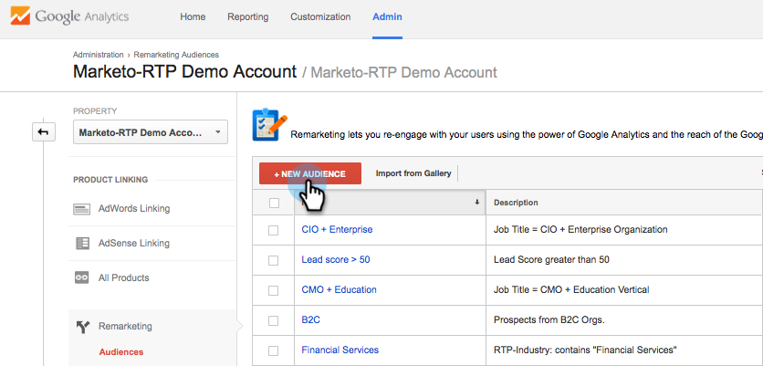

# Google의 개인화된 리마케팅 {#personalized-remarketing-in-google}

개인화된 리마케팅을 사용하면 Google 디스플레이 네트워크의 접근성을 통해 RTP 데이터 및 강력한 Google Analytics을 사용하여 사용자와 다시 교류할 수 있습니다.

>[!NOTE]
>
>**사전 요구 사항**
>
>* 웹 [개인화 데이터 구성을 사용하여 리타겟팅](retargeting-with-web-personalization-data.md) 완료
>* Google Analytics [로 리마케팅 검토 도움말](https://support.google.com/analytics/topic/2611283?hl=en&amp;ref_topic=3413645) 설명서

>

## Google에서 리마케팅 대상 만들기 {#creating-a-remarketing-audience-in-google}

1. Google Analytics에 로그인합니다. 관리, **계정**, **속성**&#x200B;을 **클릭합니다**. 대상 **정의** 및 대상을 **클릭합니다**.

   

1. +새 대상 **을 클릭합니다**.

   

1. **링크 구성**:Google Adwords 계정에 연결
1. **대상 정의**:새로 **만들기를 클릭합니다**.

   

1. Audience Builder에서 **시퀀스를** 클릭하고 **사용자 지정 Dimension, 사용자 지정 변수, 이벤트** 아래에서 RTP 데이터찾기를 클릭합니다.

>[!TIP]
>
>Analytics에서 RTP 데이터를 찾아 고객을 확보하는 방법
>
>Google Analytics:
>
>* 사용자 지정 변수:조직, 업계
>* 이벤트 범주:세그먼트, Insightera-CTA, RTP-Remarketing
>* 이벤트 레이블:세그먼트 이름, 캠페인 이름, 세그먼트화된 대상 이름

>
>
Google Universal Analytics에서:
>
>* 사용자 지정 Dimension:조직, 산업, 카테고리(Fortune 500,1000, 글로벌 2000), 그룹(기업, SMB), ABM 목록(Named Account List)
>* 이벤트 범주:RTP-Segment, RTP-Campaign RTP-Remarketing
>* 이벤트 레이블:세그먼트 이름, 캠페인 이름, 세그먼트화된 대상 이름

>

**RTP 세그먼트 대상 데이터에서 리마케팅 대상 예**

1. 시퀀스를 **클릭합니다.**
1. [ **이벤트 레이블]을 선택합니다.**
1. 세그먼트화된 **대상의** 이름을 입력합니다(RTP에 표시됨).
1. 적용을 **클릭합니다**.

**RTP 산업 데이터의 대상 예**

1. 시퀀스를 **클릭합니다**.
1. *** RTP-Industry**를 선택합니다.
1. 산업 **이름** (예: 금융 서비스, 교육 기관..).
1. 적용을 **클릭합니다**.
1. 대상자 **이름을 입력합니다**. 저장을 **클릭합니다**.

## Google Adwords에서 리마케팅 광고 캠페인 만들기 {#create-a-remarketing-ad-campaign-in-google-adwords}

1. Google **Adwords에 로그인합니다**. 캠페인을 **클릭하고**&#x200B;네트워크만 **표시를 선택합니다**.

   

1. 캠페인 **이름을**&#x200B;입력하고 **유형 재마케팅 을 선택합니다.**

   

1. 광고 **그룹 이름을 입력하고** **향상된 CPC**, 재마케팅 목록 **을 선택합니다**.

   

1. 저장을 클릭하고 계속합니다.
1. 이미지 또는 텍스트 광고를 추가하고 리마케팅 캠페인을 시작합니다.

   

>[!NOTE]
>
>**관련 문서**
>
>* [웹 개인화 데이터를 사용한 리타겟팅](retargeting-with-web-personalization-data.md)
>* [Facebook에서 개인화된 리마케팅](personalized-remarketing-in-facebook.md)

