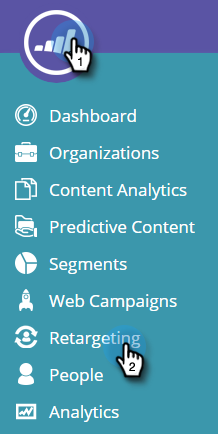

# [!DNL Web Personalization] 데이터로 재타겟팅 {#retargeting-with-web-personalization-data}

>[!AVAILABILITY]
>
>웹 사이트 재타겟팅은 이제 웹 Personalization 타일에 해당됩니다. 리타겟팅만 구매한 경우 이 타일이 표시되고 [!DNL Web Personalization]전용&#x200B;**리타겟팅 기능이 활성화된** 제품에 액세스합니다. 이렇게 하면 계정 설정, 리타겟팅 페이지, 세그먼트 및 추가 추적 페이지에 액세스할 수 있습니다.

리마케팅은 이전에 자신의 신원과 수행한 작업에 따라 디스플레이 광고를 사용하여 사이트를 방문한 잠재 고객을 타깃팅합니다. 개인화된 리타기팅은 업계, 명명 계정 및 알려진 사용자 데이터를 기반으로 하는 관련 광고를 통해 특정 대상을 타기팅합니다.

웹 Personalization은 현재 다음 리마케팅 플랫폼에 데이터를 추가합니다.

* [Google](/help/marketo/product-docs/web-personalization/website-retargeting/personalized-remarketing-in-google.md)
* [Facebook](/help/marketo/product-docs/web-personalization/website-retargeting/personalized-remarketing-in-facebook.md)

[!DNL Web Personalization]은(는) 대상자를 만들고 리마케팅 광고 캠페인을 실행하기 위해 리마케팅 플랫폼으로 다음 데이터를 보냅니다.

<table>
 <tbody>
  <tr>
   <th colspan="1">[!DNL Web Personalization] 데이터</th>
  </tr>
  <tr>
   <th>
업종
</th>
  </tr>
  <tr>
   <th>
그룹(엔터프라이즈, SMB)
</th>
  </tr>
  <tr>
   <th>
카테고리(Fortune 500/1000, 글로벌 2000)
</th>
  </tr>
  <tr>
   <th>
ABM 목록(명명된 계정 목록)
</th>
  </tr>
  <tr>
   <th>
세그먼트화된 대상자(세그먼트 기반)
</th>
  </tr>
  <tr>
   <th>
클릭한 웹 캠페인
</th>
  </tr>
 </tbody>
</table>

## 리마케팅 구성 {#remarketing-configuration}

1. **[!UICONTROL Retargeting]**(으)로 이동합니다.

   

   >[!NOTE]
   >
   >리타겟팅 구성은 도메인 또는 하위 도메인별로 수행됩니다. 해당 도메인에서 리타겟팅 플랫폼으로 데이터를 전송하려면 다른 도메인을 활성화합니다.

1. 도메인당 Google Analytics 또는 [!DNL Google Universal Analytics]에 대한 설정을 활성화합니다.

   >[!NOTE]
   >
   >웹 사이트에 Google 리타겟팅 태그가 구현되어 있어야 합니다.
   >
   >이미 웹 Personalization 및 Google Analytics과의 통합을 설정한 경우 이 부분은 계정 설정 의 구성과 동일하기 때문에 편집할 필요가 없습니다.

   

1. Facebook에 대한 구성을 활성화합니다. [!DNL Facebook] 아코디언을 클릭하고 확장한 다음 **[!UICONTROL On]**&#x200B;을(를) 클릭하여 각 이벤트와 데이터를 Facebook Audience Manager으로 보냅니다. **[!UICONTROL Save]**&#x200B;를 클릭합니다.

   >[!NOTE]
   >
   >이 기능을 사용하려면 웹 사이트에 [[!DNL Facebook] 사용자 지정 대상 픽셀](https://developers.facebook.com/docs/ads-for-websites/website-custom-audiences/getting-started#install-the-pixel)을(를) 설치해야 합니다.

   

## 세그먼트화된 대상자 만들기 {#creating-segmented-audience}

세그먼트화된 대상자를 사용하면 기존 세그먼트를 리타겟팅 캠페인에 사용할 대상자로 선택할 수 있습니다. 예를 들어 알려진 사용자 세그먼트를 선택합니다.

>[!TIP]
>
>도메인 구성에서 이미 보낸 업계 또는 기타 데이터에 대해 세그먼트화된 대상자를 만들 필요가 없습니다. 알려진 사용자 데이터를 기반으로 하는 세그먼트에 대해 세그먼트화된 대상을 사용하는 것이 가장 좋습니다.

1. **[!UICONTROL Create Segmented Audience]**&#x200B;를 클릭합니다.

   

1. 대상자 이름을 입력하고 채널을 선택한 다음 기존 세그먼트 목록에서 세그먼트를 선택합니다.

   

1. **[!UICONTROL Save]**&#x200B;를 클릭합니다.

   이제 [!DNL Web Personalization]에서 리타겟팅 설정을 완료하고, 리타겟팅 플랫폼에 로그인하고 이 데이터를 기반으로 대상을 만들고 리타겟팅 광고 캠페인을 설정했습니다.
