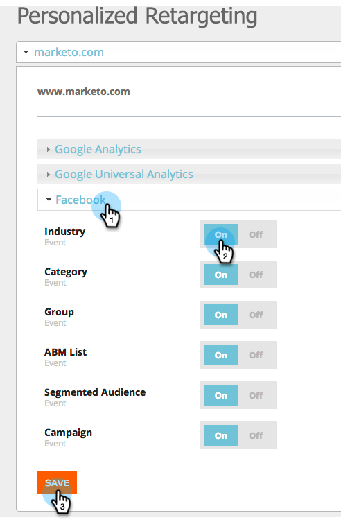

# 웹 개인화 데이터를 사용한 리타겟팅 {#retargeting-with-web-personalization-data}

>[!AVAILABILITY]
>
>
>이제 웹 사이트 재타깃팅이 웹 개인화 타일에 적용됩니다. 리타겟팅을 구입하기만 하면 이 타일이 표시되고 **만** 리타겟팅 기능이 활성화된 웹 개인화 제품에 액세스할 수 있습니다. 계정 설정, 다시 타깃팅 페이지, 세그먼트 및 추가 추적 페이지에 액세스할 수 있습니다.

리마케팅은 잠재 고객이 누구이며 무엇을 했는지에 따라 디스플레이 광고를 사용하여 이전에 사이트를 방문한 적이 있는 잠재 고객을 타겟팅합니다. 개인화된 리타겟팅은 업계, 명명 계정 및 알려진 개인 데이터를 기반으로 연관성 있는 광고를 타겟팅합니다.

웹 개인화는 현재 다음 리마케팅 플랫폼에 데이터를 추가합니다.

* [Google](personalized-remarketing-in-google.md)
* [Facebook](personalized-remarketing-in-facebook.md)

웹 개인화는 다음 데이터를 리마케팅 플랫폼으로 전송하여 대상을 만들고 리마케팅 광고 캠페인을 실행합니다.

<table> 
 <tbody> 
  <tr> 
   <th colspan="1">웹 개인화 데이터</th> 
  </tr> 
  <tr> 
   <th>
업계
</th> 
  </tr> 
  <tr> 
   <th>
그룹(엔터프라이즈, SMB)
</th> 
  </tr> 
  <tr> 
   <th>
부문(2000년 5월 10일, 글로벌 2000년)
</th> 
  </tr> 
  <tr> 
   <th>
ABM 목록(명명된 계정 목록)
</th> 
  </tr> 
  <tr> 
   <th>
세그먼트화된 대상(세그먼트 기반)
</th> 
  </tr> 
  <tr> 
   <th>
클릭한 웹 캠페인
</th> 
  </tr> 
 </tbody> 
</table>

## 리마케팅 구성 {#remarketing-configuration}

1. **리타깃팅**&#x200B;으로 이동합니다.

   

   >[!NOTE]
   >
   >재타깃팅 구성은 도메인 또는 하위 도메인별로 이루어집니다. 해당 도메인에서 리타겟팅 플랫폼으로 데이터를 보내려면 다른 도메인을 활성화합니다.

1. 도메인별 Google Analytics 또는 Google Universal Analytics에 대한 설정을 활성화합니다.

   >[!NOTE]
   >
   >웹 사이트에 Google 리타깃팅 태그를 구현해야 합니다.
   >
   >
   >웹 개인화 및 Google Analytics와의 통합을 이미 설정한 경우 계정 설정에서 동일한 구성이므로 이 부분을 편집할 필요가 없습니다.

   

1. Facebook 구성을 활성화합니다. Facebook 아코디언 **On**을 클릭하여 해당 이벤트와 데이터를 Facebook Audience Manager으로 보냅니다. **저장**&#x200B;을 클릭합니다.

   >[!NOTE]
   >
   >이 기능이 작동하려면 [Facebook 사용자 지정 대상 픽셀](https://developers.facebook.com/docs/ads-for-websites/website-custom-audiences/getting-started#install-the-pixel)웹 사이트를 설치해야 합니다.

   

## 세그먼트화된 대상 만들기 {#creating-segmented-audience}

세그먼트화된 대상을 사용하면 기존 세그먼트를 재타깃팅 캠페인에 사용할 대상으로 선택할 수 있습니다. 예를 들어 알려진 사람 세그먼트를 선택합니다.

>[!TIP]
>
>도메인 구성에서 이미 전송한 업계나 기타 데이터에 대해 세그먼트화된 대상을 만들 필요가 없습니다. 알려진 개인 데이터를 기반으로 세그먼트에 세그먼트화된 대상을 사용하는 것이 가장 좋습니다.

1. **세그먼트화된 대상 만들기**&#x200B;를 클릭합니다.

   

1. 대상자 이름을 입력하고 채널을 선택한 다음 기존 세그먼트 목록에서 세그먼트를 선택합니다.

   

1. **저장**&#x200B;을 클릭합니다.

   이제 웹 개인화의 재타깃팅 설정을 완료하고, 재타깃팅 플랫폼에 로그인하고, 이 데이터를 기반으로 대상을 만들고, 재타깃팅 광고 캠페인을 설정합니다.

>[!MORELIKETHIS]
>
>* [Google에서 개인화된 리마케팅](personalized-remarketing-in-google.md)
>* [Facebook에서 개인화된 리마케팅](personalized-remarketing-in-facebook.md)

