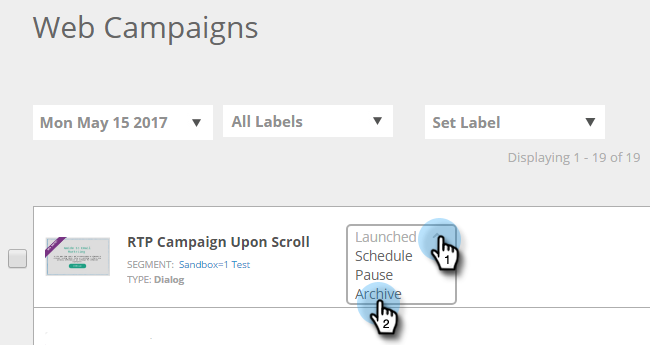

# 웹 캠페인 보관 {#archive-a-web-campaign}

1. **[!UICONTROL Web Campaigns]** 으로 이동합니다.

   

1. 원하는 웹 캠페인의 상태 드롭다운을 클릭하고 **[!UICONTROL Archive]**&#x200B;을(를) 선택합니다.

   

   >[!NOTE]
   >
   >보관된 웹 캠페인은 기본 필터에 표시되지 않습니다. 이를 보려면 필터 아이콘을 클릭하고 **[!UICONTROL Status]**&#x200B;에서 **[!UICONTROL Archived]** 확인란을 선택한 다음 **[!UICONTROL Apply]**&#x200B;을(를) 클릭합니다.

>[!MORELIKETHIS]
>
>[[!UICONTROL Web Campaign]](/help/marketo/product-docs/web-personalization/working-with-web-campaigns/delete-a-web-campaign.md) 삭제
