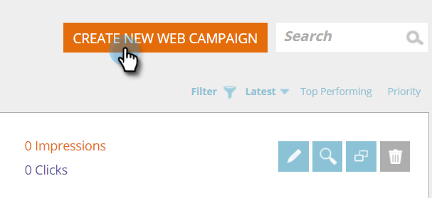

# 새 대화 상자 웹 캠페인 만들기 {#create-a-new-dialog-web-campaign}

## 대화 상자 웹 캠페인 만들기 {#create-a-dialog-web-campaign}

웹 캠페인을 만들어 웹 컨텐츠를 실시간으로 개인화하고 적절한 시간에 적절한 사용자에게 적절한 메시지를 제공할 수 있습니다.

웹 캠페인은 특정 세그먼트와 연결된 사용자 지정된 반응입니다. 이러한 반응은 웹 사이트의 대화 상자나 [영역 대체](/help/marketo/product-docs/web-personalization/working-with-web-campaigns/create-a-new-in-zone-web-campaign.md), [위젯 기능](/help/marketo/product-docs/web-personalization/working-with-web-campaigns/create-a-new-widget-web-campaign.md) 또는 이메일 경고.

1. 이동 **웹 캠페인**.

   

1. 선택 **새 웹 캠페인 만들기**.

   

1. 을(를) 선택합니다 **대화 상자** 웹 캠페인 유형. 편집기에서 크리에이티브를 디자인하고 추가합니다. 클릭 **미리 보기** 를 클릭하여 웹 캠페인이 사이트에서 어떻게 반응하는지 확인합니다.

   

<table> 
 <thead> 
  <tr> 
   <th colspan="1" rowspan="1">이름</th> 
   <th colspan="1" rowspan="1">설명</th> 
  </tr> 
 </thead> 
 <tbody> 
  <tr> 
   <td colspan="1"><strong>표시 켜기</strong></td> 
   <td colspan="1">다음을 수행할 수 있습니다. <a href="/help/marketo/product-docs/web-personalization/working-with-web-campaigns/set-how-your-web-campaign-displays.md" rel="nofollow">사용자 지정 시간 및 방법</a> 웹 캠페인이 표시됩니다.</td> 
  </tr> 
  <tr> 
   <td colspan="1" rowspan="1"><strong>대화 상자 스타일</strong></td> 
   <td colspan="1" rowspan="1"> 
    <ul> 
     <li>현대적인 트림 - 반투명 블랙 트림과 둥근 모서리가 있는 세련되고 독특한 대화</li> 
     <li>Modern Trim II - 밝은 그림자 트림, 둥근 모서리 및 닫기 단추가 있는 세련되고 독특한 대화</li> 
     <li>투명 - 작업 호출을 위한 투명(png) 이미지에 적합한 완전히 투명한 대화 상자입니다. </li> 
     <li>기본 - 기본 대화 상자의 요구 사항을 충족하는 더 두꺼운 제목 헤더 공간을 제공하는 간단한 스타일 대화 상자입니다.</li> 
    </ul></td> 
  </tr> 
  <tr> 
   <td colspan="1"><strong>애니메이션 in/Out</strong></td> 
   <td colspan="1">대화 상자 시작 및/또는 종료에서 설정합니다. 효과(드롭, 블라인드, 슬라이드, 페이드, 효과 없음), 지속 시간(초) 및 방향(위쪽, 아래쪽, 왼쪽, 오른쪽)을 선택합니다.</td> 
  </tr> 
  <tr> 
   <td colspan="1" rowspan="1">
<strong>위치</strong>
</td> 
   <td colspan="1" rowspan="1">페이지에서 대화 상자의 위치에 대한 9개 옵션 중 하나를 선택합니다. 예를 들어, 중간 상자를 선택하면 화면 중간에 대화 상자가 표시됩니다.</td> 
  </tr> 
  <tr> 
   <td colspan="1" rowspan="1">
<strong>좌표별</strong>

 
</td> 
   <td colspan="1" rowspan="1">대화 상자의 추가 위치 옵션을 보려면 '위치 좌표' 확인란을 선택하고 대화 상자를 표시할 정확한 화면 좌표(가로, 세로)를 입력합니다.</td> 
  </tr> 
  <tr> 
   <td colspan="1"><strong>단추 채우기</strong></td> 
   <td colspan="1">색상, 스타일 및 위치를 사용하여 모달의 닫기 단추를 사용자 지정합니다. 이미지 URL 상자에서 직접 단추에 연결하여 사용할 수도 있습니다.</td> 
  </tr> 
  <tr> 
   <td colspan="1"><strong>고정</strong></td> 
   <td colspan="1">고정 확인란을 선택하면 사용자가 닫힐 때까지 대화 상자가 시간 제한 없이 해당 위치에 유지되며 방문자 세션 전체의 모든 페이지에 표시됩니다.</td> 
  </tr> 
  <tr> 
   <td colspan="1"><strong>모달</strong></td> 
   <td colspan="1">대화 상자에 더 많은 포커스를 제공하고 대화 상자 창 뒤에 어두운 배경에서 대화 상자를 시작하여 대화 상자에 대한 사용자 인식을 높입니다.</td> 
  </tr> 
  <tr> 
   <td colspan="1"><strong>모달 색상</strong></td> 
   <td colspan="1">모달 색상과 불투명도를 사용자 지정합니다.</td> 
  </tr> 
  <tr> 
   <td colspan="1"><strong>시간 초과 </strong></td> 
   <td colspan="1">대화 상자가 시간(초)에 활성화되어 페이드 아웃됩니다.</td> 
  </tr> 
  <tr> 
   <td colspan="1"><strong>머리글 색상</strong></td> 
   <td colspan="1">대화 상자의 헤더 막대를 원하는 색상으로 설정합니다. 색상은 색상 차트에서 선택하거나 16진수 색상 코드로 입력할 수 있습니다. </td> 
  </tr> 
  <tr> 
   <td colspan="1"><strong>컨텐츠 배경색 </strong></td> 
   <td colspan="1">대화 상자의 배경색을 원하는 색으로 설정합니다. 색상은 색상 차트에서 선택하거나 16진수 색상 코드로 입력할 수 있습니다. </td> 
  </tr> 
  <tr> 
   <td colspan="1"><strong>대화 상자 제목</strong></td> 
   <td colspan="1">대화 상자의 헤더 제목 표시줄에 제목을 추가합니다.</td> 
  </tr> 
  <tr> 
   <td colspan="1"><strong>폭과 높이</strong></td> 
   <td colspan="1">대화 상자의 픽셀 크기 조정을 선택합니다.</td> 
  </tr> 
  <tr> 
   <td colspan="1"><strong>너비 자동</strong></td> 
   <td colspan="1">이 확인란을 선택하면 대화 상자가 컨텐트 너비에 자동으로 맞출 수 있습니다.</td> 
  </tr> 
  <tr> 
   <td colspan="1"><strong>크기 조정 가능 </strong></td> 
   <td colspan="1">크기 조정 가능 확인란을 선택하면 사용자가 대화 상자의 크기를 조정할 수 있습니다.</td> 
  </tr> 
  <tr> 
   <td colspan="1"><strong>리치 텍스트 편집기</strong></td> 
   <td colspan="1">
리치 텍스트 편집기를 사용하면 텍스트 형식 지정, 연결 및 이미지 삽입을 할 수 있습니다. <a href="/help/marketo/product-docs/web-personalization/working-with-web-campaigns/using-the-web-personalization-rich-text-editor.md">자세한 내용은 여기 를 참조하십시오</a>.
</td> 
  </tr> 
  <tr> 
   <td colspan="1"><strong>사이트에서 미리 보기</strong></td> 
   <td colspan="1">캠페인을 시작하기 전에 미리 봅니다.  
    <ul> 
     <li>URL - 캠페인이 실행되는 예제 URL을 입력하여 캠페인이 라이브로 표시되는 방법의 미리 보기 예를 볼 수 있습니다.</li> 
     <li>장치 - 장치별로 캠페인이 표시되는 방식을 미리 봅니다. 데스크탑, 모바일 세로, 모바일 가로, 태블릿 세로, 세로 가로. </li> 
     <li>미리 보기 - 클릭 <strong>미리 보기 </strong>url 예제 의 새 창을 열어 캠페인이 어떻게 반응하는지 확인합니다. </li> 
     <li>공유 - 공유 단추를 사용하여 링크를 사용하여 동료에게 전자 메일을 전송하여 프록시 캠페인을 볼 수 있습니다.</li> 
    </ul></td> 
  </tr> 
 </tbody> 
</table>

>[!TIP]
>
>Adobe의 [내장 템플릿](/help/marketo/product-docs/web-personalization/using-templates/using-templates-to-create-web-campaigns.md) 또는 [기존 캠페인 저장](/help/marketo/product-docs/web-personalization/using-templates/using-templates-to-create-web-campaigns.md) 을 템플릿으로 사용하여 다시 사용할 수 있습니다.

## 웹 캠페인 편집 {#edit-a-web-campaign}

1. 에서 **웹 캠페인** 페이지를 클릭한 다음 **편집** 클릭합니다.

>[!NOTE]
>
>원하는 웹 캠페인을 쉽게 찾으려면 [필터 기능](/help/marketo/product-docs/web-personalization/working-with-web-campaigns/filter-web-campaigns.md).

## 웹 캠페인 미리 보기 {#preview-a-web-campaign}

1. 에서 **웹 캠페인** 페이지를 클릭한 다음 **미리 보기** 웹 캠페인에서 보려는 작업입니다.

## 웹 캠페인 복제 {#clone-a-web-campaign}

자세한 내용은 [웹 캠페인 복제](/help/marketo/product-docs/web-personalization/working-with-web-campaigns/clone-a-web-campaign.md).

## 웹 캠페인 삭제 {#delete-a-web-campaign}

1. 에서 **웹 캠페인** 페이지를 클릭한 다음 **삭제** 삭제할 웹 캠페인에서 를 삭제합니다.

   

1. 웹 캠페인을 삭제할지 여부를 확인하는 확인 메시지가 나타납니다.

>[!MORELIKETHIS]
>
>* [영역 캠페인에서 RTP 만들기](/help/marketo/product-docs/web-personalization/working-with-web-campaigns/create-a-new-in-zone-web-campaign.md)
>* [RTP 위젯 캠페인 만들기](/help/marketo/product-docs/web-personalization/working-with-web-campaigns/create-a-new-widget-web-campaign.md)

