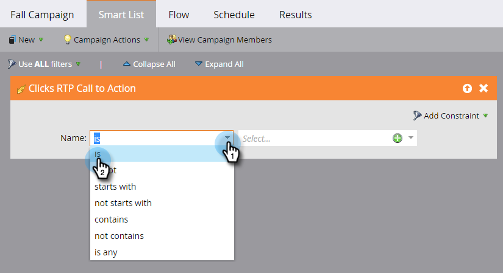

# 웹 개인화 활동에 대한 스마트 목록 정의 {#define-a-smart-list-for-web-personalization-activities}

스마트 캠페인에서 스마트 목록을 정의할 때 필터 및 트리거에서 웹 개인화 활동을 사용할 수 있습니다. 여기서는 웹 개인화 호출을 클릭한 모든 사용자를 캡처하려고 합니다(캠페인).

트리거를 사용하여 이메일 또는 경고를 보내거나 웹 개인화 호출과 참여하여 클릭했거나 방문자를 기준으로 값 또는 점수를 변경합니다. 웹 개인화 호출에서 클릭했던 리드를 필터링하고 볼 수도 있습니다.

1. 스마트 캠페인에서 **스마트 목록** 탭을 클릭합니다.

   

   >[!NOTE]
   >
   >**딥 다이브**
   >
   >
   >스마트 리스트는 놀라운 일을 할 수 있습니다. 고급 목록 [심층 분석에서 자세한 내용을 살펴보십시오](../../../product-docs/core-marketo-concepts/smart-campaigns/understanding-smart-campaigns.md).

1. 트리거를 검색한 다음 캔버스에 트리거를 드래그하여 놓습니다.

   

   >[!NOTE]
   >
   >트리거가 있는 스마트 캠페인은 트리거 모드에서 실행됩니다. 트리거된 이벤트 및 추가된 필터를 기반으로 한 시간에 한 사람씩 실행됩니다.

1. 드롭다운을 클릭하고 연산자를 선택합니다.

   

   >[!CAUTION]
   >
   >빨간색의 물방울 선은 오류를 나타냅니다. 수정되지 않으면 캠페인이 유효하지 않게 되고 실행되지 않습니다.

1. 트리거를 정의합니다.

   

1. 필요에 따라 필터를 추가합니다.

   

   >[!TIP]
   >
   >트리거와 필터가 모두 있는 스마트 캠페인에서 트리거가 맨 위에 표시됩니다. 트리거되면 필터 기준을 만족하는 사람만 흐름을 따라 이동합니다.

   >[!NOTE]
   >
   >여러 개의 트리거를 사용하는 경우 트리거들 중 하나가 활성화되면 사람이 흐름을 따라 이동합니다.

   [스마트 캠페인에 대한 스마트 목록 정의 | 일괄 처리](../../../product-docs/core-marketo-concepts/smart-campaigns/creating-a-smart-campaign/define-smart-list-for-smart-campaign-batch.md)

   >[!NOTE]
   >
   >**관련 문서**
   >
   >    
   >    
   >    * [스마트 캠페인에 대한 스마트 목록 정의 | 일괄 처리](../../../product-docs/core-marketo-concepts/smart-campaigns/creating-a-smart-campaign/define-smart-list-for-smart-campaign-batch.md)
   >    * [스마트 캠페인에 흐름 단계 추가](../../../product-docs/core-marketo-concepts/smart-campaigns/flow-actions/add-a-flow-step-to-a-smart-campaign.md)
   >    * [예측 컨텐츠 활동에 대한 스마트 목록 정의](../../../product-docs/predictive-content/define-a-smart-list-for-predictive-content-activities.md)

동시에 여러 사람 집합에서 캠페인을 실행하려면 방법을 알아봅니다.