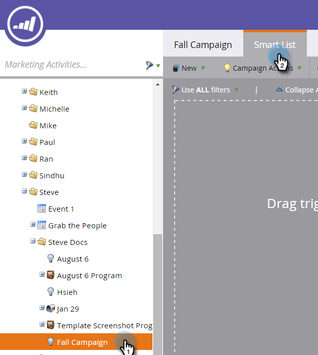

# 웹 개인화 활동에 대한 스마트 목록 정의 {#define-a-smart-list-for-web-personalization-activities}

스마트 캠페인에서 스마트 목록을 정의할 때 필터 및 트리거에서 웹 개인화 활동을 사용할 수 있습니다. 여기에서는 웹 개인화 호출을 클릭한 사람(캠페인)을 캡처하려고 합니다.

트리거를 사용하여 이메일 또는 경고를 전송하거나, 웹 개인화 호출에 참여하여 작업을 수행한 방문자를 기반으로 값 또는 점수를 변경합니다. 또한 웹 개인화 호출에서 클릭된 리드를 필터링하고 작업에 볼 수 있습니다.

1. 스마트 캠페인에서 **Smart List** 탭.

   

   >[!NOTE]
   >
   >스마트 리스트는 놀라운 일을 할 수 있습니다. 자세한 내용은 [Smart List 심층 분석](/help/marketo/product-docs/core-marketo-concepts/smart-campaigns/understanding-smart-campaigns.md).

1. 트리거를 검색한 다음 트리거를 캔버스에 드래그하여 놓습니다.

   

   >[!NOTE]
   >
   >트리거가 있는 스마트 캠페인은 트리거 모드에서 실행됩니다. 트리거된 이벤트와 추가된 필터를 기반으로 한 번에 한 사람씩 실행됩니다.

1. 드롭다운을 클릭하고 연산자를 선택합니다.

   

   >[!CAUTION]
   >
   >빨간색 광선이 표시되면 오류가 표시됩니다. 수정하지 않으면 캠페인이 유효하지 않게 되고 실행되지 않습니다.

1. 트리거를 정의합니다.

   

1. 필요에 따라 필터를 추가합니다.

   

   >[!TIP]
   >
   >트리거와 필터가 모두 있는 스마트 캠페인에서 트리거가 맨 위에 표시됩니다. 트리거되면 필터 기준을 충족하는 사용자만 흐름을 통과합니다.

   >[!NOTE]
   >
   >여러 트리거를 사용할 때 트리거 중 하나가 활성화되면 한 사람이 플로우에 도달합니다.

   한 세트의 사용자에 대해 캠페인을 동시에 실행하려면 다음을 학습합니다 [스마트 캠페인에 대한 스마트 목록 정의 | 일괄 처리](/help/marketo/product-docs/core-marketo-concepts/smart-campaigns/creating-a-smart-campaign/define-smart-list-for-smart-campaign-batch.md).

   >[!MORELIKETHIS]
   >
   >* [스마트 캠페인에 대한 스마트 목록 정의 | 일괄 처리](/help/marketo/product-docs/core-marketo-concepts/smart-campaigns/creating-a-smart-campaign/define-smart-list-for-smart-campaign-batch.md)
   >* [스마트 캠페인에 흐름 단계 추가](/help/marketo/product-docs/core-marketo-concepts/smart-campaigns/flow-actions/add-a-flow-step-to-a-smart-campaign.md)
   >* [예측 컨텐츠 활동에 대한 스마트 목록 정의](/help/marketo/product-docs/predictive-content/define-a-smart-list-for-predictive-content-activities.md)

