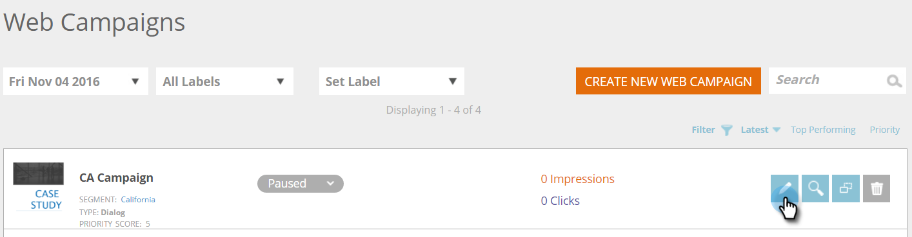

# 기존 웹 캠페인 편집 {#edit-an-existing-web-campaign}

1. 웹 **캠페인으로 이동합니다**.

   

1. 웹 **캠페인** 페이지에서 편집할 캠페인에서 **편집 **을 클릭합니다.

   

   >[!NOTE]
   >
   >원하는 웹 캠페인을 쉽게 찾으려면 [필터 기능을 사용하십시오](filter-web-campaigns.md).

>[!NOTE]
>
>**관련 문서**
>
>* [웹 캠페인 삭제](delete-a-web-campaign.md)
>* [캠페인 시작/](launch-pause-a-web-campaign.md) 일시 [중지](launch-pause-a-web-campaign.md)

>

