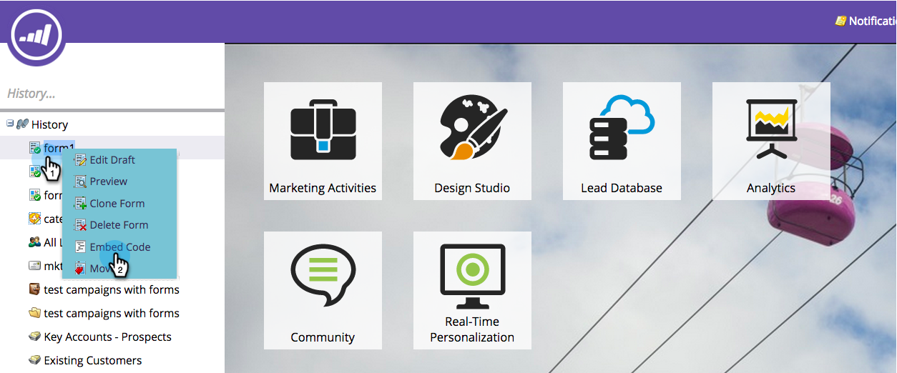

# 웹 캠페인에 양식 포함 {#embed-a-form-into-a-web-campaign}

마케팅 양식을 웹 캠페인(대화 상자, 영역 또는 위젯)에 포함할 수 있는 방법을 확인합니다.

1. 승인된 양식을 마우스 오른쪽 단추로 클릭합니다. **포함 코드**&#x200B;를 선택합니다.

   ** 

   **

1. 코드 복사를 참조하십시오.

   

1. 웹 개인화에서 **웹 캠페인**&#x200B;으로 이동합니다.

   

1. **새 캠페인 만들기**&#x200B;를 클릭합니다.

   ** 

   **

1. 리치 텍스트 편집기에서 HTML 아이콘을 클릭합니다.

   

1. 양식 포함 코드를 HTML 소스 편집기에 붙여 넣습니다. **업데이트**&#x200B;를 클릭합니다.

   

1. 양식이 편집기 보기에는 표시되지 않지만 미리 보기를 통해 캠페인에서 어떻게 렌더링되는지 확인할 수 있습니다.
1. **시작**&#x200B;을 클릭하여 캠페인을 시작합니다.

   >[!NOTE]
   >
   >양식 필드의 변경 사항은 양식의 초안 편집에서 Marketing의 활동 내에서 수행해야 합니다.

## 양식 {#three-ways-to-add-a-background-image-to-a-form}에 배경 이미지를 추가하는 3가지 방법

양식에 배경 이미지를 추가하려면 다음을 수행합니다.

* 양식 테마의 CSS 편집
* 캠페인 설정에서 대화 상자 또는 위젯 색상 변경
* 스크립트에 CSS 코드 추가

양식 테마의 CSS를 편집하려면 [이 문서](../../../product-docs/demand-generation/forms/form-design/edit-the-css-of-a-form-theme.md)를 참조하십시오.

캠페인 설정에서 대화 상자 또는 위젯 색상을 변경하려면:

1. 리치 텍스트 편집기에서 대화 상자 캠페인 유형과 대화 상자 스타일, 머리글 색상 및 배경색을 선택하여 양식의 배경색을 사용자 지정합니다. **저장**&#x200B;을 클릭합니다.

   

1. 밝은 자주색 머리글과 배경색을 사용하여 모던 트림 대화 스타일이 어떻게 나타나는지 예를 소개합니다.

   

스크립트에 CSS 코드를 추가하려면:

1. 리치 텍스트 편집기에서 HTML 아이콘을 클릭합니다.

   

1. 배경 스타일 코드가 포함된 양식 포함 코드를 HTML 소스 편집기에 붙여 넣습니다. **업데이트**&#x200B;를 클릭합니다.

   

1. **미리 보기**&#x200B;를 클릭하여 캠페인에서 어떻게 렌더링되는지 확인합니다(양식이 편집기 보기에 표시되지 않음). 다음은 배경 이미지가 있는 캠페인에서 위의 양식 코드가 렌더링하는 방식의 예입니다.

   

>[!MORELIKETHIS]
>
>* [양식 테마의 CSS 편집](https://docs.marketo.com/display/public/DOCS/Edit+the+CSS+of+a+Form+Theme)
>* [후속 랜딩 페이지 없이 감사 메시지 표시](http://developers.marketo.com/blog/show-thank-you-message-without-a-follow-up-landing-page/)
>* [Forms 2.0](http://developers.marketo.com/documentation/websites/forms-2-0/)

>

