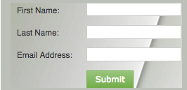

# 웹 캠페인에 양식 포함 {#embed-a-form-into-a-web-campaign}

Marketo 양식을 웹 캠페인(대화 상자, 영역 또는 위젯)에 임베드하는 방법을 확인하십시오.

1. 승인된 양식을 마우스 오른쪽 버튼으로 클릭합니다. **포함 코드**&#x200B;을(를) 선택하십시오.

   

1. 코드를 복사합니다.

   

1. 웹 Personalization에서 **웹 캠페인**(으)로 이동합니다.

   

1. **새 캠페인 만들기**&#x200B;를 클릭합니다.

   

1. 리치 텍스트 편집기에서 HTML 아이콘을 클릭합니다.

   

1. 양식 포함 코드를 HTML Source 편집기에 붙여넣습니다. **업데이트**&#x200B;를 클릭합니다.

   

1. 양식이 편집기 보기에 표시되지 않지만, 양식을 미리 보고 캠페인에서 어떻게 렌더링될지 확인할 수 있습니다.

1. 캠페인을 시작하려면 **시작**&#x200B;을 클릭하세요.

   >[!NOTE]
   >
   >양식의 필드를 변경하려면 양식 초안 편집에서 Marketo의 마케팅 활동 내에서 수행해야 합니다.

## 양식에 배경 이미지를 추가하는 세 가지 방법 {#three-ways-to-add-a-background-image-to-a-form}

양식에 배경 이미지를 추가하려면 다음을 수행할 수 있습니다.

* 양식 테마의 CSS 편집
* Set Campaign에서 대화 상자 또는 위젯 색상 변경
* 스크립트에 CSS 코드 추가

양식 테마의 CSS를 편집하려면 [이 문서](/help/marketo/product-docs/demand-generation/forms/form-design/edit-the-css-of-a-form-theme.md)를 참조하세요.

Set Campaign에서 대화 상자 또는 위젯 색상을 변경하려면:

1. 리치 텍스트 편집기에서 대화 상자 캠페인 유형과 대화 상자 스타일, 머리글 색상 및 배경색을 선택하여 양식의 배경색을 사용자 지정합니다. **저장**&#x200B;을 클릭합니다.

   

1. 다음은 연한 자주색 머리글과 배경색으로 [최신 트림] 대화 상자 스타일을 표시하는 방법의 예입니다.

   

스크립트에 CSS 코드를 추가하려면:

1. 리치 텍스트 편집기에서 HTML 아이콘을 클릭합니다.

   

1. 배경 스타일 코드가 있는 양식 포함 코드를 HTML Source 편집기에 붙여 넣습니다. **업데이트**&#x200B;를 클릭합니다.

   

1. 캠페인에서 렌더링되는 방법을 보려면 **미리 보기**&#x200B;를 클릭하십시오(양식이 편집기 보기에 표시되지 않음). 다음은 배경 이미지가 있는 캠페인에서 위의 양식 코드가 렌더링되는 방식에 대한 예입니다.

   

>[!MORELIKETHIS]
>
>* [양식 테마의 CSS 편집](/help/marketo/product-docs/demand-generation/forms/form-design/edit-the-css-of-a-form-theme.md)
>* [후속 랜딩 페이지 없이 감사 메시지 표시](https://developers.marketo.com/blog/show-thank-you-message-without-a-follow-up-landing-page/)
>* [Forms 2.0](https://experienceleague.adobe.com/ko/docs/marketo-developer/marketo/javascriptapi/forms-api-reference)
