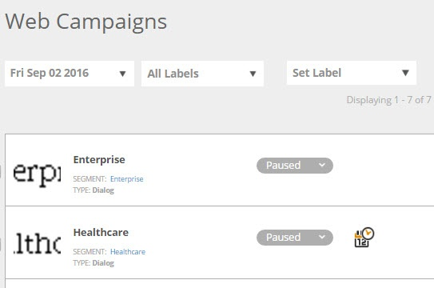

# 웹 캠페인 필터링 {#filter-web-campaigns}

수백 개의 웹 Personalization 캠페인을 만든 후에는 필터를 사용하여 관심 있는 캠페인만 볼 수 있습니다.

1. **웹 캠페인**(으)로 이동합니다.

   

1. 웹 캠페인 페이지에서 **필터**&#x200B;를 클릭합니다.

   

1. 필터링할 캠페인의 상태 및/또는 유형(예: **일시 중지됨** 또는 **대화 상자**)에 대한 확인란을 선택하십시오. **적용**&#x200B;을 클릭합니다.

   

   >[!TIP]
   >
   >**모두 선택** 확인란을 사용하여 모두 선택하거나 **지우기** 링크를 사용하여 모든 확인란을 선택 취소하십시오.

1. 이제 필터와 일치하는 캠페인만 표시됩니다.

   

   케이크 한 조각!
