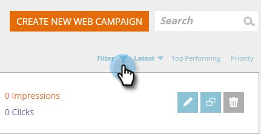

# 웹 캠페인 필터링 {#filter-web-campaigns}

수백 개의 [!DNL Web Personalization] 캠페인을 만든 후에는 필터를 사용하여 관심 있는 캠페인만 볼 수 있습니다.

1. **[!UICONTROL Web Campaigns]** 으로 이동합니다.

   

1. [!UICONTROL Web Campaigns] 페이지에서 **[!UICONTROL Filter]**&#x200B;을(를) 클릭합니다.

   

1. 필터링할 캠페인의 상태 및/또는 유형(예: **[!UICONTROL Paused]** 또는 **[!UICONTROL Dialog]**)에 대한 확인란을 선택합니다. **[!UICONTROL Apply]**&#x200B;를 클릭합니다.

   

   >[!TIP]
   >
   >**[!UICONTROL Select All]** 확인란을 사용하여 모두를 선택하거나 **[!UICONTROL Clear]** 링크를 사용하여 모든 확인란을 선택 취소하십시오.

1. 이제 필터와 일치하는 캠페인만 표시됩니다.

   

   케이크 한 조각!
