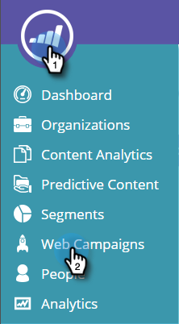
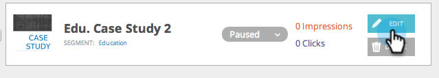

# 웹 캠페인 시작/일시 중지 {#launch-pause-a-web-campaign}

웹 캠페인은 특정 세그먼트와 연계된 사용자 지정 반응이며 웹 사이트의 [대화 상자](/help/marketo/product-docs/web-personalization/working-with-web-campaigns/create-a-new-dialog-web-campaign.md), [영역 교체](/help/marketo/product-docs/web-personalization/working-with-web-campaigns/create-a-new-in-zone-web-campaign.md), 위젯 기능 또는 이메일 알림일 수 있습니다.

[!UICONTROL Web Campaigns] 페이지 또는 [!UICONTROL Set Web Campaigns] 페이지에서 두 가지 방법으로 웹 캠페인을 시작하거나 일시 중지할 수 있습니다.

1. **[!UICONTROL Web Personalization]**&#x200B;을(를) 클릭합니다.

   

1. **[!UICONTROL Web Campaigns]**(으)로 이동합니다.

   

1. 캠페인이 시작되면 **[!UICONTROL Launched]**&#x200B;을(를) 클릭하여 캠페인의 상태를 **[!UICONTROL Paused]**(으)로 변경하고 캠페인을 일시 중지합니다.

   

1. 캠페인이 일시 중지된 경우 **[!UICONTROL Paused]**&#x200B;을(를) 클릭하여 캠페인의 상태를 **[!UICONTROL Launched]**(으)로 변경합니다. 이렇게 하면 캠페인이 활성화되고 시작됩니다.

   

   >[!NOTE]
   >
   >캠페인 설정 페이지에서 캠페인 상태를 변경할 수도 있습니다.

1. 캠페인에서 **[!UICONTROL Edit]**&#x200B;을(를) 클릭합니다.

   

1. 캠페인을 저장하고 일시 중지하려면 **[!UICONTROL Save]**&#x200B;을(를) 클릭하십시오. 캠페인을 시작하고 활성화하려면 **[!UICONTROL Launch]**&#x200B;을(를) 클릭하십시오.

   

>[!MORELIKETHIS]
>
>* [대화 상자 캠페인 만들기](/help/marketo/product-docs/web-personalization/working-with-web-campaigns/create-a-new-dialog-web-campaign.md)
>* [영역 캠페인에 RTP 만들기](/help/marketo/product-docs/web-personalization/working-with-web-campaigns/create-a-new-in-zone-web-campaign.md)
>* [RTP 위젯 캠페인 만들기](/help/marketo/product-docs/web-personalization/working-with-web-campaigns/create-a-new-widget-web-campaign.md)
