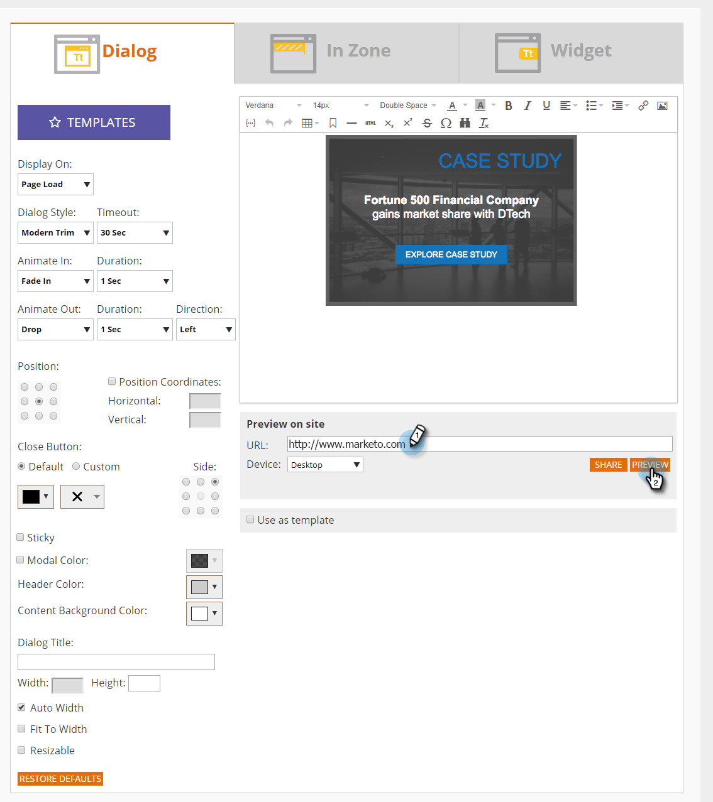

# 웹 캠페인 미리 보기 및 테스트 {#preview-and-test-a-web-campaign}

이 문서에서는 웹 캠페인을 미리 보는 다양한 방법과 웹 사이트에서 라이브로 샌드박스 세그먼트를 사용하여 테스트하는 방법을 보여 줍니다.

## 만들기 페이지 {#preview-a-web-campaign-on-the-creation-page}에서 웹 캠페인 미리 보기

1. **웹** **캠페인**&#x200B;으로 이동합니다.

   

1. 새 웹 캠페인 만들기**** ** 또는 아이콘을 클릭하여 기존 캠페인을 편집합니다.

   

1. 사이트에서 미리 보기에서 페이지 URL을 추가하고 **미리 보기**&#x200B;를 클릭합니다. 캠페인 미리 보기를 보여주는 새 창/탭이 열립니다.

   

   >[!TIP]
   >
   >캠페인 미리 보기의 고정 URL이 있는 이메일을 열려면 **공유**&#x200B;를 클릭합니다.

   >[!NOTE]
   >
   >캠페인을 미리 볼 수 있는 최상의 환경을 위해 브라우저 플러그인([Chrome](https://chrome.google.com/webstore/detail/marketo-web-personalizati/ldiddonjplchallbngbccbfdfeldohkj) 또는 [Firefox](http://docs.marketo.com/display/docs/assets/mwp-0.0.0.8.xpi))을 설치하는 옵션도 있습니다. 아래 섹션을 참조하십시오.

## 브라우저 플러그인 {#preview-a-web-campaign-on-the-creation-page-using-the-browser-plug-in}을 사용하여 작성 페이지에서 웹 캠페인 미리 보기

1. `section above`에서 1단계와 2단계를 수행합니다.
1. 브라우저 플러그인에 대한 링크를 클릭합니다(이 경우 Chrome을 사용 중입니다).

   

1. 새 창/탭이 열립니다. **Chrome에 추가**&#x200B;를 클릭합니다.

   

1. **확장 추가**&#x200B;를 클릭합니다.

   

1. 다시 Marketing으로 돌아갑니다. 페이지 URL을 추가하고 **미리 보기**&#x200B;를 클릭합니다.

   

1. 데스크탑, 휴대폰 또는 태블릿에서 캠페인이 어떻게 보이는지 미리 볼 수 있는 새 창/탭이 열립니다.

   

## 웹 캠페인 페이지 {#preview-a-web-campaign-on-the-web-campaigns-page}에서 웹 캠페인 미리 보기

1. 웹 캠페인 목록을 보는 동안 캠페인을 선택하고 **미리 보기** 아이콘을 클릭하면 됩니다.

   

   진정해!

## 웹 사이트에서 웹 캠페인 미리 보기 {#preview-a-web-campaign-on-your-website}

샌드박스 세그먼트 및 캠페인을 만듭니다.

1. **세그먼트**&#x200B;로 이동합니다.

   

1. **새로 만들기**&#x200B;를 클릭합니다.

   

1. 세그먼트 이름을 지정합니다.
1. 행동에서 페이지 포함을 캔버스로 드래그합니다. *sandbox=1* 값을 추가합니다. 캠페인 저장 및 정의를 클릭합니다.

   

1. 웹 캠페인 설정 페이지의 목록에서 Target 세그먼트를 선택하여 세그먼트를 샌드박스 세그먼트로 변경합니다.

   

1. 캠페인 크리에이티브를 완료하고 **시작**&#x200B;을 클릭합니다.\
   

1. 웹 사이트로 이동하여 URL 끝에 URL 매개 변수 &quot;?sandbox=1&quot;을 추가합니다. 예:[www.marketo.com?sandbox=1](http://www.marketo.com/?sandbox=1)
1. 웹 사이트에서 캠페인이 반응하는지 확인합니다.

>[!NOTE]
>
>캠페인은 방문자 세션 중에 한 번만 반응합니다. 캠페인을 다시 보려면 브라우저 쿠키를 지우십시오.

>[!NOTE]
>
>리디렉션 캠페인을 미리 볼 수 없습니다. 테스트할 수 있는 유일한 방법은 샌드박스 세그먼트를 사용하는 것입니다(특정 페이지별로 타깃팅하는 경우 - *sandbox=redirect*).

