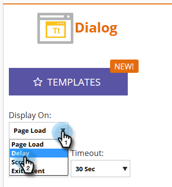
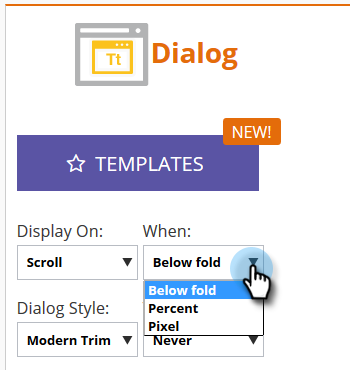

# 웹 캠페인이 표시되는 방식 설정 {#set-how-your-web-campaign-displays}

웹 캠페인이 표시되는 시기/방법과 관련하여 활용할 수 있는 방법에는 몇 가지가 있습니다.

## 페이지 로드 {#page-load}

기본적으로 이 선택 사항은 페이지 로드 시 캠페인을 표시합니다.

## 지연 {#delay}

웹 캠페인이 웹 사이트에서 반응할 시간 지연(총 초)을 지정합니다.

1. **[!UICONTROL Display On]** 드롭다운을 클릭하고 **[!UICONTROL Delay]**&#x200B;을(를) 선택합니다.

   

1. **[!UICONTROL Wait]** 드롭다운을 클릭하고 원하는 시간을 선택합니다.

   

## 스크롤 {#scroll}

1. **[!UICONTROL Display On]** 드롭다운을 클릭하고 **[!UICONTROL Scroll]**&#x200B;을(를) 선택합니다.

   

1. **[!UICONTROL When]** 드롭다운을 클릭하고 웹 캠페인을 표시할 시기를 선택합니다.

   

<table> 
 <tbody> 
  <tr> 
   <td><strong>[!UICONTROL Below fold]</strong></td> 
   <td>방문자가 접힌 부분 아래로 스크롤할 때 캠페인을 표시합니다. 방문자가 접힌 부분 위로 스크롤하면 캠페인이 사라집니다.</td> 
  </tr> 
  <tr> 
   <td><strong>[!UICONTROL Percent]</strong></td> 
   <td>방문자가 페이지의 사전 결정된 비율로 스크롤할 때 캠페인을 표시합니다.</td> 
  </tr> 
  <tr> 
   <td><strong>[!UICONTROL Pixel]</strong></td> 
   <td>
방문자가 페이지의 사전 지정된 상단 픽셀로 스크롤할 때 캠페인을 표시합니다.
</td> 
  </tr> 
 </tbody> 
</table>

## 종료 의도 {#exit-intent}

종료 의도는 마우스 커서가 브라우저를 종료할 때 웹 캠페인을 표시합니다.

1. **[!UICONTROL Display On]** 드롭다운을 클릭하고 **[!UICONTROL Exit Intent]**&#x200B;을(를) 선택합니다.

   

1. [!UICONTROL Exit Intent]이(가) 모바일과 호환되지 않음을 알리는 메시지가 나타납니다.

   

>[!TIP]
>
>미리 선택한 효과가 어떻게 보이는지 알고 싶으신가요? [웹 캠페인 미리 보기](/help/marketo/product-docs/web-personalization/working-with-web-campaigns/preview-and-test-a-web-campaign.md)를 통해 확인해 보세요.
