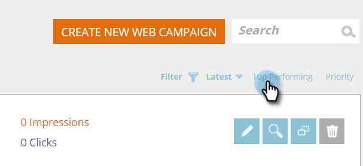

# 최신 또는 성과가 좋은 웹 캠페인 정렬 {#sort-web-campaigns-by-latest-or-top-performing}

웹 캠페인을 서로 다른 두 가지 방법으로 정렬할 수 있습니다.

1. 이동 **웹 캠페인**.

   

1. 정렬 유형을 선택합니다.

   >[!NOTE]
   >
   >**정의**
   >
   >**최신 항목** - 은(는) 캠페인을 만든 날짜를 기준으로 정렬됩니다. 최신 캠페인이 맨 위에 있습니다.
   >
   >**성과가 좋은 상위** - 클릭스루 비율에 따라 캠페인을 정렬합니다. 맨 위에 있는 가장 높은 클릭스루입니다.

   

   네, 정말 그렇게 쉬워요.
