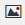

# [!DNL Web Personalization] 리치 텍스트 편집기 사용 {#using-the-web-personalization-rich-text-editor}

[!DNL Web Personalization] 페이지에 있는 [!UICONTROL Set Campaigns] 서식 있는 텍스트 편집기에서 텍스트 서식 지정, 연결 및 이미지 삽입을 허용합니다. 여기에는 표준 워드 프로세서와 유사한 서식 지정 옵션이 포함되어 있습니다.

리치 텍스트 편집기의 중요한 아이콘은 다음과 같습니다.

<table>
 <tbody>
  <tr>
   <td colspan="1"></td>
   <td colspan="1"><strong>HTML Source 편집</strong></td>
   <td colspan="1">HTML 소스 코드를 볼 수 있습니다.</td>
  </tr>
  <tr>
   <td colspan="1"></td>
   <td colspan="1">
<strong>이미지 삽입/편집</strong> 
</td>
   <td colspan="1">편집기에 표시할 그래픽 이미지의 이미지 URL을 삽입합니다.</td>
  </tr>
  <tr>
   <td colspan="1"></td>
   <td colspan="1"><strong>Design Studio에서 이미지 삽입</strong></td>
   <td colspan="1"><em></em>이미지 삽입/편집<strong> 아이콘을 클릭한 후</strong> 이 아이콘을 사용하여 Marketo Design Studio에서 이미지를 선택하십시오</td>
  </tr>
  <tr>
   <td colspan="1"></td>
   <td colspan="1">
<strong>링크 삽입/편집</strong> 
</td>
   <td colspan="1">텍스트 또는 이미지에 하이퍼링크를 추가하는 데 사용</td>
  </tr>
  <tr>
   <td colspan="1"></td>
   <td colspan="1"><strong>토큰 삽입/편집</strong></td>
   <td colspan="1">회사 또는 개인 토큰을 사용하여 웹 캠페인 개인화</td>
  </tr>
 </tbody>
</table>

>[!NOTE]
>
>웹 토큰은 [&#x200B; > &#x200B;](/help/marketo/product-docs/web-personalization/using-web-segments/manage-person-data.md)에서 [!DNL Marketo Database]에서 관리되는 [!DNL Web Personalization]의 [!UICONTROL Account Settings]사람 데이터[!UICONTROL Database]를 사용합니다. 웹 토큰이 아직 [!UICONTROL Account Settings] > [!UICONTROL Database]에 없는 새 데이터베이스 필드인 경우 자동으로 추가되며 활성화하는 데 최대 24시간이 걸릴 수 있습니다.

>[!MORELIKETHIS]
>
>[리치 텍스트 편집기 사용](/help/marketo/product-docs/email-marketing/general/understanding-the-email-editor/using-the-rich-text-editor.md)
