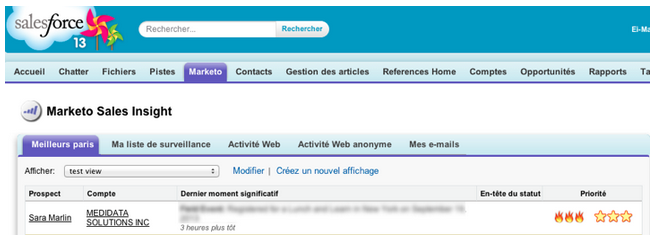

# 릴리스 노트:2013년 9월 {#release-notes-september}

9월 릴리스에는 다음 기능이 포함됩니다. 기능을 사용할 수 있는지 [Marketing](http://docs.marketo.com/display/docs/assets/pricing.php) Edition을 확인하십시오.

릴리스 후 커뮤니티에서 [새로운 릴리스](release-notes-december-2013.md) 탭에서 각 기능에 대한 자세한 기술 자료 문서를 확인하십시오.

## 짧은 URL {#shorter-urls}

이메일 URL에는 모든 추적 기능을 유지하면서 클릭을 쉽게 할 수 있는 트리밍 기능이 부여되었습니다.

>[!CAUTION]
>
>짧은 URL로 전환하면 9월 릴리스 전에 발송된 이메일의 링크가 릴리스 후 90일 후에 만료됩니다.

Marketing to의 데이터를 사용자 요구에 맞게 지정하거나 Velocity 템플릿 언어를 사용하여 이메일 컨텐츠에 조건부 논리를 추가할 수 있습니다.

## Send Test to Send Sample {#change-send-test-to-send-sample}

Send Test to be Send Sample 작업의 이름을 변경했습니다.

## 맞춤형 전송 샘플 이메일 {#personalized-send-sample-email}

이메일 샘플을 보낼 때 리드 이름을 선택하여 샘플 이메일을 개인화할 수 있습니다.

## GoToWebinar에 대한 추가 필드 동기화 {#additional-field-sync-for-gotowebinar}

마케팅 양식의 회사 이름 및 직함을 GoToWebinar로 동기화할 수 있습니다. 이러한 추가 필드를 활성화하려면 이벤트 파트너에서 &quot;추가 필드 활성화&quot;를 선택합니다.

## 사용자 로그인을 SSO로만 제한 {#restrict-user-login-to-sso-only}

일반 로그인 화면이 아닌 Marketing User가 SSO를 통해서만 로그인하도록 구독을 구성합니다.

## 업로드된 파일의 바이러스 검색 {#virus-scan-of-uploaded-files}

파일에 바이러스가 포함되어 있는 경우 Design Studio에 업로드된 파일이 자동으로 스캔되고 차단됩니다

## 기회 영향 분석기 내보내기 {#export-opportunity-influence-analyzer}

이제 기회 영향 분석기의 데이터를 Excel로 내보낼 수 있습니다. 내보낸 각 Excel 파일에는 모든 리드(영업 기회의 역할이 없는 리드 포함)에 대한 모든 마케팅 상호 작용과 분석기에서 선택한 계정 아래의 모든 기회가 포함됩니다. 기회 행은 녹색으로 강조 표시됩니다. 특정 리드 또는 마케팅 활동에 중점을 두어야 하는 경우 Excel의 기본 데이터 필터링 기능을 사용할 수 있습니다.

## 프로그램 속성 설정 {#program-attribution-settings}

계정 기반 속성을 수행하는 기능을 포함하여, Marketing에서 첫 번째 및 다중 터치 기여도 지표에 대한 연락처와 기회를 연결하는 방법을 변경할 수 있습니다. 이러한 설정은 프로그램 기회 분석 영역 및 기회 분석 영역 아래의 매출 탐색기 보고서의 속성 지표에 영향을 줍니다. 이는 프로그램 분석기의 속성 지표에도 영향을 줍니다.

프로그램 속성 설정을 세 가지 선택 사항 중 하나로 변경할 수 있습니다. 이 설정을 변경해도 Marketing 또는 CRM 데이터는 수정되지 않습니다.보고서 실행 방식을 변경하면 언제든지 되돌릴 수 있습니다.

[명시적] 설정은 역할이 있는 연락처(현재 동작)만 검사합니다. 암시적 기능은 역할에 관계없이 계정과 연결된 모든 연락처를 검사합니다. 가능한 경우 명시적 모드를 사용하는 것이 좋습니다. 암시적 사용은 기회에도 실질적인 영향을 주지 않음에도 불구하고 기회에 대해 신용을 갖춘 잘못된 긍지를 만들 수 있습니다.

## 프랑스어 및 독일어로 제공되는 영업 인사이트(Salesforce만 해당) {#sales-insight-available-in-french-and-german-salesforce-only}

AppExchange에서 최신 버전의 Marketing To Lead Management 및 Marketing To Sales Insight를 다운로드하여 프랑스어 및 독일 영업 사원이 선호하는 언어로 Sales Insight 컨텐츠를 볼 수 있습니다.

## 코발트 사용자 인터페이스 {#cobalt-user-interface}

앞으로 몇 달 동안 애플리케이션의 여러 부분에서 새로운 테마가 롤아웃됩니다. 이번 달에는 더 많은 새로운 파란색 모달 창을 발견할 수 있습니다.
