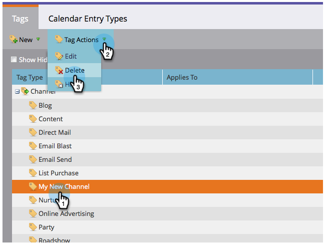
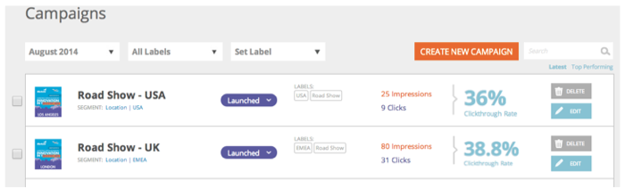

# 릴리스 노트:2014년 8월 {#release-notes-august}

다음 기능은 2014년 8월 릴리스에 포함되어 있습니다. Marketing Edition에서 기능을 사용할 수 있는지 확인하십시오. 릴리스 후 자세한 기능 문서에 대한 링크를 다시 확인하십시오.

## 마케팅 달력 라이선스 {#marketing-calendar-licenses}

2014년 9월 5일 이후에는 5명의 사용자만 마케팅 일정에 무료로 액세스할 수 있습니다. 중단된 액세스 [를 위해 먼저 선택한 사용자에게 마케팅 달력](../../product-docs/core-marketo-concepts/marketing-calendar/understanding-the-calendar/issue-revoke-a-marketing-calendar-license.md) 라이선스를 발행/취소해야 합니다.

## 새 사용자 권한 {#new-user-permissions}

다음과 같은 새 사용자 권한이 추가되었습니다.

| 권한 | 설명 |
|---|---|
| 수익 탐색기 액세스 | RCA를 구입한 경우 액세스할 수 있는 사용자를 제어할 수 있습니다. |
| 목록 가져오기 | 사용자가 리드 데이터베이스로 목록을 가져오는 것을 제한합니다. |
| 목록 가져오기 | 마케팅 활동 중 프로그램을 통해 사용자가 목록을 가져오는 것을 제한합니다. |
| 트리거 캠페인 활성화 | 트리거 캠페인을 활성화하거나 활성화할 수 없는 사용자를 제어할 수 있습니다. |
| 배치 캠페인 예약 | 일괄 캠페인 실행을 예약할 수 있는 사람과 예약할 수 없는 사람을 제어합니다. |

## 관리에서 사용자 및 역할 내보내기 {#export-users-and-roles-from-admin}

이제 [Marketing에서 사용자 및 역할 목록을 내보낼 수](../../product-docs/administration/users-and-roles/export-a-list-of-users-and-roles.md) 있습니다. 내보내기에 포함할 &quot;마지막 로그인&quot; 타임스탬프를 포함할 수도 있습니다.

## 채널 및 태그 삭제 {#delete-channels-and-tags}

이제 사용하지 않은 채널 및 상태를 삭제할 수 있습니다. 항상 마찬가지로 현재 사용 중인 항목만 숨길 수 있습니다.

## 자동화된 DKIM {#automated-dkim}

향상된 전달 기능을 위해 나가는 모든 이메일에는 DKIM(DomainKeys Identified Mail)이 서명됩니다. 기본적으로 이메일은 Marketing의 공유 DKIM 서명을 사용합니다. 이 서명을 사용자 지정할 수 있습니다.

>[!NOTE]
>
>DKIM은 천천히 롤아웃될 것이며, 당신은 몇 주 동안 그것을 볼 수 없을 것입니다.

## 실시간 개인화 업데이트 {#real-time-personalization-updates}

하트 컨텐츠에 태그를 지정할 수 있도록 캠페인 페이지에 레이블을 추가했습니다.

## 모바일 타깃팅 {#mobile-targeting}

커뮤니티에 물어봤더니 배달했어요 이제 모바일 및 태블릿 사용자를 위한 특정 클릭 수를 포함, 제외 또는 설정할 수 있습니다.

## 향상된 1:1 세분화 및 타깃팅 {#enhanced-segmentation-and-targeting}

이제 알려진 방문자를 타깃팅하기 위해 고급 필터 연산자를 사용할 수 있습니다.

## 캠페인 공유 {#campaign-sharing}

이제 RTP 캠페인 미리 보기 링크를 빠르고 쉽게 공유할 수 있습니다.

## 컨텐츠 추천 엔진 보고서 {#content-recommendation-engine-report}

유용한 요약을 볼 수 있도록 새로운 컨텐츠 추천 엔진 보고서가 추가되었습니다.

## 향상된 사용자 관리 {#enhanced-user-administration}

이제 관리자 사용자는 여러 번 로그인 시도가 실패하여 사용자를 잠글 수 있습니다. 원할 경우 해당 사용자의 잠금을 해제할 수도 있습니다.

## 추적 컨트롤 {#tracking-control}

이제 실시간 개인화의 모든 추적 및 보고에서 특정 IP를 제외할 수 있습니다.

