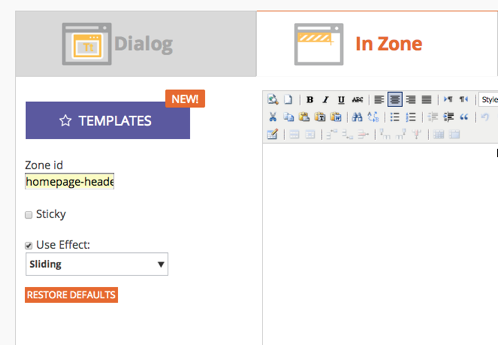

# 릴리스 노트:2014년 12월 {#release-notes-december}

다음 기능은 2014년 12월 릴리스에 포함되어 있습니다. 기능을 사용하려면 Marketing Edition을 확인하십시오. 릴리스 후 다시 돌아와 각 기능에 대한 자세한 아티클에 대한 링크를 찾으십시오.

## 영업 인사이트 보고서 {#sales-insight-reports}

Sales [Insight 이메일 성과 보고서를](../../product-docs/marketo-sales-insight/msi-for-salesforce/features/performance-reports/sales-insight-email-performance-report.md) 사용하면 이메일 및 영업 대표별로 이메일 지표를 볼 수 있습니다. Salesforce, Microsoft Dynamics, Outlook 플러그인 및 Gmail 플러그인을 통해 발송되는 이메일을 지원합니다.

## Facebook 사용자 지정 대상 {#facebook-custom-audiences}

마케팅 관리자가 관리 > 시작 지점을 통해 [Facebook을 추가한](../../product-docs/demand-generation/ad-network-integrations/add-facebook-custom-audiences-as-a-launchpoint-service.md)후 Facebook 사용자 지정 대상을 쉽게 만들거나, 업데이트하거나, Marketing에서 정적 또는 스마트 목록으로 [바꿀 수 있습니다](../../product-docs/demand-generation/facebook/create-a-custom-audience-in-facebook.md). 정적 목록 또는 스마트 목록의 리드 격자 하단에 있는 새로운 Facebook 아이콘을 찾습니다.

## 작업 영역 간 복제 개선  {#improved-cloning-across-workspaces}

[프로그램을](../../product-docs/core-marketo-concepts/programs/working-with-programs/clone-a-program.md) 다른 작업 영역으로 복제하는 작업이 훨씬 수월해졌습니다. 복제를 클릭하면 대상 작업 공간을 선택합니다. 더 이상 폴더로 복제한 다음 폴더를 이동하지 마십시오!

>[!NOTE]
>
>이 새로운 복제 기능은 현재 프로그램에만 사용할 수 있습니다.

## 참조 스마트 목록 {#reference-smart-list}

[스마트 목록 또는 흐름을 작성할 때 다른 작업 공간과 공유되는](../../product-docs/core-marketo-concepts/smart-lists-and-static-lists/using-smart-lists/reference-a-list-or-smart-list-across-workspaces.md)스마트 목록을 참조할 수 있습니다.

## 향상된 목록 가져오기 {#list-import-improvements}

[UTF-16, Shift-JIS 또는 EUC-JP로 인코딩된 파일을](../../getting-started/quick-wins/import-a-list-of-people.md) 가져옵니다. UTF-8 인코딩 파일은 계속 지원됩니다.

## 이메일 스크립팅의 링크 추적 {#link-tracking-in-email-scripting}

이메일 스크립트 내의 링크가 이제 이메일 링크 성능 보고서 내에서 추적 및 사용할 수 있습니다.

## 토큰 인코딩 설정 {#token-encoding-setting}

HTML 인코딩 토큰을 자동으로 사용하기 위한 새로운 보안 기능이 출시되었습니다. 이 기능은 2015년 3월에 기본적으로 활성화됩니다. 그때까지 필드 관리에서 이 기능을 전환하여 미리 동작을 테스트합니다. 모든 리드 및 회사 토큰은 이메일 또는 랜딩 페이지에 삽입될 때 인코딩됩니다. 옵션은 개별 필드에도 사용할 수 있습니다.

## 새로운 ReST API 호출 {#new-rest-api-calls}

리드 및 활동 ReST API에 대한 세 가지 새로운 호출:

・ 리드 파티션 가져오기

・ 리드 연계

・ 리드 병합

자세한 내용은 [developers.marketing.com에서 릴리스 후 제공됩니다.](http://developers.marketo.com/)

## Munchkin Javascript 호환성 개선 사항 {#munchkin-javascript-compatibility-enhancements}

페이지의 다른 JavaScript에서 계속해서 빠르게 로드되고 원하는 대로 작동하도록 Munchkin에 대해 몇 가지 사소한 개선 사항이 수행되었습니다.

롤아웃은 12월 중순부터 시작되며 다음 몇 달 동안 지속됩니다.

## 매출 탐색기 룩앤필 업그레이드 {#revenue-explorer-upgraded-look-and-feel}

## RTP:지정된 계정 목록 모듈 {#rtp-named-account-list-module}

새로운 명명 계정 페이지에서 주요 고수익 계정을 관리하고 모니터링할 수 있습니다. 명명된 계정의 새 목록을 업로드하여 이러한 조직을 식별하고 타깃팅합니다. Adobe는 계정 기반의 마케팅 계획을 구현하고 다양한 채널(웹 및 광고)에서 주요 계정을 타깃팅할 수 있는 더 많은 제어 및 유연성을 제공하는 프로세스를 자동화했습니다.

## RTP:영역 캠페인에 대한 슬라이딩 효과 {#rtp-sliding-effect-for-in-zone-campaigns}

개인화된 컨텐츠가 페이지 로드 시 제자리에 밀릴 수 있도록 시작 영역 캠페인에 대한 새로운 슬라이딩 효과를 추가했습니다.

