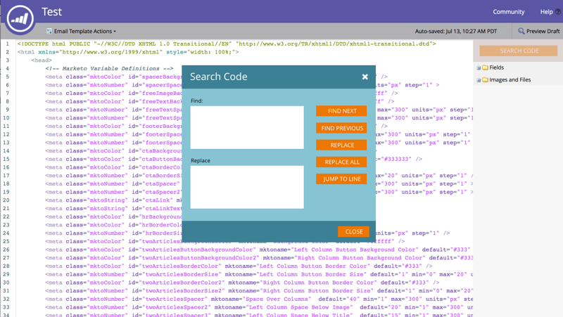
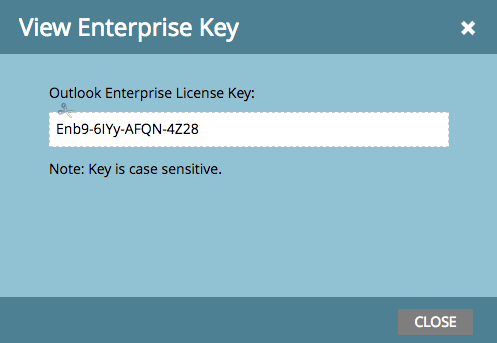

# 릴리스 노트:16년 여름 {#release-notes-summer}

다음 기능은 2016년 여름 릴리스에 포함되어 있습니다. Marketing Edition에서 기능을 사용할 수 있는지 확인하십시오. 제목 링크를 클릭하여 각 기능에 대한 세부 집필을 확인하십시오.

## [계정 기반 마케팅](http://docs.marketo.com/display/docs/account+based+marketing) {#account-based-marketing}

Marketing To Account Based Marketing은 단일 플랫폼에서 모든 필수 요소를 제공합니다.

* **Target** - 계정 검색, 계정 간 일치 및 명명 계정 목록
* **참여** - 계정 기반의 개인화, 크로스채널 참여 및 계정별 워크플로우
* **평가** - 계정 및 목록 수준 인사이트, 계정 참여 점수, 파이프라인 및 매출 영향

>[!NOTE]
>
>ABM은 Marketing To 구독에 대한 추가 기능으로 사용할 수 있으므로 해당 영업 담당자에게 연락하여 구현해 주십시오.

## [감사 추적](http://docs.marketo.com/display/docs/audit+trail) {#audit-trail}

감사 추적은 Marketing To 구독 내에서 수행된 변경 사항에 대한 포괄적인 내역을 제공합니다. 사용자 및 관리자 간의 책임을 생성하고, 예상치 못한 행동의 원인을 식별하고, 누가 무엇을 하고 있는지 알 수 있는 보안을 제공합니다. 이 정보는 언제든지 사용할 수 있으며 다음과 같은 질문에 대답하는 데 사용할 수 있습니다.

* 이 자산 또는 설정은 어떻게 되었고 누가 마지막으로 업데이트했습니까?
* 사용자 X는 어떤 작업을 하고 있습니까?
* 누가 우리 계정에 로그인합니까?

## [Marketing-Video SMS LaunchPoint 통합](http://docs.marketo.com/display/docs/vibes+sms+messages) {#marketo-vibes-sms-launchpoint-integration}

Marketing To에서 바로 SMS 메시지를 손쉽게 만들 수 있습니다. 풍부한 마케팅 데이터를 사용하여 메시지를 개인화하고 타깃팅할 수 있으며 SMS 메시지 대시보드를 통해 성과를 손쉽게 모니터링할 수 있습니다.

>[!NOTE]
>
>이 기능을 사용하려면 기존 Vibes SMS 계정이 있어야 합니다.

## [이메일 2.0 개선 사항](/help/marketo/product-docs/email-marketing/general/email-editor-2/email-editor-v2-0-overview.md) {#email-enhancements}

**모듈 수준 변수**

이전에는 이메일 2.0 템플릿에 지정된 모든 변수가 범위에서 &quot;전역&quot;이었습니다. 모듈 내에서 변수를 사용하는 경우 모듈의 여러 인스턴스를 사용하려는 경우에는 이러한 변수가 항상 권장되지 않습니다. 이번 릴리스를 통해 변수를 &quot;모듈 수준&quot;으로 지정할 수 있으므로, 사용자가 사용되는 각 모듈에 대해 고유한 값을 설정할 수 있어야 함을 나타낼 수 있습니다.

**구문 업데이트**

* 이제 이메일 2.0 템플릿에 지정된 모듈에 대해 &quot;mktoAddByDefault&quot;를 사용하여 새 이메일에 기본적으로 표시되어야 하는 모듈을 표시할 수 있습니다. 대량의 모듈이 포함된 이메일 템플릿을 만드는 경우 훨씬 편리합니다.
* 이제 이미지 요소에서는 기본 `` HTML 요소의 &quot;height&quot; 및 &quot;width&quot; 속성을 최종 사용자에게 잠그거나 편집할 수 있는지 지정할 수 있습니다. mktoLockImgSize=&quot;true&quot;로 설정하면 높이/너비가 잠깁니다(이미지가 변경되더라도). 마찬가지로 mktoLockImgStyle=&quot;true&quot;이면 &quot;style&quot; 속성이 잠깁니다.

**코드 검색**

새로운 검색 기능을 사용하면 이메일 코드 내에서 컨텐츠를 효율적으로 찾아 교체할 수 있습니다. 이 기능은 이메일 템플릿 편집기에서도 사용할 수 있습니다.

**이미지 요소의 토큰 지원**

이제 이미지 삽입 경험의 &quot;외부 URL&quot; 영역에서 토큰을 사용할 수 있습니다. 이미지를 지정한 경우 이제 이메일 편집기 2.0 내에서 이러한 토큰을 참조할 수 `{{my.tokens}}`있습니다. 이미지는 여전히 이메일 편집기 2.0 캔버스에서 끊어진 상태로 표시됩니다. 그러나 이메일을 전송하기 전에 미리 보기 및 샘플 보내기에서 렌더링되는 것을 확인할 수 있습니다.

## [여러 브랜딩 도메인](http://docs.marketo.com/display/docs/add+multiple+branding+domains) {#multiple-branding-domains}

이메일 추적 링크는 단일 브랜딩 도메인으로만 브랜드화할 수 있었던 시대는 지났습니다. 이제 여러 브랜딩 도메인을 추가하여 소비자의 신뢰도를 높일 수 있고 브랜드에 더 집중할 수 있는 보다 간소화된 모양을 만들 수 있으며 이메일 전달 능력을 향상시킬 수 있으며 각 이메일의 추적 링크에 사용할 브랜드 도메인을 이메일 기준으로 선택할 수 있습니다.

## [프로그램 토큰](/help/marketo/product-docs/demand-generation/landing-pages/personalizing-landing-pages/tokens-overview.md) {#program-tokens}

프로그램의 새로운 토큰 유형을 만들었습니다. 이제 자산 및 스마트 캠페인 흐름 단계에서 프로그램 이름, 설명 및 ID를 렌더링할 수 있습니다.

## [기업 키](/help/marketo/product-docs/marketo-sales-insight/msi-outlook-plugin/authorize-the-marketo-outlook-plugin.md) {#enterprise-key}

Outlook용 Sales Insight 플러그인을 세일즈 팀의 각 담당자가 설치하도록 하는 작업은 지루할 수 있습니다. Enterprise 키를 사용하여 원격으로 Outlook용 플러그인을 설치하는 새로운 방법을 도입했습니다. 관리자의 Marketing to Sales Insight 섹션에 있는 고유한 키를 IT 팀에 보내 나머지 작업을 처리할 수 있습니다.

## [웹 개인화 캠페인](/help/marketo/product-docs/web-personalization/working-with-web-campaigns/create-a-new-dialog-web-campaign.md) {#web-personalization-campaigns}

웹 캠페인이 웹 사이트에서 반응할 시간을 지정합니다.

## [컨텐츠 분석 및 Recommendations 내보내기](/help/marketo/product-docs/web-personalization/understanding-web-personalization/understanding-content-analytics.md) {#content-analytics-and-recommendations-export}

콘텐츠 분석 및 추천 데이터를 오프라인으로 봅니다.

## [이메일 편집기 2.0에 대한 API 지원](http://developers.marketo.com/documentation/asset-api/) {#api-support-for-email-editor}

이전에는 v1.0 이메일 및 템플릿과 호환되는 기존 자산 API가 이제 v2.0 이메일 자산에 대해 활성화됩니다.

## [Marketing To 개발자 사이트](http://developers.marketo.com/) {#marketo-developers-site}

새롭고 향상된 기능!

## [개인 정보 설정](/help/marketo/product-docs/administration/settings/understanding-privacy-settings.md) {#privacy-settings}

마케터는 개인 정보 설정을 사용하여 Munchkin 및 웹 개인화 기능을 사용하여 방문자를 추적할지 여부를 결정할 수 있습니다. 추적 수준은 브라우저의 [추적 안 함] 설정, 옵트아웃 쿠키 또는 특정 IP를 사용하여 제어합니다. 이러한 방법은 특정 영역의 Marketing To 가치 및 기능에 영향을 줄 수 있지만 마케터가 변경하지 않는 경우 Marketing To 기능이 동일하게 유지됩니다.

이 기능은 6주 동안 점진적으로 고객에게 제공됩니다. 필요한 경우 Marketing To 지원 센터로 문의하십시오.
