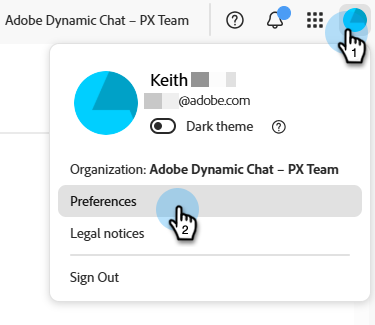
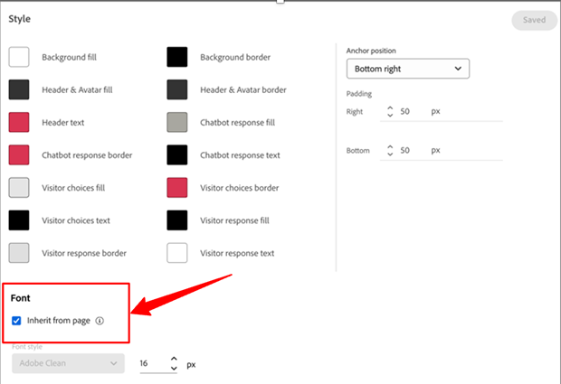
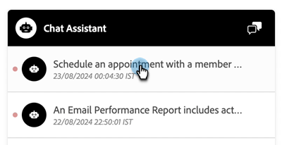
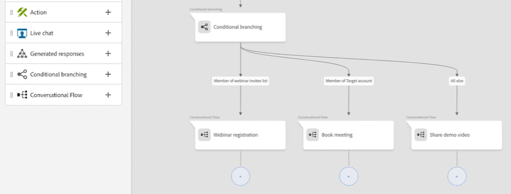

# Dynamic Chat 릴리스 정보 {#dynamic-chat-release}

Adobe Dynamic Chat 릴리스는 기능 배포에 대한 확장 가능한 단계별 접근 방식을 고려하는 연속 게재 모델에서 작동합니다. 한 달에 여러 번의 릴리스가 있을 수 있으므로 정기적으로 다시 확인하여 최신 정보를 확인하십시오.

Marketo Engage의 표준 릴리스 정보 페이지는 [여기에서 확인할 수 있습니다](/help/marketo/release-notes/current.md){target="_blank"}.

## 2025년 6월 릴리스 {#june-2025-release}

**릴리스 일자: 2025년 6월 30일**

### 라우팅 논리 개선 {#routing-logic-revamp}

Dynamic Chat의 라이브 채팅 라우팅 논리를 개편하여 모든 라우팅 유형(계정, 사용자 정의, 팀 및 라운드 로빈)에서 보다 지능적이고 예측 가능한 참여 비헤이비어를 보장합니다. 새로운 논리는 라우팅 플로우를 단순화하고 에이전트가 지원 불가능한 경우 대체 처리를 개선합니다.

#### 라우팅 비헤이비어의 주요 개선 사항

* **세션당 최대 2회의 참여 시도**

   * 시스템은 최대 두 개의 에이전트와 연결을 시도하지만 기본 라우팅 규칙 내에서만 엄격하게 시도합니다.

   * 에이전트가 지원 가능하지만 응답하지 않는 경우(예: 채팅 거부 또는 누락) 시스템은 동일한 풀의 다른 에이전트에게 연결을 시도합니다.

   * 대체 논리(예: 라운드 로빈)는 실패한 참여를 다시 시도하는 것이 아니라 초기 배치 중에 적격한 에이전트를 찾을 수 없는 경우에만 활성화됩니다.

* **라우팅 규칙별 비헤이비어**

##### -계정 라우팅-

방문자의 이메일 도메인이 알려진 계정에 매핑되는 경우 매핑된 에이전트가 항상 우선순위를 가집니다.

에이전트가 지원 가능한 경우 채팅이 해당 에이전트에게 직접 라우팅됩니다.

에이전트가 지원 불가능한 경우 시스템은 다음 작업을 수행합니다.

* 라운드 로빈이 대체 항목으로 활성화되어 있더라도 다른 에이전트를 시도하지 않습니다.

* 대신 다음 작업을 수행합니다.

   * 매핑된 에이전트의 회의 캘린더를 표시하거나 (활성화된 경우)
   * 기본 메시지로 돌아갑니다(최악의 경우).

카드 수준 라우팅 규칙(예: 팀, 사용자 정의)은 계정 라우팅이 적격하지 않은 경우(일치하는 도메인 또는 에이전트가 없는 경우)에만 고려됩니다.

##### -사용자 정의/팀 라우팅-

이러한 규칙은 여러 적격 에이전트를 반환할 수 있습니다.

첫 번째 지원 가능한 에이전트가 참여하지 않으면 시스템은 동일한 목록에서 한 명의 에이전트에게 더 연결을 시도합니다.

한 에이전트가 응답하지 않는다고 해서 라운드 로빈 대체가 트리거되지 않습니다.

두 에이전트 모두 참여하지 않으면 시스템은 다음 작업을 수행합니다.

* 첫 번째 시도한 에이전트의 캘린더를 표시하거나 (활성화된 경우)
* 기본 대체 메시지를 표시합니다.

##### -라운드 로빈 라우팅-

기본 라우팅 규칙으로 사용되는 경우 시스템은 다음 작업을 수행합니다.

* 라운드 로빈 풀에서 첫 번째 지원 가능한 에이전트와 참여를 시도합니다.

* 첫 번째 에이전트가 응답하지 않으면 다음으로 적격한 에이전트로 재시도합니다.

라운드 로빈이 대체로 사용되는 경우 기본 규칙에서 배정된 에이전트가 없는 경우에만 활성화됩니다.

##### 방문자 경험 플로우

시스템은 계정 라우팅이 적용 가능한지 확인합니다.

* 적용 가능하며 에이전트가 지원 가능한 경우 즉시 연결됩니다.

* 에이전트가 적격하지 않거나 지원 불가능한 경우 카드 수준 라우팅 규칙으로 진행합니다.

카드 수준 라우팅 규칙(사용자 정의, 팀, 라운드 로빈)이 평가됩니다.

* 적격한 에이전트의 가용성(권한, 상태)을 확인합니다.

* 시스템은 한 명의 에이전트와 연결하고, 필요한 경우 동일한 규칙에 따라 두 번째 에이전트와 연결을 시도합니다.

* 참여가 성공하지 못하면 대체 논리가 적용됩니다.

   * 캘린더 대체 (활성화된 경우) 또는
   * 기본 메시지

라운드 로빈 대체는 개별 에이전트가 응답하지 않을 때가 아니라 기본 라우팅 규칙에서 적격한 에이전트를 찾을 수 없는 경우에만 고려됩니다.

##### 사용 사례

_**계정 라우팅**_

<table><thead>
  <tr>
    <th>유형</th>
    <th>예</th>
    <th>결과</th>
  </tr></thead>
<tbody>
  <tr>
    <td>적합</td>
    <td>방문자의 도메인이 계정에 매핑됩니다. 매핑된 에이전트는 라이브 채팅을 활성화했으며 지원 가능합니다.</td>
    <td>채팅은 매핑된 에이전트에 직접 연결됩니다.</td>
  </tr>
  <tr>
    <td>대체 (라운드 로빈)</td>
    <td>매핑된 에이전트를 사용할 수 없습니다. 라운드 로빈 대체가 활성화되었습니다.</td>
    <td>시스템은 라운드 로빈을 통해 지원 가능한 한 명의 에이전트를 선택하여 참여시킵니다. </td>
  </tr>
  <tr>
    <td>대체 에이전트 없음</td>
    <td>매핑된 에이전트를 사용할 수 없으며 라운드 로빈 대체가 없습니다. 회의 예약이 활성화되었습니다.</td>
    <td>시스템은 매핑된 에이전트의 캘린더를 표시하거나 기본 대체 메시지를 표시합니다.</td>
  </tr>
</tbody></table>

_**사용자 정의 라우팅**_

<table><thead>
  <tr>
    <th>유형</th>
    <th>예</th>
    <th>결과</th>
  </tr></thead>
<tbody>
  <tr>
    <td>적합</td>
    <td>사용자 지정 로직이 에이전트 목록을 확인합니다. 첫 번째 에이전트를 사용할 수 있으며 채팅을 허용합니다.</td>
    <td>채팅이 첫 번째 에이전트에게 연결됩니다.</td>
  </tr>
  <tr>
    <td>대체 (라운드 로빈)</td>
    <td>사용자 정의 규칙은 에이전트를 배정하지 않으며, 라운드 로빈 대체가 활성화됩니다.</td>
    <td>시스템은 라운드 로빈을 통해 지원 가능한 한 명의 에이전트를 선택하여 참여시킵니다.</td>
  </tr>
  <tr>
    <td>대체 에이전트 없음</td>
    <td>두 에이전트가 배정되었지만 둘 다 채팅을 수락하지 않으며, 대체 방안으로 회의 캘린더가 설정되었습니다.</td>
    <td>처음 시도한 에이전트의 캘린더가 표시되거나 기본 대체 메시지가 표시됩니다.</td>
  </tr>
</tbody></table>

_**팀 라우팅**_

<table><thead>
  <tr>
    <th>유형</th>
    <th>예</th>
    <th>결과</th>
  </tr></thead>
<tbody>
  <tr>
    <td>적합</td>
    <td>팀에 라이브 채팅 가능한 에이전트가 포함되어 있으며, 가장 먼저 지원 가능한 에이전트가 채팅을 수락합니다.</td>
    <td>채팅이 해당 에이전트에게 연결됩니다.</td>
  </tr>
  <tr>
    <td>대체 (라운드 로빈)</td>
    <td>지원 가능한 팀 에이전트가 없으며 라운드 로빈 대체가 활성화됩니다.</td>
    <td>시스템이 라운드 로빈 풀에서 한 명의 에이전트를 선택하여 연결합니다.</td>
  </tr>
  <tr>
    <td>대체 에이전트 없음</td>
    <td>두 명의 지원 가능한 에이전트가 있지만 둘 다 참여하지 않으며, 캘린더 대체가 활성화됩니다.</td>
    <td>처음 시도한 에이전트의 캘린더가 표시되거나 대체 메시지가 트리거됩니다.</td>
  </tr>
</tbody></table>

_**라운드 로빈 라우팅**_

<table><thead>
  <tr>
    <th>유형</th>
    <th>예</th>
    <th>결과</th>
  </tr></thead>
<tbody>
  <tr>
    <td>적합</td>
    <td>라운드 로빈 풀에는 여러 에이전트가 있습니다. 두 번째 에이전트는 첫 번째 에이전트가 실패한 후 채팅을 수락합니다.</td>
    <td>채팅이 두 번째 에이전트에게 연결됩니다.</td>
  </tr>
  <tr>
    <td>대체 (라운드 로빈)</td>
    <td>라운드 로빈 풀에 지원 가능한 에이전트가 없으며, 회의 캘린더가 활성화됩니다.</td>
    <td>목록에 첫 번째 에이전트(구성된 경우)에 대한 캘린더가 표시되거나 대체 메시지가 표시됩니다.</td>
  </tr>
  <tr>
    <td>대체 에이전트 없음</td>
    <td>지원 가능한 에이전트가 없고 대체가 비활성화됩니다.</td>
    <td>방문자에게 정적 대체 메시지가 표시됩니다.</td>
  </tr>
</tbody></table>

### 펄스 알림 {#pulse-notification}

방문자가 에이전트 연결을 요청할 때마다 인앱 및 브라우저 알림이 에이전트에게 제공됩니다. 하지만 때로는 에이전트가 이러한 채팅을 놓치는 경우가 있습니다.

이 릴리스를 통해 라이브 에이전트는 새로운 방문자가 채팅에 관심을 보일 때 이메일, Slack, 인앱 및 브라우저 알림을 받을 수 있습니다.

1. Adobe Experience Cloud 홈 페이지에서 계정 아이콘을 클릭하고 **환경 설정**&#x200B;을 선택합니다.

   

1. _알림_&#x200B;까지 아래로 스크롤하여 원하는 Dynamic Chat 선택 항목을 만듭니다.

   

>[!NOTE]
>
>펄스 알림의 콘텐츠는 인앱 및 브라우저 알림에 사용하는 것과 동일할 수 있습니다.

## 2025년 4/5월 릴리스 {#apr-may-25-release}

### 메시지 알림음 {#message-notification-sound}

이제 세션에서 챗봇이 트리거될 때마다 방문자를 위한 사운드를 활성화하는 옵션이 제공됩니다. 선택할 수 있는 여러 사운드가 있습니다.

### 모바일에서 포크 메시지 활성화 {#enable-poke-messages-on-mobile}

방문자가 클릭하지 않고도 채팅 아이콘 옆에 시작 질문을 표시하는 “Poke” 기능이 이제 모바일 디바이스를 사용하는 방문자를 위해 활성화할 수 있는 옵션으로 제공됩니다.

### 기본 대체 업데이트 {#default-fallback-update}

사용자 정의 규칙/팀을 라이브 채팅 카드로 사용하는 경우, 사용 가능한 에이전트가 없거나 채팅에 연결할 수 없는 경우 지원 가능한 에이전트(스트림에 설정된 라우팅 논리/규칙에 관계없이 해당 시간에 이용 가능한 모든 에이전트)에 대해 라운드 로빈으로 대체됩니다.

### Demandbase 통합 {#demandbase-integration}

Demandbase 사용자는 Dynamic Chat에서 Demandbase 사용자 속성을 사용하여 대화 타기팅, 조건부 브랜딩 및 사용자 정의 라우팅을 수행할 수 있습니다.

## 2024년 9월/10월 릴리스 {#sep-oct-release}

### 향상된 라이브 채팅 분석 {#enhanced-live-chat-analytics}

Analytics 대시보드에 다음과 같은 여러 개선 사항이 적용되었습니다.

* 총 요청된 라이브 채팅 수: “에이전트와 채팅”을 요청한 방문자 수

* 총 연결된 라이브 채팅: “에이전트와 채팅”을 요청한 총 방문자 수 대비 연결된 방문자 수

* 놓친 라이브 채팅 요청 수: “에이전트와 채팅”을 요청한 방문자 수 대비 처리되지 않은 방문자 수

* 평균 채팅 시간(분): 방문자와 에이전트 간의 “평균 채팅 시간” 분석

* 평균 에이전트 응답 시간(초): 라이브 채팅 Q&amp;A에 응답하는 데 걸린 에이전트의 “평균 시간” 분석

* 일일 대시보드: 성공적으로 연결된 라이브 채팅 요청, 놓친 라이브 채팅 요청, 최근 라이브 채팅 활동 정렬 및 필터링

### 대화 점수 {#conversation-scoring}

채팅 상호 작용의 품질을 기반으로 리드를 정량화하고 해당 지표를 Marketo Engage 스마트 캠페인에서 트리거/필터로 사용하십시오. 다음 활동에 새로운 속성 _대화 점수_&#x200B;를 사용하십시오.

* 대화에 참여함
* 대화 플로우에 참여함
* 에이전트와 상호 작용함

**참고 사항:**

* 점수 값은 0, 1, 2, 3입니다(기본값은 null).

* 대화가 완료되거나 중단되면 점수 값을 편집할 수 없습니다.

* 점수 설정:

   * 에이전트 받은 편지함 - 라이브 채팅 중에 에이전트가 대화 점수를 업데이트하거나 설정할 수 있으며, 이 점수는 대화 활동에 저장됩니다.

   * 스트림 디자이너 - 목표 카드에서 사용자가 대화 점수를 업데이트하거나 설정할 수 있습니다.

### 새로운 리드 생성 논리 {#new-lead-creation-logic}

리드가 이메일 `abc@test.com`으로 양식을 작성하고 xyz로 쿠키 처리되면 나중에 이메일 `def@test.com`으로 동일한 양식을 작성하는 경우 새로운 사용자 기록이 생성되지만 쿠키 xyz는 새로운 사용자와 연결되고 사용자 `abc@test.com`에서는 제거됩니다.

따라서 쿠키 abc를 사용하는 방문자가 페이지에 방문하여 `abc@test.com`으로 이메일 ID를 제공하는 경우:

<table><thead>
  <tr>
    <th>방문자</th>
    <th>쿠키</th>
    <th>제공된 이메일</th>
    <th>예상 비헤이비어</th>
  </tr></thead>
<tbody>
  <tr>
    <td>익명</td>
    <td>abc</td>
    <td>데이터베이스에 존재하지 않음</td>
    <td>새 사용자 만들기</td>
  </tr>
  <tr>
    <td>익명</td>
    <td>abc</td>
    <td>데이터베이스에 존재함</td>
    <td>사용자 병합</td>
  </tr>
  <tr>
    <td>익명</td>
    <td>xyz</td>
    <td>데이터베이스에 존재함</td>
    <td>사용자 병합</td>
  </tr>
  <tr>
    <td>알려진 사용자</td>
    <td>abc</td>
    <td>기존 사용자와 동일함</td>
    <td>사용자 업데이트</td>
  </tr>
  <tr>
    <td>알려진 사용자</td>
    <td>abc</td>
    <td>기존 사용자와 다름</td>
    <td>알려진 사용자가 이미 존재하는 경우 쿠키를 전송하고 해당 프로필을 확인합니다. 이 이메일을 사용하는 사용자가 존재하지 않으면 새로운 사용자 레코드를 생성하고 쿠키를 전송합니다.</td>
  </tr>
  <tr>
    <td>알려진 사용자</td>
    <td>xyz</td>
    <td>기존 사용자와 동일함</td>
    <td>동일한 사용자에게 새 쿠키 추가</td>
  </tr>
  <tr>
    <td>알려진 사용자</td>
    <td>xyz</td>
    <td>기존 사용자와 다름</td>
    <td>이 시나리오는 다음의 새 쿠키처럼 수행할 수 없습니다.   기본값을 새로운 익명 프로필로 고려</td>
  </tr>
</tbody></table>

### 글꼴 상속 옵션 {#option-to-inherit-font}

이제 챗봇이 Dynamic Chat에서 브랜드 글꼴을 관리하는 대신 호스팅되는 웹 페이지에서 직접 글꼴을 상속하도록 활성화하는 옵션이 제공됩니다. 이 옵션을 활성화하면 챗봇이 페이지의 `<body>` 태그에 정의된 글꼴을 가져옵니다.

### Dynamic Chat과 Demandbase 통합 {#demandbase-integration-with-dynamic-chat}

Demandbase 사용자는 자체 Demandbase 라이선스를 가져와서 통합을 활성화할 수 있습니다. 대화 타기팅, 조건부 브랜딩 및 사용자 정의 라우팅에 Demandbase 개인 속성을 활용하십시오.

이러한 속성 값에 대한 개인별 분석은 실시간으로 수행되며 해당 개인 프로필에 저장됩니다.

### 최적화된 대화 플로우 로드 시간 {#optimized-conversation-flow-load-time}

사용자 경험을 개선하기 위해 대화 플로우가 로드되는 동안 공백 대신 쉬머 로더가 표시됩니다.

**이전**

**이후**

## 2024년 8월 릴리스 {#august-release}

**릴리스 일자: 2024년 8월 23일**

### 대화 메시지 사용자 정의 형식 {#custom-format-conversation-messages}

이제 스트림 디자이너는 [HTML 삽입](/help/marketo/product-docs/demand-generation/dynamic-chat/automated-chat/stream-designer.md#create-a-stream){target="_blank"}을 지원하여 대화의 모양과 느낌을 사용자 정의할 수 있습니다.

### 챗봇이 맨 아래로 스크롤됩니다. {#chatbot-scroll-to-bottom}

웹 방문자가 마지막 메시지로 바로 이동할 수 있도록 챗봇에 아이콘이 추가되었습니다. 이는 텍스트를 스크롤하는 방문자가 대화로 빠르게 돌아오는 데 도움이 됩니다.

### 코어 펄스 알림 {#core-pulse-notifications}

이제 사용자는 회의 예약 또는 라이브 채팅이 실패할 때 [이메일 알림](/help/marketo/product-docs/demand-generation/dynamic-chat/live-chat/live-chat-overview.md#failed-action-notifications){target="_blank"}을 받습니다.

### 다중 대화 지원 {#support-for-multiple-conversations}

이제 챗봇은 다중 대화를 지원합니다. 웹 사이트 방문자는 다른 페이지에서 동시에 여러 대화에 참여할 수 있으며, 페이지 간을 전환하는 기능도 있습니다.

### 콘텐츠에 대한 기본 정렬 {#default-sorting-for-content}

기본적으로 대화 로그, 답변되지 않은 질문 및 질문 생성 테이블은 생성 날짜(가장 최신순부터 가장 오래된 순)로 정렬됩니다.

### 실시간 리드 해결 {#real-time-lead-resolution}

익명 리드와의 대화 중에 이메일 ID가 제공되면 해당 이메일 ID가 있는 알려진 리드 기록이 있는지 확인하고, 해당 기록을 사용하여 실시간 개인화를 진행합니다. 여러 레코드가 발견되면 실시간으로 병합합니다. 이 비헤이비어는 대화 및 대화 플로우 모두에 대해 구현됩니다.

### Marketo Engage에서 쿠키 없는 리드 동기화 {#syncing-leads-without-cookies}

이전에는 Marketo Engage 동기화가 활성화되면 Dynamic Chat은 Marketo Engage에서 하나 이상의 쿠키 ID가 있는 알려진 리드만 동기화했습니다. 이제 모든 알려진 리드(쿠키 ID 유무와 관계없음)가 Dynamic Chat으로 동기화되고 대화의 개인화를 위해 사용될 수 있습니다.

### 추가 방문자 데이터를 대화 플로우로 전달 {#pass-additional-visitor-data}

양식이나 로그인을 통해 방문자 정보를 수집하는 경우 이제 이 정보를 Dynamic Chat으로 직접 전달할 수 있습니다.

### 새로 고침된 추론 데이터 {#refreshed-inferred-data}

웹 사이트의 대다수 대화는 익명 방문자와 함께 진행됩니다. 방문자 IP에 의존하는 추론 데이터를 통해 여전히 이들을 타기팅할 수 있습니다. IP와 그에 따른 추론 데이터의 데이터베이스를 업데이트했으며, 이제 4배 더 많은 IP를 지원합니다.

### 에이전트 브라우저 알림에 사운드 추가됨 {#sound-added-to-agent-browser-notification}

라이브 채팅이 에이전트에게 할당되면 브라우저 알림이 전송됩니다. 하지만 가끔 보지 못하는 경우가 있습니다. 앞으로 알림 누락을 방지하는 데 도움이 되도록 [알림음](/help/marketo/product-docs/demand-generation/dynamic-chat/live-chat/live-chat-overview.md#when-a-live-chat-is-routed-to-an-agent){target="_blank"}을 추가했습니다.

### 라이브 채팅 중에 리드 프로필을 업데이트하는 기능 {#update-lead-profile-during-live-chat}

라이브 채팅 중에 에이전트는 방문자에 대한 정보를 수집하고 해당 프로필을 업데이트하고자 합니다. 이제 리드 및 회사 오브젝트의 속성 값을 업데이트하는 옵션이 제공됩니다.

## 2024년 6월 릴리스 {#june-release}

**릴리스 일자: 2024년 6월 6일**

### 대화 플로우 카드 {#conversational-flow-card}

대화 플로우 카드를 활용하여 대화 내의 플로우에서 여러 단계를 간소화합니다.

예: 다중 대화를 통해 웨비나 등록을 유도하는 것이 목표인 경우, 해당 목표를 가진 모든 대화에 걸쳐 동일한 플로우를 다시 만들어야 했습니다. 그리고 세부 사항을 업데이트해야 하는 경우 각 개별 대화를 한 번에 하나씩 편집해야 했습니다. 대화 플로우 카드 덕분에 더 이상 이러한 작업이 필요하지 않습니다.

여러 대화에 걸쳐 플로우를 재사용하는 것 외에도 동일한 전환 플로우를 양식 및 랜딩 페이지와 같은 다른 채널을 통해 트리거하는 데 사용할 수 있습니다.

### 사용 제한 {#usage-limits}

사용 제한 페이지에는 패키지 세부 사항 및 사용 한도 상태와 같은 중요한 정보가 표시됩니다.

## 2024년 5월 릴리스 {#may-release}

**릴리스 일자: 2024년 5월 15일**

### 사전 승인된 응답 라이브러리 {#pre-approved-response-library}

AI가 생성한 질문 및 답변으로 [마케팅 승인 라이브러리를 만들면](/help/marketo/product-docs/demand-generation/dynamic-chat/generative-ai/response-library.md){target="_blank"} 몇 분 만에 생성형 AI 채팅을 설정하는 데 도움이 됩니다.

### 답변되지 않은 질문 {#unanswered-questions}

이전 대화의 [답변되지 않은 질문 저장소를 사용](/help/marketo/product-docs/demand-generation/dynamic-chat/generative-ai/unanswered-questions.md){target="_blank"}하여 최신 정보를 포함하는 응답 라이브러리를 유지 관리하는 새로운 사전 승인된 응답을 생성하십시오.

### 대화 요약 {#conversation-summaries}

회의 전에 주요 토론 주제에 대한 인사이트를 포함하여 [세일즈 담당자에게 요약된 대화를 제공](/help/marketo/product-docs/demand-generation/dynamic-chat/live-chat/agent-inbox.md#conversation-summary){target="_blank"}하면 준비 시간을 줄이고 세일즈 담당자가 최신 정보를 더욱 잘 수집하도록 할 수 있습니다.

### GenAI 세일즈 단축키 {#genai-sales-shortcuts}

라이브 채팅 에이전트에게 AI 생성 응답에 더 빠르게 액세스하고, 기존의 생성된 응답을 편집하며, 대화 중에 구매자에게 보낼 추가 콘텐츠를 검색하는 [더 빠른 방법](/help/marketo/product-docs/demand-generation/dynamic-chat/live-chat/agent-inbox.md#shortcuts){target="_blank"}을 제공합니다.

### 대화 지원 {#conversation-assist}

마케팅 팀에서 사전 승인한 응답을 사용하여 라이브 대화 중에 세일즈 담당자가 정확하게 응답하도록 지원합니다.

### 대화 넛지 {#conversation-nudges}

대화를 결론으로 이끌어내기 위해 웹 방문자를 행동으로 유도합니다.

## 2024년 4월 릴리스 {#april-release}

**릴리스 일자: 2024년 4월 23일**

### 이제 모든 사용자가 대화 플로우를 사용할 수 있습니다. {#conversational-flows-available-to-all-users}

적격 리드가 양식 제출 직후 영업과 회의를 예약하거나 채팅할 수 있도록 허용하여 양식 및 랜딩 페이지를 더욱 대화형으로 만들고 판매 경로를 단축하는 대화형 양식은 이제 모든 Dynamic Chat 사용자에게 완전히 제공&#42;됩니다.

_&#42;이전에는 평생 참여 100회를 제공하는 체험판 기능으로 제공되었습니다. 대화 플로우 참여는 이제 Select 패키지 사용자의 월 250회 참여 대화 한도에 포함됩니다._

### 콜백 함수 {#callback-functions}

q[콜백 함수](/help/marketo/product-docs/demand-generation/dynamic-chat/setup-and-configuration/callback-functions.md){target="_blank"}를 사용하면 방문자가 Dynamic Chat 대화에 참여할 때 Adobe Analytics 또는 Google Analytics와 같은 외부 시스템에서 Dynamic Chat 분석 이벤트를 수집할 수 있습니다. API에 콜백을 등록하여 Dynamic Chat 분석 이벤트를 수신하도록 함으로써 Dynamic Chat 분석 이벤트를 활성화합니다. 이를 통해 웹 트래픽과 같은 다른 주요 데이터와 관련된 Dynamic Chat 참여를 보다 전체적으로 살펴볼 수 있습니다.

### 조건부 분기에 라이브 에이전트 가용성 조건이 추가됨 {#live-agent-availability-conditional-branching}

기본 및 사용자 정의 Marketo Engage 필드 외에도 이제 조건부 분기를 사용하여 에이전트 가용성에 기반으로 분기를 만들 수 있습니다. 이는 라이브 에이전트가 지원 가능한 경우에만 방문자에게 라이브 에이전트와 대화하는 옵션을 제공하려는 경우에 유용합니다.

### 조건부 분기에 스마트 목록 조건이 추가됨 {#smart-list-condition}

조건부 분기에 새로운 Marketo Engage 스마트 목록 조건이 추가됨에 따라 Dynamic Chat에서 대상자 분기 조건을 정의하는 대신 이미 Marketo Engage에서 만든 기존 대상자를 기반으로 분기를 만들 수 있습니다.

### 대화 플로우에 대한 조건부 분기 {#conditional-branching-for-conversational-flows}

올해 초에 대화에 대한 조건부 분기를 릴리스했으며, 이제 대화 플로우에서도 조건부 분기를 활용할 수 있습니다. 조건부 분기를 사용하면 다른 조건을 기반으로 플로우에 분기를 만들 수 있습니다.

### 대화 플로우에 대한 라이브 채팅 {#live-chat-for-conversational-flows}

2023년에 대화용 라이브 채팅 기능을 릴리스했으며, 이제 대화 플로우에도 라이브 채팅 참여를 추가할 수 있습니다. Marketo Engage 양식과 함께 대화 플로우를 사용하는 경우 이제 적격 방문자가 양식 제출 직후 라이브 에이전트와 채팅할 수 있도록 허용할 수 있습니다.

### 에이전트 받은 편지함의 최근 Marketo Engage 활동 {#recent-marketo-engage-activities-in-agent-inbox}

에이전트 받은 편지함의 최근 활동 섹션에 최근 Marketo Engage 활동을 추가하여 사이트 방문자가 에이전트와 채팅을 요청할 때 에이전트가 방문자가 최근(지난 25개 활동)에 다음 Marketo Engage 활동에 참여했는지 여부를 빠르게 확인할 수 있습니다.

* 이메일 열람함
* 방문한 웹 페이지
* 작성된 양식
* “즐거운 순간”이 있었음

### 에이전트 관리의 캘린더 연결 상태 {#calendar-connection-status-in-agent-management}

관리자는 이제 회의 예약 권한이 있는 에이전트가 Dynamic Chat에서 캘린더를 연결했는지 여부를 쉽게 확인할 수 있습니다. 이를 통해 전체 세일즈 팀이 연결되고 Dynamic Chat의 회의 요청을 수락할 준비가 되었는지 확인할 수 있습니다.

### 에이전트 캘린더 구성의 최소 알림 설정 {#minimum-notice-setting-in-agent-calendar-configuration}

사용자들이 웹 방문자가 불과 10분 전에 회의를 예약한다는 보고를 받았고, 이에 따라 에이전트 캘린더 구성에 최소 통지 설정을 도입하고 기본 리드 타임을 24시간으로 설정했습니다.

### 사용자 비헤이비어 추가/제거가 업데이트됨 {#add-remove-user-behavior-updated}

일부 사용자는 Dynamic Chat에서 에이전트를 추가하고 제거하는 데 문제가 있다고 지적하여 이러한 문제를 해결하기 위해 일부 변경 사항을 적용했습니다.

라이브 채팅 또는 회의 예약 권한이 있는 사용자가 Admin Console에 추가되면 즉시 에이전트 관리 목록에 표시되고 대화, 대화 플로우, 라우팅 규칙 및 팀에 추가할 수 있습니다.

회의 예약 또는 라이브 채팅 권한이 있는 사용자가 Admin Console에서 제거되면 Dynamic Chat에서 즉시 제거되고 더 이상 라이브 채팅 또는 회의 라우팅에 사용할 수 없으며 라이선스 한도에 포함되지 않습니다.

### 대화 수준 보고서 성능 개선 {#improved-conversation-level-report-performance}

개별 대화 및 대화 플로우 수준 보고서의 성능과 정확도가 향상되었습니다. 이전에는 대화 보고서를 로드하는 데 몇 초가 걸리고 데이터가 글로벌 성과 보고서와 일치하지 않는 경우가 있었습니다. 이제 개별 대화 보고서가 즉시 로드되고 데이터가 항상 글로벌 보고 데이터와 일치합니다.

### 권한 업데이트 {#permission-updates}

Adobe Admin Console에서 권한 구조와 이름을 정리하여 권한 관리를 보다 직관적으로 만들었습니다.

* &#39;대화 관리&#39; 카테고리가 이제 &#39;대화&#39;로 변경되었습니다.
* &#39;회의&#39; 카테고리가 이제 &#39;활동&#39;으로 변경되었습니다.
* &#39;에이전트 설정&#39; 카테고리가 이제 &#39;에이전트&#39;로 변경되었습니다.
* &#39;관리 설정&#39; 카테고리가 이제 &#39;구성&#39;으로 변경되었습니다.
* &#39;라이브 채팅&#39; 카테고리가 제거되었으며 모든 라이브 채팅 권한이 에이전트 카테고리로 이동되었습니다.

### 에이전트 받은 편지함의 하이퍼링크 지원 {#support-for-hyperlinks-in-agent-inbox}

이제 라이브 채팅 에이전트가 채팅에서 방문자와 URL을 공유하면 해당 URL이 하이퍼링크로 연결되어 방문자가 URL을 복사하여 브라우저에 붙여넣을 필요 없이 URL을 클릭하여 해당 페이지로 이동할 수 있습니다.

### 에이전트 받은 편지함에서 업데이트된 Enter 키 비헤이비어 {#enter-key-behavior-updated-in-agent-inbox}

에이전트 받은 편지함에서 Return 키 비헤이비어를 전환했습니다. Return 또는 Enter 키를 누르면 메시지가 전송되고 Shift+Enter를 누르면 줄 바꿈이 생성됩니다.

### 라운드 로빈 페이지가 제거되었습니다. {#round-robin-page-removed}

걱정하지 마십시오. 라운드 로빈 라우팅은 여전히 완벽하게 작동하며 항상 동일한 방식으로 작동합니다. 라운드 로빈 라우팅 대기열에서 에이전트 목록과 순서를 종종 부정확하게 보여 주는 페이지를 제거했습니다.

2022년에 Dynamic Chat을 릴리스했을 당시 라이브 채팅에 대한 지원은 없었고 회의 예약만 지원되었으며, 라운드 로빈 라우팅 페이지는 회의 예약만 염두에 두고 설계되었습니다. 작년에 라이브 채팅이 도입되면서 라운드 로빈 페이지는 회의 예약 및 라이브 채팅 권한이 모두 제공되는 에이전트 간의 라운드 로빈 라우팅의 더 복잡한 특성을 정확하게 반영하지 못했기 때문에 더 이상 사용되지 않게 되었습니다. 이 문제를 해결하기 위해 몇 가지 다른 옵션을 살펴보았지만 결국 혼란을 최소화하기 위해 이 페이지를 완전히 제거하는 것이 가장 적합한 옵션이라는 결론을 내렸습니다.

## 2024년 2월 릴리스 {#february-release}

**릴리스 일자: 2024년 2월 22일**

### 대화 페이지 {#conversations-page}

새로운 대화 페이지를 통해 알려진 리드와 익명 리드 모두에서 인스턴스에 대해 발생한 모든 대화(자동 및 라이브)의 트랜스크립트를 한 번에 볼 수 있으며, 이를 통해 고객이 대화, 대화 플로우 및 라이브 에이전트와 어떻게 상호 작용하는지 더 잘 파악할 수 있습니다.

### 글로벌 대시보드의 날짜 범위가 90일에서 24개월로 증가했습니다. {#date-range-in-global-dashboard}

요청하시면 제공해 드립니다. 이제 모든 분석 대시보드에서 최대 2년 동안의 Dynamic Chat 참여 데이터를 볼 수 있습니다.

### 대화의 조건부 분기 {#conditional-branching-in-dialogues}

조건부 분기를 사용하면 다른 조건을 기반으로 대화 플로우에 분기를 만들 수 있습니다. 이제 Marketo Engage의 리드 및 회사 특성을 기반으로 동일한 대화에서 다양한 사용자에게 다양한 콘텐츠를 제공할 수 있습니다.

## 2024년 1월 릴리스 {#january-release}

**릴리스 일자: 2024년 1월 24일**

### 에이전트 관리의 동시 라이브 채팅 제한 설정 {#Concurrent-live-chat-limit-setting}

기본적으로 인스턴스의 각 라이브 채팅 에이전트는 한 번에 최대 5개의 라이브 채팅 세션에 참여할 수 있습니다. 이 한도를 1에서 10으로 조정할 수 있는 새로운 에이전트 관리 설정이 도입되었습니다.

