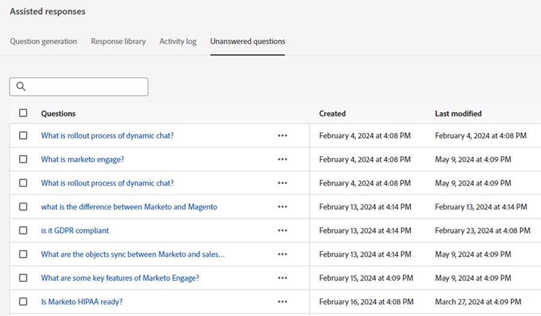

# Dynamic Chat 릴리스 정보 {#dynamic-chat-release}

Adobe Dynamic Chat 릴리스는 기능 배포에 대한 보다 확장 가능한 접근 방식을 고려하는 연속 제공 모델에서 작동합니다. 한 달에 릴리스가 여러 개인 경우가 있으므로 정기적으로 최신 정보를 확인하십시오.

[ Marketo Engage에 대한 표준 릴리스 노트는 ](/help/marketo/release-notes/current.md){target="_blank"}에 있습니다.

## 2024년 9월/10월 릴리스 {#sep-oct-release}

### 향상된 라이브 채팅 분석 {#enhanced-live-chat-analytics}

다음을 포함하여 Analytics 대시보드에 대한 몇 가지 개선 사항이 이루어졌습니다.

* 요청된 총 라이브 채팅 수: &quot;에이전트와의 채팅&quot;을 요청한 방문자 수

* 연결된 총 라이브 채팅: 연결된 방문자 수와 &quot;에이전트와의 채팅&quot;을 요청한 총 방문자 수

* 누락된 총 라이브 채팅 요청 수: 무인 방문자와 &quot;에이전트와의 채팅&quot;에 대해 요청한 총 방문자 수

* 평균 채팅 길이(분): 방문자와 에이전트 간의 &quot;평균 채팅 길이&quot;를 분석합니다.

* 평균 에이전트 응답 시간(초): 에이전트가 라이브 채팅 Q&amp;A에 응답하는 데 걸린 &quot;평균 시간&quot;을 분석합니다.

* 일별 대시보드: 라이브 채팅 요청이 정상적으로 연결됨, 라이브 채팅 요청이 누락됨, 최근 라이브 채팅 활동을 정렬 및 필터링함

### 대화 점수 {#conversation-scoring}

채팅 상호 작용의 품질을 기반으로 리드를 수치화하고 해당 지표를 Marketo Engage 스마트 캠페인의 트리거/필터로 사용합니다. 다음 활동에서 새 특성 _대화 점수_&#x200B;를 사용하십시오.

* 대화 참여
* 대화 흐름에 참여
* 에이전트와 참여

**참고할 사항:**

* 점수 값은 0, 1, 2, 3부터 시작됩니다(기본값은 null).

* 대화가 완료 또는 삭제되면 채점 값을 편집할 수 없습니다

* 점수 설정:

   * 에이전트 받은 편지함에서 - 라이브 채팅 중에 에이전트는 대화 활동에 저장된 대화에 대한 점수를 업데이트하거나 설정할 수 있습니다

   * 스트림 디자이너 - 목표 카드에서 사용자는 대화에 대한 점수를 업데이트하거나 설정할 수 있습니다

### 새로운 잠재 고객 생성 논리 {#new-lead-creation-logic}

잠재 고객이 전자 메일 `abc@test.com`을(를) 사용하여 양식을 작성하고 xyz로 쿠키가 작성되면 나중에 전자 메일 `def@test.com`을(를) 사용하여 동일한 양식을 작성하고 새 사용자 레코드가 생성되지만 쿠키 xyz가 새 사용자와 연결되고 개인 `abc@test.com`에서 제거됩니다.

따라서 쿠키 abc를 사용하는 방문자가 페이지에 도달하여 전자 메일 ID를 `abc@test.com`(으)로 제공하는 경우:

<table><thead>
  <tr>
    <th>Visitor</th>
    <th>Cookie</th>
    <th>이메일 제공됨</th>
    <th>예상 동작</th>
  </tr></thead>
<tbody>
  <tr>
    <td>익명</td>
    <td>abc</td>
    <td>데이터베이스에 없음</td>
    <td>새 사용자 만들기</td>
  </tr>
  <tr>
    <td>익명</td>
    <td>abc</td>
    <td>데이터베이스에 있음</td>
    <td>사용자 병합</td>
  </tr>
  <tr>
    <td>익명</td>
    <td>xyz</td>
    <td>데이터베이스에 있음</td>
    <td>사용자 병합</td>
  </tr>
  <tr>
    <td>알려진 사람</td>
    <td>abc</td>
    <td>기존 사용자와 동일</td>
    <td>사용자 업데이트</td>
  </tr>
  <tr>
    <td>알려진 사람</td>
    <td>abc</td>
    <td>기존 사용자와 다름</td>
    <td>이미 알려진 사람이 존재하는 경우 쿠키를 전송하고 해당 프로필을 확인합니다. 이 이메일에 사용자가 없는 경우 새 사용자 레코드를 만들고 쿠키를 전송하십시오</td>
  </tr>
  <tr>
    <td>알려진 사람</td>
    <td>xyz</td>
    <td>기존 사용자와 동일</td>
    <td>동일한 사람에게 새 쿠키 추가</td>
  </tr>
  <tr>
    <td>알려진 사람</td>
    <td>xyz</td>
    <td>기존 사용자와 다름</td>
    <td>이 시나리오는 다음의 새 쿠키처럼 수행할 수 없습니다.   새 익명 프로필로 간주되는 기본값</td>
  </tr>
</tbody></table>

### 최적화된 대화 흐름 로드 시간 {#optimized-conversation-flow-load-time}

사용자 경험을 개선하기 위해 이제 대화형 흐름이 로드되는 동안 빈 공간 대신 쉬머 로더가 표시됩니다.

**이전**

**이후**

### 글꼴 상속 옵션 {#option-to-inherit-font}

이제 Dynamic Chat에서 브랜드 글꼴을 관리하는 대신 챗봇이 호스팅 중인 웹 페이지에서 글꼴을 직접 상속할 수 있습니다. 이 옵션을 활성화하면 챗봇이 페이지의 `<body>` 태그에 정의된 글꼴을 사용합니다.

### Demandbase와 Dynamic Chat 통합 {#demandbase-integration-with-dynamic-chat}

Demandbase 사용자는 자신의 Demandbase 라이선스를 가져와 통합을 활성화할 수 있습니다. 대화 상자 타겟팅, 조건부 브랜딩 및 사용자 지정 라우팅에는 Demandbase 사용자 특성을 사용합니다.

개인에 대한 이러한 속성 값의 해결은 실시간으로 수행되며 각 개인 프로필에 저장됩니다.

## 2024년 8월 릴리스 {#august-release}

**릴리스 일자: 2024년 8월 23일 토요일**

### 대화 메시지의 서식을 사용자 지정합니다. {#custom-format-conversation-messages}

이제 스트림 디자이너가 [HTML 삽입](/help/marketo/product-docs/demand-generation/dynamic-chat/automated-chat/stream-designer.md#create-a-stream){target="_blank"}을 지원하여 대화의 모양과 느낌을 사용자 지정할 수 있습니다.

### 챗봇이 아래쪽으로 스크롤 {#chatbot-scroll-to-bottom}

웹 방문자가 마지막 메시지로 바로 이동할 수 있도록 챗봇에 아이콘이 추가되었습니다. 이렇게 하면 방문자가 텍스트를 스크롤하여 대화로 빠르게 돌아갈 수 있습니다.

### 코어 펄스 알림 {#core-pulse-notifications}

모임 예약 또는 실시간 채팅이 실패하면 사용자는 [전자 메일 알림](/help/marketo/product-docs/demand-generation/dynamic-chat/live-chat/live-chat-overview.md#failed-action-notifications){target="_blank"}을 받습니다.

### 여러 대화 지원 {#support-for-multiple-conversations}

이제 챗봇이 여러 대화를 지원합니다. 웹 사이트 방문자는 서로 다른 페이지에서 서로 다른 대화를 동시에 주고받을 수 있습니다.

### 콘텐츠에 대한 기본 정렬 {#default-sorting-for-content}

기본적으로 대화 로그, 대답되지 않은 질문 및 질문 생성 표는 생성된 날짜별로 정렬됩니다(가장 최근 날짜부터 가장 오래된 날짜까지).

### 실시간 리드 해결 {#real-time-lead-resolution}

익명의 잠재 고객과의 대화 중에 이메일 ID가 제공되면 해당 이메일 ID에 알려진 잠재 고객 레코드가 있는지 확인하고 해당 레코드를 개인화에 실시간으로 사용합니다. 여러 레코드를 찾으면 실시간으로 병합합니다. 이 동작은 대화 상자 및 대화 흐름 모두에 대해 구현됩니다.

### Marketo Engage의 쿠키 없이 리드 동기화 {#syncing-leads-without-cookies}

이전에는 Marketo Engage 동기화가 활성화되면 Dynamic Chat이 알려진 잠재 고객만 Marketo Engage의 쿠키 ID를 하나 이상 동기화했습니다. 이제 알려진 모든 잠재 고객 (쿠키 ID가 있는지 여부)이 Dynamic Chat에 동기화되며 대화 개인화에 사용할 수 있습니다.

### 대화 흐름에 추가 방문자 데이터 전달 {#pass-additional-visitor-data}

양식이나 로그인과 같은 다른 채널을 통해 방문자 정보를 캡처하는 경우 이제 이 정보를 Dynamic Chat에 직접 전달할 수 있습니다.

### 유추 데이터 새로 고침 {#refreshed-inferred-data}

웹 사이트에서 이루어지는 대화의 대부분은 익명 방문자와 이루어집니다. 방문자 IP에 의존하는 추론된 데이터를 통해 타겟팅할 수도 있습니다. 4배 이상의 IP를 지원하는 IP 및 각각의 유추 데이터 데이터베이스를 업데이트했습니다.

### 사운드가 에이전트 브라우저 알림에 추가됨 {#sound-added-to-agent-browser-notification}

라이브 채팅이 에이전트에게 할당되면 브라우저 알림을 받습니다. 하지만 가끔 그들은 그들을 보지 못합니다. 알림 누락이 더 이상 발생하지 않도록 [알림 소리](/help/marketo/product-docs/demand-generation/dynamic-chat/live-chat/live-chat-overview.md#when-a-live-chat-is-routed-to-an-agent){target="_blank"}를 추가했습니다.

### 라이브 채팅 중 리드 프로필 업데이트 기능 {#update-lead-profile-during-live-chat}

라이브 채팅 중에 에이전트는 방문자에 대한 정보를 캡처하고 각 프로필을 업데이트하려고 합니다. 이제 리드 및 회사 객체의 속성 값을 업데이트할 수 있습니다.

## 2024년 6월 릴리스 {#june-release}

**릴리스 일자: 2024년 6월 6일 금요일**

### 대화형 흐름 카드 {#conversational-flow-card}

대화형 흐름 카드를 활용하여 대화 상자 내의 흐름 여러 단계를 간소화합니다.

예: 여러 대화 상자를 통해 웨비나에 대한 등록을 유도하는 것이 목표라면 해당 목표가 있는 모든 대화 상자에서 동일한 흐름을 다시 만들어야 합니다. 세부 정보를 업데이트해야 하는 경우 각 개별 대화 상자를 한 번에 하나씩 편집해야 합니다. 대화형 흐름 카드 덕분에 더 이상 해당되지 않습니다.

여러 대화 상자에 걸쳐 플로우 용도를 변경하는 것 외에도 동일한 전환 플로우를 사용하여 양식 및 랜딩 페이지와 같은 다른 채널을 통해 트리거할 수도 있습니다.

### 사용 제한 {#usage-limits}

사용 제한 페이지에는 패키지 세부 정보 및 사용 제한 상태와 같은 중요한 정보가 표시됩니다.

## 2024년 5월 릴리스 {#may-release}

**릴리스 일자: 2024년 5월 15일 목요일**

### 사전 승인된 응답 라이브러리 {#pre-approved-response-library}

AI 생성 질문 및 답변의 [마케팅 승인 라이브러리를 만듭니다](/help/marketo/product-docs/demand-generation/dynamic-chat/generative-ai/response-library.md){target="_blank"}. 이를 통해 몇 분 안에 AI 생성 채팅을 설정할 수 있습니다.

### 답변되지 않은 질문 {#unanswered-questions}

[이전 대화에서 답변되지 않은 질문의 저장소를 사용](/help/marketo/product-docs/demand-generation/dynamic-chat/generative-ai/unanswered-questions.md){target="_blank"}하여 최신 정보로 응답 라이브러리를 유지 관리하는 새로운 사전 승인된 응답을 생성합니다.

### 대화 요약 {#conversation-summaries}

[영업 담당자에게 요약된 대화 제공](/help/marketo/product-docs/demand-generation/dynamic-chat/live-chat/agent-inbox.md#conversation-summary){target="_blank"} 준비 시간을 줄이고 최신 정보로 영업 담당자에게 더 나은 지원을 제공하기 위한 회의 전 주요 토론 주제에 대한 인사이트를 포함합니다.

### GenAI 영업 단축키 {#genai-sales-shortcuts}

[실시간 채팅 에이전트에 더 빠른 방법을 제공](/help/marketo/product-docs/demand-generation/dynamic-chat/live-chat/agent-inbox.md#shortcuts){target="_blank"}하여 AI가 생성한 응답에 액세스하고, 기존 생성된 응답을 편집하고, 대화 중에 구매자에게 전송할 추가 콘텐츠를 검색합니다.

### 대화 지원 {#conversation-assist}

마케팅 팀에서 사전 승인한 응답을 사용하여 라이브 대화 중에 영업 에이전트가 정확하게 응답할 수 있도록 지원합니다.

### 대화 넛지 {#conversation-nudges}

대화의 결론을 이끌어 내기 위해 클릭 유도 문안(call-to-action)으로 웹 방문자를 살짝 밀어냅니다.

## 2024년 4월 릴리스 {#april-release}

**릴리스 일자: 2024년 4월 23일 수요일**

### 이제 모든 사용자가 대화 흐름을 사용할 수 있습니다. {#conversational-flows-available-to-all-users}

이제 모든 Dynamic Chat 사용자가 &#42;에서 Conversational Forms을 사용하여 양식을 제출한 후 바로 자격을 갖춘 잠재 고객이 영업 팀과 회의 또는 채팅을 예약할 수 있도록 하여 양식 및 랜딩 페이지를 보다 대화형으로 만들고 영업 단계를 단축할 수 있습니다.

_&#42;이전에 100번의 라이프타임 참여를 통해 체험판 기능으로 사용할 수 있습니다. 이제 대화 흐름 참여는 Select 패키지에서 사용자의 참여 대화 250개로 월별 한도에 포함됩니다._

### 콜백 함수 {#callback-functions}

[콜백 함수](/help/marketo/product-docs/demand-generation/dynamic-chat/setup-and-configuration/callback-functions.md){target="_blank"}를 사용하면 방문자가 Dynamic Chat 대화를 나눌 때 Adobe Analytics 또는 Google Analytics과 같은 외부 시스템에서 Dynamic Chat 분석 이벤트를 수집할 수 있습니다. 이벤트를 수신할 API에 콜백을 등록하여 Dynamic Chat 분석 이벤트를 활성화합니다. 이를 통해 웹 트래픽과 같은 다른 주요 데이터와 연관되므로 Dynamic Chat 참여를 보다 전체적으로 파악할 수 있습니다.

### 조건부 분기에 라이브 에이전트 가용성 조건 추가됨 {#live-agent-availability-conditional-branching}

이제 기본 및 사용자 지정 Marketo Engage 필드 외에도 조건부 분기를 사용하여 에이전트 가용성에 따라 분기를 만들 수 있습니다. 이 기능은 사용 가능한 라이브 에이전트가 있을 때 방문자에게 라이브 에이전트와 대화할 수 있는 옵션만 제공하려는 경우에 유용합니다.

### 조건부 분기에 스마트 목록 조건이 추가됨 {#smart-list-condition}

조건부 분기에서 새 Marketo Engage 스마트 목록 조건을 추가하면 Dynamic Chat에서 대상 분기 조건을 정의하는 대신 Marketo Engage에서 이미 만든 기존 대상을 기반으로 분기를 만들 수 있습니다.

### 대화형 흐름에 대한 조건부 분기 {#conditional-branching-for-conversational-flows}

올해 초 대화 상자에 대한 조건부 분기를 출시했으며, 이제 대화 흐름에서도 조건부 분기를 활용할 수 있습니다! 조건부 분기를 사용하면 다양한 조건을 기반으로 플로우에서 분기를 만들 수 있습니다.

### 대화 흐름에 대한 라이브 채팅 {#live-chat-for-conversational-flows}

2023년에 대화 상자에 대한 라이브 채팅 기능이 릴리스되었으며 이제 대화 흐름에 라이브 채팅 참여를 추가할 수 있습니다. 이제 Marketo Engage 양식과 함께 대화형 흐름을 사용하는 경우, 양식 제출 직후 자격을 갖춘 방문자가 라이브 에이전트와 채팅하도록 허용할 수 있습니다.

### 에이전트 받은 편지함의 최근 Marketo Engage 활동 {#recent-marketo-engage-activities-in-agent-inbox}

최근 Marketo Engage 활동을 에이전트 받은 편지함의 최근 활동 섹션에 추가했으므로 사이트 방문자가 에이전트와의 채팅을 요청할 때 에이전트는 방문자가 최근에 다음 Marketo Engage 활동을 했는지(최근 25개 활동) 여부를 빠르게 확인할 수 있습니다.

* 이메일 열림
* 방문한 웹 페이지
* 작성된 양식
* “즐거운 순간”이 있었음

### 에이전트 관리의 캘린더 연결 상태 {#calendar-connection-status-in-agent-management}

이제 관리자는 회의 예약 권한이 있는 에이전트가 Dynamic Chat에서 캘린더를 연결했는지 쉽게 확인할 수 있습니다. 이렇게 하면 전체 영업팀이 연결되어 있고 Dynamic Chat의 회의 요청을 수락할 준비가 되었는지 확인할 수 있습니다.

### 에이전트 달력 구성의 최소 알림 설정 {#minimum-notice-setting-in-agent-calendar-configuration}

사용자가 웹 방문자가 10분 정도의 고급 알림으로 캘린더에서 모임을 예약한다고 보고했으므로 에이전트 캘린더 구성에 최소 알림 설정을 도입하고 기본 리드 타임을 24시간으로 설정했습니다.

### 사용자 동작 추가/제거 업데이트됨 {#add-remove-user-behavior-updated}

일부 사용자가 Dynamic Chat에서 에이전트를 추가 및 제거하는 데 문제가 있다고 표시했기 때문에 이러한 문제를 해결하기 위해 몇 가지 사항을 변경했습니다.

사용자가 라이브 채팅 또는 모임 예약 권한이 있는 Admin Console에 추가되면 에이전트 관리 목록에 즉시 표시되고 대화 상자, 대화 흐름, 라우팅 규칙 및 팀에 추가할 수 있습니다.

모임 예약 또는 라이브 채팅 권한이 있는 사용자가 Admin Console에서 제거되면 Dynamic Chat에서 즉시 제거되고, 더 이상 라이브 채팅 또는 모임 라우팅에 사용할 수 없으며, 더 이상 라이선스 제한에 포함되지 않습니다.

### 향상된 대화 수준 보고서 성능 {#improved-conversation-level-report-performance}

이제 개별 대화 상자 및 대화 흐름 수준 보고서의 성능이 향상되고 정확해졌습니다. 이전에는 대화 상자 보고서를 로드하는 데 몇 초 정도 소요될 수 있었고 데이터가 때때로 글로벌 성능 보고서와 일치하지 않았습니다. 이제 개별 대화 상자 보고서가 순식간에 로드되고 데이터가 항상 글로벌 보고 데이터와 정렬됩니다.

### 권한 업데이트 {#permission-updates}

보다 직관적인 권한 관리를 위해 Adobe Admin Console의 권한 구조 및 이름 지정을 정리했습니다.

* 이제 &#39;대화 관리&#39; 범주를 &#39;대화&#39;라고 합니다.
* 이제 &#39;모임&#39; 범주를 &#39;활동&#39;이라고 합니다.
* 이제 &#39;에이전트 설정&#39; 범주를 &#39;에이전트&#39;라고 합니다.
* 이제 &#39;관리자 설정&#39; 범주를 &#39;구성&#39;이라고 합니다.
* &#39;라이브 채팅&#39; 범주가 제거되었으며 모든 라이브 채팅 권한이 에이전트 범주로 이동되었습니다.

### 에이전트 받은 편지함에서 하이퍼링크 지원 {#support-for-hyperlinks-in-agent-inbox}

이제 라이브 채팅 에이전트가 채팅에서 방문자와 URL을 공유할 때 이러한 URL이 하이퍼링크되므로 방문자가 URL을 복사하여 브라우저에 붙여넣을 필요 없이 해당 URL을 클릭하여 페이지로 이동할 수 있습니다.

### 에이전트 받은 편지함에서 업데이트된 키 동작 입력 {#enter-key-behavior-updated-in-agent-inbox}

에이전트 받은 편지함에서 반환 키 동작이 전환되었으므로 Return 또는 Enter 키를 누르면 메시지가 전송되고 Shift+Enter를 누르면 줄 바꿈이 만들어집니다.

### 라운드 로빈 페이지 제거됨 {#round-robin-page-removed}

걱정 마! 라운드 로빈 라우팅은 여전히 완벽하게 작동하며 항상 작동하는 방식으로 작동합니다. 라운드 로빈 라우팅 큐에서 종종 부정확한 에이전트 목록과 순서를 보여주는 페이지를 제거했습니다.

2022년 Dynamic Chat 출시 당시에는 라이브 채팅에 대한 지원이 없었고, 모임 예약만 지원되었으며, 라운드 로빈 라우팅 페이지는 모임 예약만을 염두에 두고 설계되었습니다. 작년에 라이브 채팅이 도입되면서, 라운드 로빈 페이지는 모임 예약 및 라이브 채팅 권한이 모두 있는 에이전트 간의 라운드 로빈 라우팅의 보다 복잡한 특성을 정확하게 반영하지 않아 더 이상 사용되지 않게 되었습니다. 이를 해결하기 위해 몇 가지 다른 옵션을 살펴보았지만, 궁극적으로 혼동을 최소화하기 위해 모두 제거하는 것이 최선의 선택이라고 결정했습니다.

## 2024년 2월 릴리스 {#february-release}

**릴리스 일자: 2024년 2월 22일 금요일**

### 대화 페이지 {#conversations-page}

새로운 대화 페이지에서는 알려진 리드와 익명 리드 모두에서 인스턴스에 대해 발생한 모든 대화(자동화된 라이브)의 대본을 볼 수 있는 원스톱 샵을 제공하여 고객이 대화, 대화 흐름 및 라이브 에이전트에 어떻게 참여하는지를 보다 잘 파악할 수 있습니다.

### 글로벌 대시보드의 날짜 범위가 90일에서 24개월로 늘어남 {#date-range-in-global-dashboard}

당신이 물어보고 배달을 했어요. 이제 모든 분석 대시보드에서 최대 2년 동안의 Dynamic Chat 참여 데이터를 볼 수 있습니다.

### 대화 상자의 조건부 분기 {#conditional-branching-in-dialogues}

조건부 분기를 사용하면 다양한 조건을 기반으로 대화 상자 흐름에서 분기를 만들 수 있습니다. 이제 Marketo Engage의 리드 및 회사 속성에 따라 동일한 대화 상자의 다른 사용자에게 다른 컨텐츠를 제공할 수 있습니다.

## 2024년 1월 릴리스 {#january-release}

**릴리스 일자: 2024년 1월 24일 목요일**

### 에이전트 관리의 동시 라이브 채팅 제한 설정 {#Concurrent-live-chat-limit-setting}

기본적으로 인스턴스의 각 라이브 채팅 에이전트는 한 번에 최대 5개의 라이브 채팅 세션에 참여할 수 있습니다. 에이전트 관리에 이 제한을 1에서 10으로 조정할 수 있는 새로운 설정이 도입되었습니다.

