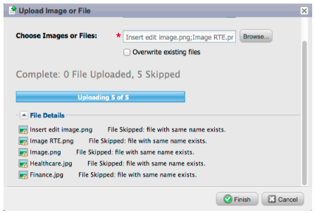

# 릴리스 정보: 2012년 4월 {#release-notes-april}

## 세그먼테이션 필터 및 트리거 {#segmentation-filters-and-triggers}

동일한 리드 그룹을 지속적으로 타깃팅합니까? 그렇다면 타겟팅 리드에 대해 스마트 목록에서 세그먼테이션을 사용하십시오. 세분화를 통해 전체 리드 데이터베이스는 항상 세분화되며 일관성을 위해 프로그램 전체에서 다시 사용할 수 있습니다. 세분화 결과는 요청 시 스마트 목록을 실행할 필요가 없기 때문에 빠르게 가져옵니다.

## 확장된 API 기능을 통해 이메일 콘텐츠 및 기타 흐름 단계에 외부 값 삽입 {#insert-external-values-into-email-content-and-other-flow-steps-through-expanded-api-capabilities}

* 이제 캠페인 요청 API를 통해 특정 캠페인 실행에 대한 내 토큰 값을 보낼 수 있습니다. 이는 API를 통해 이메일 콘텐츠를 채우는 데 특히 유용합니다
* 새로운 목록 업로드 및 예약 캠페인 API는 리드 및 배치 캠페인 목록에 대해 위의 기능을 지원합니다.

## [!DNL GoToWebinar] 및 [!DNL WebEx]에 대한 보다 쉬운 확인 전자 메일(Adobe Connect 및 [!DNL ON24]이 곧 제공 예정) {#easier-confirmation-emails-for-gotowebinar-and-webex-adobe-connect-and-on-coming-soon}

각 리드에 대한 고유한 등록 확인 URL을 표시하는 멤버 토큰을 만들어 확인 URL을 간소화했습니다. 더 이상 다른 토큰을 사용하여 이 URL을 만들 필요가 없습니다. 이 기능은 현재 [!DNL GoToWebinar] 및 [!DNL WebEx] 고객이 사용할 수 있으며, 다음 릴리스에서 Adobe Connect 및 [!DNL ON24]이(가) 사용할 수 있습니다.

## 한 번의 클릭으로 여러 이미지와 파일을 업로드할 수 있습니다. {#upload-multiple-images-and-files-with-a-single-click}

이미지와 파일을 Marketo으로 가져올 때 시간을 절약하고 효율성을 높일 수 있습니다! [!DNL Firefox] 또는 [!DNL Google Chrome]을(를) 사용하는 경우 파일을 여러 개 선택하여 한 번에 모두 업로드할 수 있습니다. 업로드할 수 있는 파일 수에는 제한이 없지만 파일당 개별 크기 제한은 50MB입니다.

참고: 현재 이 기능은 브라우저의 제한 사항으로 인해 [!DNL Internet Explorer]에서 지원되지 않습니다.

## 전자 메일의 텍스트 이동 {#move-text-in-an-email}

이메일에서 텍스트 블록의 순서를 변경할 수 있습니다. 텍스트 편집기 내에서 텍스트 블록을 선택합니다. 편집 아이콘을 클릭하면 블록을 위나 아래로 이동하는 옵션이 표시됩니다.

## [!DNL Salesforce]명이 아닌 사용자에 대해 [!DNL Salesforce]개의 참조가 제거됨 {#salesforce-references-removed-for-non-salesforce-users}

구독을 [!DNL Salesforce]과(와) 동기화하지 않는 경우 [!DNL Salesforce]을(를) 참조하는 모든 폴더 및 흐름 작업이 제거됩니다.

## Marketo 수익 주기 분석 {#marketo-revenue-cycle-analytics}

**수익 주기 Modeler의 향상된 게이트 단계**

사용자가 전환 규칙에 대한 순서를 정의할 수 있습니다.

