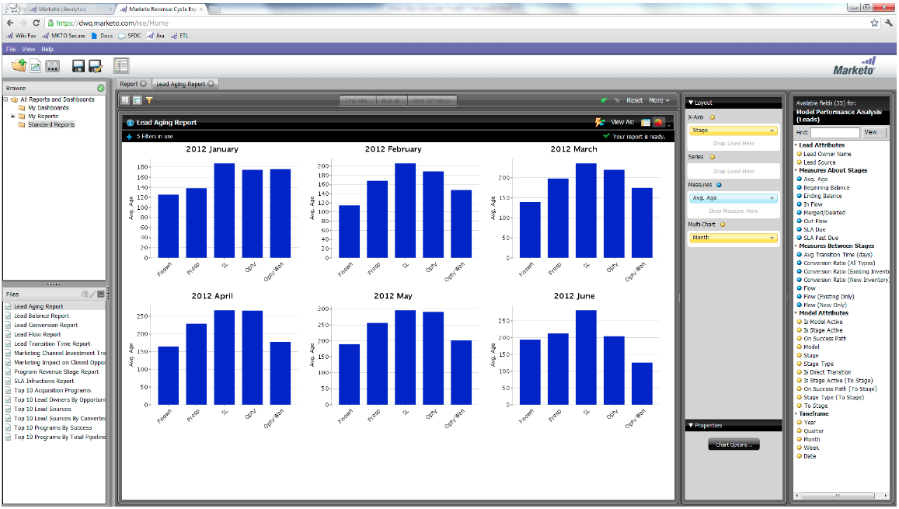
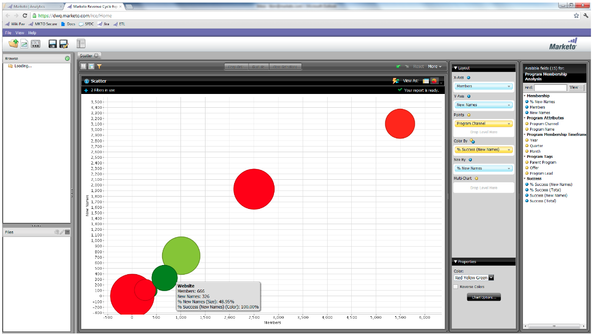

# 릴리스 정보: 2012년 6월 {#release-notes-june}

## Marketo 리드 관리 개선 사항 {#marketo-lead-management-enhancements}

### 이름 바꾸기 {#rename}

스마트 목록, 정적 목록 및 캠페인의 이름을 변경할 수 있습니다. 필터, 트리거 또는 흐름에서 이러한 자산을 사용하는 경우 이름도 자동으로 업데이트됩니다. 이메일, 양식 및 폴더의 이름을 항상 바꿀 수 있었습니다.

그리고 보너스로 에셋에 대한 설명 텍스트 입력 및 보기를 개선했습니다.

## 필드 매핑 가져오기 {#import-field-mapping}

목록을 Marketo으로 가져오는 작업이 훨씬 쉬워졌습니다. 가져오기 프로세스 중에 Marketo 필드의 이름을 가져오기 파일의 열 헤더 이름에 매핑할 수 있습니다. 또한 [!UICONTROL Admin]에서 Marketo의 필드 이름에 매핑되는 별칭 이름을 설정하여 사용자가 항상 올바른 필드를 선택하도록 할 수 있습니다.

필드를 계속 가져오고 매핑하면 Marketo에서 쉽게 사용할 수 있도록 가져오는 동안 매핑을 기억하고 표시합니다. 또한 샘플 값 헤더를 클릭하여 필드를 채울 다른 값을 볼 수 있으므로 더욱 편리한 작업이 가능합니다. 이렇게 하면 매번 올바른 필드를 매핑할 수 있습니다.

## 스마트 목록 및 정적 목록의 [!UICONTROL Summary] 페이지 {#summary-page-for-smart-lists-and-static-lists}

목록이 어디에 사용되고 있는지 궁금하신 적이 있습니까? 또는 누가 목록을 만들었거나 마지막으로 수정했습니까? 스마트 목록 및 정적 목록에서 사용할 수 있는 새 요약 페이지에서 다음과 같은 중요한 세부 정보를 제공합니다.

기존 프로그램 및 캠페인 요약 페이지에 만든 날짜/사용자 및 마지막으로 수정한 날짜/사용자 정보도 추가했습니다.

## Assets용 [!UICONTROL Used By] {#used-by-for-assets}

자산 [!UICONTROL Summary] 페이지에 [!UICONTROL Used By]&#x200B;(이)라는 새 탭을 추가했습니다.

예: 정적 목록의 경우 [!UICONTROL Used By]

## 랜딩 페이지 눈금선 {#landing-page-gridlines}

랜딩 페이지 눈금선을 추가하면 랜딩 페이지의 텍스트, 그래픽 및 양식 맞춤이 훨씬 더 쉬워집니다. 주어진 랜딩 페이지에 대해 이 기능을 켜거나 끄고 줄 사이의 너비도 조정하십시오.

## 잠재 고객이 메일링에서 차단됨 {#leads-blocked-from-mailings}

캠페인을 예약할 때 링크를 클릭하면 메일링이 차단된 잠재 고객 목록을 볼 수 있습니다.

## [!UICONTROL Wait] 단계 - 잠재 고객 토큰 및 내 토큰 {#wait-step-lead-token-and-my-token}

5월 릴리스에서는 [!UICONTROL Wait] 흐름 단계에 고급 옵션을 추가했습니다. 이러한 변경 사항으로 영업일, 날짜 및 시간을 지정할 수 있습니다. 이 릴리스에서는 대기 단계에서 토큰을 사용하는 기능을 추가했습니다. 예를 들어 `{{lead.Birthday}}`을(를) 사용하여 생일 축하 이메일을 보내거나 `{{my.Event Date}}`을(를) 사용하여 최종 웨비나 미리 알림을 보낼 수 있습니다.

## Design Studio에서 [!UICONTROL View]&#x200B;(으)로 [!UICONTROL Thumbnails] {#view-as-thumbnails-in-design-studio}

이미지 목록에서 썸네일 보기로 전환합니다!

참고: 이 릴리스부터 스마트 목록 그리드의 이전 정렬이 사용자가 보는 다음 스마트 목록에 적용되지 않습니다. 예를 들어 회사 이름별로 스마트 목록을 정렬하는 경우 동일한 필드에서 본 다음 스마트 목록은 자동으로 정렬되지 않습니다.

미리 알림: 전자 메일 성능 보고서 업그레이드가 진행 중입니다!

## Marketo 수익 주기 분석 개선 사항 {#marketo-revenue-cycle-analytics-enhancements}

### 프로그램 영업 기회 분석의 새로운 지표  {#new-metrics-in-program-opportunity-analysis}

이제 기회를 만들거나 닫기 전의 평균 마케팅 터치 횟수와 마케팅 터치의 평균 값에 대한 통찰력을 얻을 수 있습니다.

## 다중 차트 표시 {#displaying-multi-charts}

다중 차트 기능을 사용하면 단일 수익 주기 탐색기 보고서에 여러 차트를 표시할 수 있습니다. 예를 들어, 서로 다른 달에 대해 동일한 데이터를 표시하려는 경우 이 기능을 사용할 수 있습니다. 이 기능을 사용하면 별도의 필터 및 보고서를 만들 필요가 없습니다.

## 열 그리드 차트 유형  {#heat-grid-chart-type}

히트그리드를 사용하면 데이터를 시각화하여 마케팅 성과 패턴을 식별할 수 있습니다. 이 시각화 유형은 결과를 색상 코딩하므로 이해하기 쉬운 시각화로 복잡한 비즈니스 분석을 볼 수 있습니다.

## 분산형 차트 유형  {#scatter-chart-type}

분산형 차트를 통해 여러 차원에 대한 데이터를 하나의 그래프로 시각화할 수 있습니다. 이 시각화 유형은 사용된 속성을 기반으로 그래프에 버블을 표시합니다. 그런 다음 측정값을 사용하여 버블에 색상을 지정하거나 측정값을 사용하여 버블의 크기를 지정할 수 있습니다.

