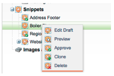

# 릴리스 노트: 2012년 3월 {#release-notes-march}

## 내 토큰 확인 {#resolve-my-tokens}

이메일을 미리 보고, 테스트 이메일을 보내고, 단일 흐름 작업을 통해 로컬 이메일을 보낼 때 내 토큰(프로그램 토큰)이 확인됩니다. 더 이상 내 토큰을 테스트하기 위해 프로그램 내에 스마트 캠페인을 만들 필요가 없습니다!

## 이메일 및 랜딩 페이지의 미리 보기 및 편집기 간 전환 {#toggle-between-previewer-and-editor-in-emails-and-landing-pages}

한 번의 클릭으로 편집기와 미리보기 사이를 쉽게 왔다 갔다 할 수 있습니다.

미리 보기 편집기:

미리 보기-편집기:

## 코드 조각 미리 보기 {#snippet-previewer}

메뉴에서 &quot;코드 조각 미리 보기&quot;를 선택하면 초안을 만들지 않고 코드 조각을 볼 수 있습니다.또한 공유 코드 조각(작업 영역을 통해)에 대한 읽기 전용 액세스 권한이 있는 경우 이 작업을 사용하여 코드 조각을 볼 수 있습니다

## 여러 테스트 이메일 보내기 {#send-multiple-test-emails}

다이내믹 콘텐츠를 추가하면 잠재 고객에게 전송할 수 있는 모든 이메일 변형을 미리 보고 테스트하는 것이 점점 더 중요해집니다. 리드 세부 정보별 보기를 사용하여 미리 보는 경우 리드 목록에서 변형에 대한 테스트를 전송할 수 있습니다(최대 100개의 테스트 이메일).

## URL 매개 변수 기반 동적 랜딩 페이지 {#dynamic-landing-pages-based-on-url-parameter}

익명 리드는 랜딩 페이지 방문의 상당한 양을 차지합니다. 동적 컨텐츠와 URL에 매개 변수로 세그멘테이션을 추가할 수 있으므로 익명 또는 알려진 잠재 고객이 링크를 클릭하면 랜딩 페이지 컨텐츠를 동적으로 표시할 수 있습니다.
