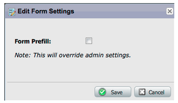
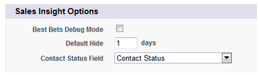

# 릴리스 노트: 2012년 5월 {#release-notes-may}

## 전자 메일 성과 보고서 재디자인 {#email-performance-report-redesign}

참고: 5월 릴리스부터 스테이지된 롤아웃이 됩니다

이메일 성능 및 캠페인 이메일 성능 보고서가 더 빨리 실행되도록 했습니다. 또한 특정 지표의 정의를 개선하고 &quot;보낸 메시지&quot; 및 &quot;보낸 리드&quot; 지표를 단일 지표 &quot;전송됨&quot;으로 통합했습니다. &quot;게재한 메시지&quot; 및 &quot;게재한 리드&quot;를 &quot;게재됨&quot;에 병합했습니다.

## 대기 단계 개선 사항 {#wait-step-enhancements}

새로운 고급 대기 속성을 사용하여 Smart Campaign 흐름 작업의 대기 단계를 특정 요일, 다음 영업일, 특정 날짜 또는 시간으로 &quot;대기할 때까지&quot; 구성할 수 있습니다. 이러한 개선 사항을 통해 보육된 이메일이 업무 시간 중에 받은 편지함에 도착하도록 할 수 있습니다.

그림 1. 업무일에 종료될 대기 단계를 지정합니다.

## 숨겨진 보관된 자산 {#archived-assets-hidden}

보관된 자산은 자동 제안, 드롭다운 및 보고서에서 자동으로 필터링되므로 찾고 있는 자산을 쉽게 찾을 수 있습니다.

그림 2. 보관된 이메일 필터의 예

## iPad용 새 이벤트 체크인 앱 {#new-event-check-in-app-for-ipad}

새로운 iPad 앱을 사용하여 이벤트 체크인 프로세스를 간소화합니다! 이벤트 체크인 앱은 Marketo 프로그램과 동기화되므로 등록자를 쉽게 이벤트에 확인하고 새로운 리드를 즉시 추가할 수 있습니다.

iOS 5.1 이상 필요 iPad만 해당.

그림 3. 이벤트 체크인 홈 페이지

그림 4. 이벤트 체크 인: 이벤트를 선택합니다.

그림 5. 체크 인

## 향상된 웨비나 확인 URL {#enhanced-webinar-confirmation-url}

이제 ON24 및 Adobe Connect에서 사용할 수 있습니다! 새 `{{member.webinar URL}}` 토큰을 사용하여 등록된 각 참석자의 확인 전자 메일에 고유 링크를 포함합니다. Adobe Connect 개선 사항에는 사용자의 로그인 ID 및 암호를 포함하는 Adobe 계정 정보 이메일을 설정/해제하는 기능도 포함되어 있습니다.

그림 6. 웨비나에 있는 사람들을 안내하십시오

## 템플릿 미리 보기 {#template-preview}

전자 메일 또는 랜딩 페이지를 작성하는 동안 특정 템플릿을 찾고 있지만 어떤 모습인지 확실하지 않습니다. 새 템플릿 미리 보기 기능을 사용하면 새 자산을 저장하기 전에 선택한 템플릿을 확인할 수 있습니다.

그림 7. 선택한 템플릿 미리 보기

## 구성 가능한 양식 미리 채우기 {#configurable-form-prefill}

구독 수준에서 양식 데이터의 사전 모집단을 제어하고 랜딩 페이지 수준에서 덮어씁니다. 미리 채우지 않으면 리드가 최신 정보를 제공하는지 확인할 수 있습니다.

그림 8. 관리자의 양식 미리 채우기 구성

그림 9. 랜딩 페이지에서 양식 미리 채우기 설정 편집

## Marketo 보물상자 {#marketo-treasure-chest}

Marketo 엔지니어가 개발한 실험적인 기능에 액세스하여 사용자 경험을 향상시킬 수 있습니다. 이 릴리스에는 이메일 실행 취소 뿐만 아니라 랜딩 페이지에서 주석을 입력하고 다른 사용자와 공동 작업하는 기능이 포함되어 있습니다.

\

그림 10. 관리자의 보물상자 기능

## Microsoft Dynamics® CRM 통합 {#microsoft-dynamics-crm-integration}

사전 빌드된 새로운 통합을 사용하여 Marketo과 Microsoft Dynamics CRM Online 간 계정, 연락처 및 리드 동기화!

그림 11. Microsoft Dynamics 구성

## Marketo Sales Insight 개선 사항 {#marketo-sales-insight-enhancements}

**바닥글 옵션 구독 취소**

Sales Insight를 통해 전송된 이메일에 대해 가입 해지 바닥글이 표시되는 시기와 시기를 구성합니다.

그림 12. 관리자의 Sales Insight 설정

## 영업 전자 메일 템플릿의 폴더 {#folders-for-sales-email-templates}

이제 Marketo Sales Insight와 공유된 이메일 템플릿을 지정된 폴더로 구성하면 영업 담당자가 올바른 이메일을 보다 손쉽게 찾을 수 있습니다.

그림 13. 전자 메일 폴더 선택

## Sales Insight에서 Opportunity Analyzer 액세스 {#access-opportunity-analyzer-from-sales-insight}

Sales Rep 는 Marketo Sales Insight에서 Opportunity Analyzer에 직접 액세스하여 마케팅 활동을 통해 참여를 유도하는 통찰력을 제공합니다. 참고. Revenue Cycle Analytics 라이센스가 필요합니다.

## 연락처 상태에 대한 사용자 지정 필드 {#custom-field-for-contact-status}

이제 Salesforce의 사용자 지정 필드를 매핑하여 My Best Pets, My Team&#39;s Best Pets 및 사용자 지정 보기에서 연락처의 상태 필드를 채울 수 있습니다.

그림 14. 연락처에 사용자 지정 필드 매핑

익명 리드가 방문한 페이지 를 참조하십시오.

익명 웹 활동 보기에서 익명 리드가 본 페이지로 드릴다운합니다.

그림 15. 익명 웹 활동 을 참조하십시오

## 향상된 리드 및 연락처 가입 {#enhanced-lead-and-contact-subscribe}

레코드 세부 사항 페이지에서 새 가입 단추를 사용하여 언제든지 리드를 팔거나 연락하십시오.
