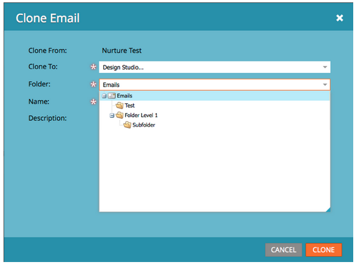

# 릴리스 노트: 2013년 6월 {#release-notes-june}

다음 기능은 6월 릴리스에 포함되어 있습니다.

## 추가 사용자 언어 {#additional-user-languages}

이제 스페인어 및 포르투갈어를 지원하는 원하는 언어로 Marketo 리드 관리 인터페이스를 볼 수 있습니다.

## Cobalt 사용자 인터페이스 {#cobalt-user-interface}

향후 몇 개월 동안 애플리케이션의 여러 부분에서 새로운 주제가 롤아웃되는 것을 볼 수 있습니다. 예를 들어 모달 창에 영향을 줍니다.

## 하위 폴더 복제 {#subfolder-cloning}

자산을 하위 폴더로 복제합니다.

## 여러 모델 {#multiple-models}

커뮤니티의 RCA(Revenue Cycle Analytics)에 대한 주요 생각인 이 기능을 사용하면 여러 모델을 만들어 제품 라인, 비즈니스 단위 또는 지역별 매출 단계를 보다 자세히 이해할 수 있습니다. 매출 단계, 성공 경로 분석기, 프로그램 분석기 및 매출 탐색기 보고서별 리드는 이제 보고할 특정 모델을 선택하는 기능을 지원합니다.

기본적으로 Select SMB Edition과 Enterprise Edition용 15개의 모델을 사용할 수 있습니다. 추가 모델도 구입할 수 있습니다.

