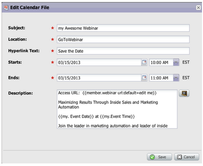

# 릴리스 노트: 2013년 5월 {#release-notes-may}

다음 기능은 5월 릴리스에 포함되어 있습니다.

## 랜딩 페이지용 달력 파일 {#calendar-files-for-landing-pages}

달력 파일을 랜딩 페이지에 추가할 수 있는 내 토큰으로 만듭니다. 이 통합 달력 파일(예: .ics 파일)은 로컬 자산 랜딩 페이지의 내 토큰을 포함하여 모든 토큰을 렌더링합니다.

## 모델 멤버십 탭 {#model-membership-tab}

쉽게 모니터링하고 문제를 해결하기 위해 모델 구성원의 데이터를 한 곳에 모두 표시합니다. 새 멤버 탭은 승인된 수익 주기 모델을 선택할 때 사용할 수 있는 읽기 전용 뷰입니다.

## 재구성된 흐름 작업 트리 {#reorganized-flow-action-tree}

새로 재구성된 플로우 작업 트리를 사용하여 플로우 작업을 보다 신속하게 찾을 수 있습니다.

## 이름이 변경된 흐름 작업 {#renamed-flow-actions}

Change Progression Status가 이제 Change Program Status입니다. 프로그램 데이터 변경: 이제 프로그램 변경 성공

